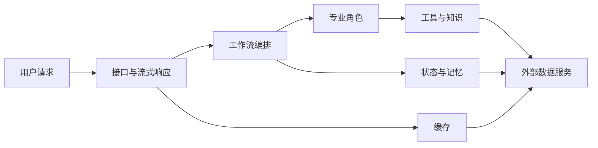

# 术语表：把陌生词翻译成人话

## 学习目标

读完并学会使用本页，你应该能够：

1. 遇到陌生术语时，先获得可工作的直觉，再进入精确定义；
2. 用“术语 / 人话 / 生活类比 / 项目里在哪”四个问题定位概念；
3. 区分容易混淆的几组能力，不把所有存储、检索或角色混成一类；
4. 从术语反向找到源码位置，从源码现象反向查到术语；
5. 用自己的话复述概念，而不是照背英文缩写。

## 1. 为什么术语一多，理解反而会变慢？

想象第一次进入大型车站：屏幕上同时出现站台、检票口、候车区、换乘通道和车次编号。如果没人告诉你这些词分别回答“去哪里、何时走、从哪进”，记住再多文字也不一定能上对车。

技术术语也一样。一个词有用，不是因为它听起来专业，而是因为它能帮你回答一个具体问题。本页不要求一次背完；它是一张随用随查的翻译卡。

## 2. 应该怎样使用这张翻译卡？

把每个术语想成工具箱上的标签：

- **术语**告诉你大家通常怎么称呼它；
- **人话**告诉你它解决什么问题；
- **生活类比**帮助你快速建立画面；
- **项目里在哪**让你回到可验证的实现。

类比只是脚手架，不是精确定义。真正做设计判断时，要回到代码、配置、测试和运行行为。

## 3. 一个词怎样从陌生变成可验证？

```text
看到陌生词
    ↓
先问：它解决什么问题？       ← 人话
    ↓
再问：像生活中的什么协作？   ← 类比
    ↓
然后问：在系统哪一层出现？   ← 位置
    ↓
最后用源码或实验修正理解     ← 证据
```

也可以把常用词放进一张关系图：



下面才把这些位置对应到 PsyConsult 的具体名称。

## 4. 项目与临床边界术语

| 术语 | 人话 | 生活类比 | 项目里在哪 |
|---|---|---|---|
| CDS（Clinical Decision Support，临床决策支持） | 给临床专业人员提供信息和建议，但不替代其决策与责任 | 导航给路线建议，方向盘仍由驾驶者掌握 | 项目整体定位；说明见 `README.md` 与 `learn/part01-background/` |
| 临床原型 | 用来验证流程与工程可行性的早期系统，不等于可直接用于真实诊疗的产品 | 新楼开业前的样板间 | 仓库整体；安全边界分布在 `app/`、前端和文档中 |
| 人工复核 | 由具备责任和能力的人检查系统输出后再决定是否采用 | 编辑审核机器生成的初稿 | 产品流程边界，不是某一个函数；前端免责声明与安全章节会体现 |
| 虚构/脱敏数据 | 不包含真实可识别患者信息的学习数据 | 消防演练用烟雾，不真的点火 | `mock_data/` 与学习实验；不得把真实患者信息写入仓库或日志 |
| PHI（Protected Health Information，受保护健康信息） | 能关联到个人的健康信息，需要严格保护 | 带姓名的密封病历袋 | 当前原型应避免写入；重点检查请求、日志、缓存和存储边界 |

## 5. 模型与角色术语

| 术语 | 人话 | 生活类比 | 项目里在哪 |
|---|---|---|---|
| LLM（Large Language Model，大语言模型） | 根据上下文生成文本或结构化结果的模型 | 阅读大量材料后按要求起草内容的助手 | 模型配置与各专业角色的调用逻辑，主要在 `agent/` |
| Prompt（提示词） | 给模型的任务、背景、约束和输出要求 | 给新同事的一张任务说明单 | `agent/agents/` 中各专业角色的提示模板或消息构造 |
| Token（词元） | 模型处理文本时使用的离散片段，不完全等同于汉字或单词 | 快递按包裹件数计费，而不是按句子计费 | 上下文长度与历史压缩相关，见 `agent/core/workflow/graph_manager.py` |
| Agent（智能体） | 围绕目标，能结合上下文、模型和工具完成一类任务的程序角色 | 有岗位说明、会查资料的工作人员 | `agent/agents/` |
| Multi-Agent（多智能体） | 多个职责不同的 Agent 按规则协作 | 联合门诊中不同岗位接力 | `agent/agents/` 与工作流图 |
| Orchestrator（编排者） | 判断请求该从哪一类任务开始的分派角色 | 分诊台 | `agent/agents/orchestrator.py` |
| Differential Diagnosis（鉴别诊断） | 比较多个可能解释，并说明支持点、反对点和待补信息 | 排查家里停电是跳闸、欠费还是线路故障 | `agent/agents/` 中诊断角色 |
| Treatment Recommendation（治疗建议） | 基于上下文形成供专业人员复核的干预建议 | 工程师给出维修方案清单，负责人最终批准 | `agent/agents/` 中治疗角色 |
| Drug Interaction Review（药物相互作用审查） | 检查药物之间及相关风险，不等于自动开处方 | 出行前检查不同路线是否互相冲突 | `agent/agents/` 中药物审查角色 |
| Tool Calling（工具调用） | 模型或 Agent 按约定参数调用外部函数获取事实或执行动作 | 工作人员打电话给资料室查档 | `agent/tools/` 及角色绑定工具的位置 |
| ReAct | 让模型在推理与行动之间循环：判断下一步、调用工具、观察结果、继续处理 | 修理工“检查—试工具—看结果—再决定” | 使用工具的 Agent 执行过程；具体以 `agent/agents/` 实现为准 |

## 6. 工作流与状态术语

| 术语 | 人话 | 生活类比 | 项目里在哪 |
|---|---|---|---|
| LangGraph | 用节点、连线和共享状态组织有分支任务的工作流库 | 带条件岔路和交接单的地铁线路图 | `agent/core/workflow/graph_manager.py` |
| StateGraph（状态图） | 每一步读取和更新同一份状态，并按连线进入下一步 | 接力赛中传递同一根接力棒 | 图的组装逻辑，见 `agent/core/workflow/graph_manager.py` |
| Node（节点） | 工作流中的一个处理步骤 | 流水线上的一个工位 | 历史压缩及各 Agent 对应的图节点 |
| Edge（边） | 规定一个步骤完成后去哪里的连接 | 路口之间的道路 | 工作流图中的固定边与条件边 |
| Conditional Edge（条件边） | 根据状态或结果选择下一站的连接 | 分诊后按病情去不同科室 | orchestrator 路由与图组装逻辑 |
| AgentState | 多个节点共同读写的结构化工作状态 | 随病例一起流转的交接单 | `agent/core/workflow/state.py` |
| Reducer（归并器） | 新旧状态相遇时决定如何合并的规则 | 交接本追加新页，而不是扔掉旧页 | `AgentState` 中消息字段使用的 `add_messages` |
| `add_messages` | 把新消息按消息规则合并进历史，而非简单覆盖 | 在对话记录末尾续写 | `agent/core/workflow/state.py` |
| START / END | 工作流的统一起点和终点标记 | 路线图上的始发站和终点站 | `agent/core/workflow/graph_manager.py` |
| Checkpoint（检查点/状态快照） | 保存某一时刻的工作流状态，下一轮可恢复 | 游戏存档 | `agent/core/workflow/checkpointer.py` |
| `thread_id` | 工作流用来区分不同连续执行线程的标识 | 交接本封面上的编号 | 图调用配置；由 `session_id` 映射而来 |
| `session_id` | API 层标识一段连续对话的编号 | 同一次就诊的取号单 | 聊天请求模型与 `app/service/chat_service.py` |
| History Compression（历史压缩） | 对较早消息做摘要，给近期消息腾出上下文空间 | 把旧会议逐字稿整理成纪要 | `agent/core/workflow/graph_manager.py`；消息超过 16 条时保留最近 8 条并摘要较早部分 |
| Async（异步） | 等待网络或存储时不把执行线程一直堵住 | 餐厅下单后先服务下一桌，不站在厨房门口干等 | Python `async`/`await`，分布在图、服务与存储调用中 |

## 7. 知识、检索与数据术语

| 术语 | 人话 | 生活类比 | 项目里在哪 |
|---|---|---|---|
| RAG（Retrieval-Augmented Generation，检索增强生成） | 先查相关资料，再让模型结合资料回答 | 开卷考试先翻到相关页再作答 | `agent/tools/` 中的检索与工具实现 |
| Embedding（向量表示） | 把文本转换为可计算比较的数字表示 | 给每段话一个“含义坐标” | 写入与搜索前的向量化步骤 |
| Vector Search（向量检索） | 按含义相近程度找内容，而不只匹配字面 | 找“情绪低落”时也可能找到“持续悲伤”的材料 | `agent/tools/` 中的向量检索实现 |
| Top-K | 只取相似度最高的前 K 条结果 | 从候选简历中先看最匹配的 5 份 | 向量搜索参数与工具返回限制 |
| Milvus | 保存向量并进行相似度搜索的数据服务 | 按“意思坐标”找书的资料库 | `agent/tools/`、`agent/core/memory/`、`app/infra/cache.py` |
| Knowledge Graph（知识图谱） | 用实体和关系表达可连接、可追踪的事实网络 | 人物关系图，线条说明“谁和谁是什么关系” | `agent/core/graph/` 与图查询工具 |
| Neo4j | 适合存储和查询图关系的数据服务 | 专门管理关系网的档案室 | `agent/core/graph/`、`agent/tools/`、`docker/docker-compose.yml` |
| Cypher | 查询 Neo4j 图数据的语言 | 向关系档案室提出结构化查询的格式 | Neo4j 查询实现与图工具 |
| Long-Term Memory（长期记忆） | 从历史中提取值得跨会话保留的临床事实 | 从每日流水账中整理长期档案 | `agent/core/memory/`；按项目策略每 5 轮触发后台提取 |
| `memory_context` | 检索到并注入当前推理的长期记忆上下文 | 办理新业务时调出的历史摘要 | `AgentState` 及长期记忆注入流程 |

## 8. API、前端与传输术语

| 术语 | 人话 | 生活类比 | 项目里在哪 |
|---|---|---|---|
| API（应用程序接口） | 不同程序按约定交换请求和结果的入口 | 餐厅点餐窗口与菜单格式 | `app/router/chat.py` 中 `POST /api/chat` |
| HTTP | 浏览器与服务器交换请求和响应的一套规则 | 寄信时统一的信封与投递规范 | 前端请求与 `app/` 路由层 |
| FastAPI | 用 Python 定义 HTTP 接口、校验请求并返回响应的 Web 框架 | 搭建标准化办事窗口的工具 | `app/app_main.py`、`app/router/` |
| SSE（Server-Sent Events，服务器发送事件） | 服务器沿一条 HTTP 连接持续向浏览器发送文本事件 | 比赛直播文字不断刷新比分 | `app/service/chat_service.py` 与 `front/clinical_cds/src/App.vue` |
| Event Stream（事件流） | 按时间到达的一系列事件，而不是单个最终值 | 收听持续播报，而不是只看赛后比分 | 聊天服务产生、前端解析的 SSE 数据 |
| Vue 3 | 用组件和响应式状态构建页面的前端框架 | 根据后台变化自动更新的信息看板 | `front/clinical_cds/` |
| Reactive State（响应式状态） | 数据变化后，相关页面自动更新 | 电子价签随后台价格变化 | `front/clinical_cds/src/App.vue` 中的 `ref` 等状态 |
| Markdown | 用纯文本符号表示标题、列表、代码等格式 | 给纯文本加排版批注 | Agent 输出渲染流程 |
| DOMPurify | 在把 HTML 放进页面前移除危险内容的净化库 | 食材进入厨房前先做安全清洗 | `front/clinical_cds/src/App.vue` 的 Markdown 渲染链路 |
| CORS（跨源资源共享） | 浏览器用来限制一个来源页面访问另一个来源服务的安全规则 | 园区门禁只允许名单中的访客跨区 | `app/app_config/settings.py`、`app/app_main.py` 与环境配置 |

## 9. 缓存、安全与运维术语

| 术语 | 人话 | 生活类比 | 项目里在哪 |
|---|---|---|---|
| Cache（缓存） | 保存可复用结果，以减少重复工作和等待 | 把常用资料放在桌面，不必每次去档案室 | `app/infra/cache.py` 与聊天服务 |
| Semantic Cache（语义缓存） | 按问题含义寻找相近历史答案，命中时跳过完整推理 | 顾客换种说法问同一问题，直接复用已审核答复 | Milvus 集合 `qa_semantic_cache`，入口在 `app/infra/cache.py` |
| Exact Match（精确匹配） | 文本完全一致时命中 | 用完整身份证号找唯一档案 | 语义缓存查询的快速判断之一 |
| Similarity Threshold（相似度阈值） | 只有足够相似才允许视作同类的界线 | 人脸核验分数必须过线才放行 | `app/infra/cache.py` 的缓存判定，当前项目阈值配置/逻辑约为 0.08，需结合距离定义理解 |
| Redis | 高速键值数据服务；本项目主要承载工作流检查点 | 可快速取放的值班交接柜 | `agent/core/workflow/checkpointer.py` 与 Docker Compose |
| TTL（Time To Live，生存时间） | 数据到期前可保留多久 | 寄存柜票据的有效期 | Redis Checkpoint 约 24 小时，并在读取时续期 |
| Graceful Degradation（优雅降级） | 增强服务失败时跳过相关能力，让核心流程尽可能继续 | 自动扶梯停了，仍可走楼梯 | Checkpoint、语义缓存、长期记忆初始化和调用的异常处理 |
| Bearer Token | 放在请求头中证明调用者持有访问凭证的字符串 | 进入受限区域时出示门票 | `app/router/chat.py`；`API_AUTH_TOKEN` 配置后强制校验 |
| `X-User-Id` | 请求头中的用户标识，用于标识与隔离调用上下文 | 交接单上的经办人编号 | `app/router/chat.py`；格式需匹配项目允许的字符规则 |
| Authentication（认证） | 确认调用者是谁或是否持有凭证 | 门卫验票 | FastAPI 路由依赖与 Token 校验 |
| Authorization（授权） | 已确认身份后，判断允许做什么 | 有员工证不代表能进所有机房 | 原型能力有限，生产化时需要更完整的权限模型 |
| Input Validation（输入校验） | 在处理前检查数据类型、长度与格式 | 前台先检查表格是否填写完整 | 请求模型与 `app/router/chat.py`；聊天输入至少 4 个非空白字符 |
| XSS（跨站脚本攻击） | 恶意内容借页面渲染执行脚本 | 把伪装成普通纸条的危险指令贴进公告栏 | 前端 Markdown/HTML 渲染风险，由 DOMPurify 等措施缓解 |
| Prompt Injection（提示注入） | 输入试图让模型忽略原任务或泄露不该暴露的信息 | 来访者伪造“领导命令”要求越权 | Agent 输入、外部检索内容和工具输出都应按不可信数据处理 |
| Logging（日志） | 记录系统在何时做了什么，便于观察与排障 | 值班记录本 | `logs/backend.log`；Agent 与 App 使用各自 logger 名称 |
| Observability（可观测性） | 通过日志、事件、指标等判断系统内部发生了什么 | 看仪表盘、行车记录和报警灯了解车辆状态 | SSE 事件、应用日志、测试与容器状态共同构成证据 |

## 10. 最容易混淆的四组词

| 术语 | 人话 | 生活类比 | 项目里在哪 |
|---|---|---|---|
| 会话状态 vs 长期记忆 | 前者服务当前连续对话，后者保存跨会话有价值的事实 | 当前通话记录 vs 长期客户档案 | Redis Checkpoint vs `agent/core/memory/` + Milvus |
| 长期记忆 vs 语义缓存 | 前者给推理补充用户事实，后者直接复用相似问题答案 | 个人档案 vs 常见问题标准答复 | `agent/core/memory/` vs `app/infra/cache.py` |
| 向量库 vs 知识图谱 | 前者擅长按含义找相近内容，后者擅长沿明确关系查询 | 按主题找相似书籍 vs 查人物关系网 | Milvus vs Neo4j |
| 编排者 vs 领域 Agent | 前者选路线，后者完成专业任务 | 分诊台 vs 专科岗位 | `agent/agents/orchestrator.py` vs `agent/agents/` 中领域角色 |
| 认证 vs 输入校验 | 前者确认凭证，后者确认数据是否符合格式 | 验门票 vs 检查申请表 | `app/router/chat.py` 中不同检查步骤 |
| SSE vs WebSocket | SSE 是服务器单向持续推送；WebSocket 是双方持续双向通信 | 广播电台 vs 对讲机 | 当前聊天流使用 SSE，不使用 WebSocket |

---

## 面试背板（30–60 秒）

> 我会把 PsyConsult 的术语按职责解释：FastAPI 和 SSE 负责接收请求并持续返回事件；LangGraph 用节点、边和共享状态组织流程；orchestrator 选择入口，领域 Agent 完成诊断、治疗和药物审查；Redis Checkpoint 保存会话状态，Milvus 分别支持向量检索、长期记忆和语义缓存，Neo4j 表达关系型知识。需要特别区分会话状态、长期记忆与缓存，它们分别服务连续性、跨会话事实和性能复用。所有能力都处在临床辅助与人工复核边界内。

## 常见误解

1. **误解：英文缩写展开了，就算理解术语。** 纠正：还要说出它解决的问题、类比和代码位置。
2. **误解：所有存在 Milvus 里的数据都是一种记忆。** 纠正：文档检索、长期事实和语义缓存用途不同。
3. **误解：Agent 就是一次模型调用。** 纠正：Agent 通常还包含角色目标、上下文、工具和执行规则。
4. **误解：Checkpoint 是数据库备份。** 纠正：这里主要指工作流状态快照，用来恢复连续会话。
5. **误解：SSE 与 WebSocket 完全一样。** 纠正：SSE 主要是服务器到浏览器的单向事件流。
6. **误解：做了鉴权就解决了全部安全问题。** 纠正：还需授权、输入校验、输出净化、隐私、审计和人工复核。

## 自测

1. 用自己的话分别解释会话状态、长期记忆和语义缓存。
2. 为什么 Milvus 与 Neo4j 不能简单互相替代？
3. Node、Edge、AgentState 各在工作流中扮演什么角色？
4. `session_id` 与 `thread_id` 是什么关系？
5. SSE 为什么适合当前页面的流式展示？
6. 认证、输入校验和 DOMPurify 分别守哪一道门？
7. Redis 不可用时，“优雅降级”意味着什么？
8. 随机选三个术语，在不看表格的情况下说出“人话、类比、位置”。

## 前后导航

- 上一页：[路线图](roadmap.md)
- 下一页：[Part 01 · 背景与边界](../part01-background/)
- 回到起点：[开始这里](index.md)
- 返回总览：[学习指南首页](../README.md)
