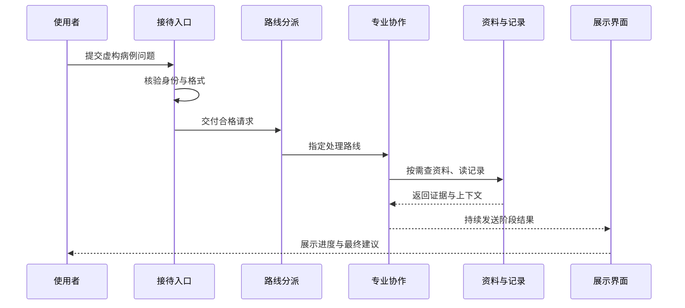

# Part 00：开始这里——先在脑中放一张地图

## 学习目标

读完本页，你应该能够：

1. 用一句人话说明这个系统在帮助谁、完成什么；
2. 不看源码画出一次请求的六站旅程；
3. 区分“用户看见的现象”和“工程师需要追踪的过程”；
4. 找到第一批源码入口，但不急着钻进实现细节；
5. 明确原型的医疗边界与本章之后的学习顺序。

## 1. 第一次接手项目，最容易卡在哪里？

设想你周一接班，前任只留下一句话：“这个系统能根据病例给出建议。”你打开目录，看到很多文件夹；启动页面，又看到内容不断出现。此时最危险的做法，是随便挑一个文件从第一行读到最后一行。

你真正缺的不是更多细节，而是一张地图：

- 谁发起请求？
- 谁接住请求？
- 谁决定下一站？
- 谁完成不同工作？
- 中间信息放在哪里？
- 结果怎样回到用户？

先回答这六个问题，后面的名词才有位置可放。

## 2. 用什么生活场景建立直觉？

把它想成一次“带交接记录的联合门诊”：

1. **来访者递交说明**：描述当前问题；
2. **前台验单**：检查身份和内容是否合规；
3. **分诊决定路线**：判断先进入哪个专业环节；
4. **多个岗位接力**：前一位的产物成为后一位的依据；
5. **资料室和交接本辅助**：需要时查材料，多轮时接续上下文；
6. **叫号屏持续更新**：每完成一段，就让来访者看到进展。

这个类比的重点不是把软件假装成医院，而是理解两个工程事实：**工作有顺序，信息要交接。**

## 3. 一次请求的六站地图



如果更习惯纯文本，可以记成：

```text
提问者 → 门口检查 → 分派路线 → 专业接力 → 查资料/接历史 → 持续展示
```

图中每个方框都是一种职责，不一定只对应一个文件。后续阅读时，我们会把职责逐步贴到实现上。

## 4. 地图怎样落到 PsyConsult 源码？

现在才进入项目名称。PsyConsult 是一个精神科临床决策支持（Clinical Decision Support，简称 **CDS**）原型。CDS 的意思是“为专业决策提供信息支持”，责任主体仍是临床专业人员。

六站地图对应到代码，大致如下：

| 地图上的一站 | 项目中的入口 | 此时只看什么 |
|---|---|---|
| 提问与展示 | `front/clinical_cds/src/App.vue` | 请求怎样发出、返回怎样显示 |
| 门口检查 | `app/router/chat.py` | 请求模型、鉴权与输入校验 |
| 串联过程 | `app/service/chat_service.py` | 缓存、推理和持续输出怎样接起来 |
| 路线分派 | `agent/agents/orchestrator.py` | 怎样判断从哪个专业环节开始 |
| 专业接力 | `agent/agents/` | 诊断、治疗、药物审查各自负责什么 |
| 状态与流程 | `agent/core/workflow/graph_manager.py` | 节点怎样连接、会话怎样恢复 |
| 资料与记录 | `agent/tools/`、`agent/core/memory/` | 怎样查外部资料、怎样保留长期事实 |

先做一个克制的动作：打开这些路径，确认它们存在，看看文件名和顶层定义，然后停下。此刻的目标是定位，不是逐行理解。

## 5. 用户看到的“流式返回”是什么？

流式返回是“结果分段到达”，而不是等所有步骤结束后一次性出现。项目通过 **SSE**（Server-Sent Events，服务器发送事件）把服务器进度持续推给页面。你可以把它理解为只有一个方向的广播：服务器不断发，浏览器不断收。

```text
传统响应：请求 ───────────────→ 完整结果
流式响应：请求 ─→ 阶段A ─→ 阶段B ─→ 文本片段 ─→ 完成
```

这会带来一个阅读提醒：不要只搜索“最终答案在哪里 return”。还要追踪事件如何产生、包装、传输和结束。

## 6. 多轮对话为什么不会每次都从零开始？

会话需要一本“交接本”。PsyConsult 使用 `session_id` 标识一次连续会话，并把它映射为工作流的 `thread_id`。工作流状态可保存到 Redis（高速键值状态服务）的 Checkpoint；**Checkpoint** 就是某个时刻的状态快照，供下一轮恢复。

当 Redis 不可用时，系统按设计应退化为无状态运行：当前轮仍可推理，但无法依赖已保存的多轮上下文。这里先记住取舍：**增强能力可以暂时缺席，主流程尽量不要被拖垮。**

## 7. 三种“记住”为什么不能混为一谈？

项目里至少有三类需求：

- **接着聊**：保存同一会话的状态；
- **以后想起重要事实**：提取临床要点形成长期记忆；
- **相似问题少算一次**：复用曾经得到的答案。

在实现上，长期事实和相似答案都可能借助 Milvus（按向量相似度搜索的数据服务），但会进入不同集合、服务不同目的。

它们看似都叫“记住”，生命周期和用途却不同。后续 `part07-memory-cache` 会专门拆解。现在只要能问出“这是为连续性、长期事实，还是性能服务？”就足够。

## 8. 专业角色为什么不是越多越好？

把任务拆给多个角色，是为了让职责、输入和输出更清楚，而不是为了让系统显得复杂。当前主链条围绕三类专业工作展开：鉴别诊断、治疗建议、药物相互作用审查；前面还有一个负责判断入口的 orchestrator（编排者/路由者）。

角色拆分的收益是可观察、可替换；成本是交接、延迟和状态复杂度。以后评价任何新增角色，都要问：**它是否拥有独立职责和可验证产物？** 如果没有，拆分可能只是增加包装。

## 9. 第一轮源码阅读应该留下什么？

不要留下几十页抄录，只留下下面这张卡片：

```text
用户输入：________________
HTTP 入口：_______________
流程入口：________________
分派位置：________________
状态载体：________________
输出方式：________________
失败降级：________________
我还不懂：________________
```

填写时允许写“不确定”。不确定不是失败，它告诉你下一部分该找什么证据。

## 10. 现在必须守住哪条边界？

PsyConsult 是原型，不是医疗器械，也不替代医生。所有学习实验只使用虚构或脱敏数据。对于自伤/他伤风险、意识障碍、严重不良反应等紧急情况，应进入当地急救或危机干预流程，不能等待模型建议。

工程上同样要守边界：密钥不进入仓库，患者信息不进入示例、日志或截图，模型输出必须经过专业复核。

---

## 面试背板（30–60 秒）

> 我理解 PsyConsult 时先不从框架入手，而是追一条请求链：页面提交虚构病例，接口层做鉴权和校验，服务层串联缓存与推理，编排者选择入口，诊断、治疗和药物审查角色接力，状态与外部资料提供上下文，结果通过服务器发送事件持续回到页面。这个设计的重点是职责清晰、过程可观察，并在 Redis 或 Milvus 等增强服务不可用时尽量优雅降级。它是临床决策支持原型，最终决策仍需专业人员负责。

## 常见误解

1. **误解：目录多，就应该逐个目录顺序读。** 纠正：先按一条请求建立跨目录链路。
2. **误解：持续出现文字只是页面动画。** 纠正：背后是服务器分段发送的真实事件过程。
3. **误解：多角色一定比单角色先进。** 纠正：只有职责可分、产物可验证时，拆分才有价值。
4. **误解：Redis 不可用就必然不能回答。** 纠正：按项目设计，它主要影响有状态能力，主推理应尝试无状态降级。
5. **误解：原型建议可以直接用于诊疗。** 纠正：它只提供辅助信息，必须由专业人员复核。

## 自测

1. 不看上文，画出一次请求的六站旅程。
2. `app/` 和 `agent/` 的职责有什么不同？各用一句话回答。
3. 为什么不能只看最终返回文本来理解系统？
4. 同一会话的“接着聊”与相似问题的“复用答案”有什么不同？
5. 外部状态服务不可用时，理想的降级行为是什么？
6. 新增一个专业角色前，你会先问哪两个问题？

如果第 1、2 题答不顺，重画本页全景图；如果第 3–6 题答不顺，不要硬背，带着问题进入后续章节。

## 前后导航

- 上一页：[学习指南首页](../README.md)
- 下一页：[路线图：把地图变成每日行动](roadmap.md)
- 随手查询：[术语表](glossary.md)
- 主线起点：[Part 01 · 背景与边界](../part01-background/)
