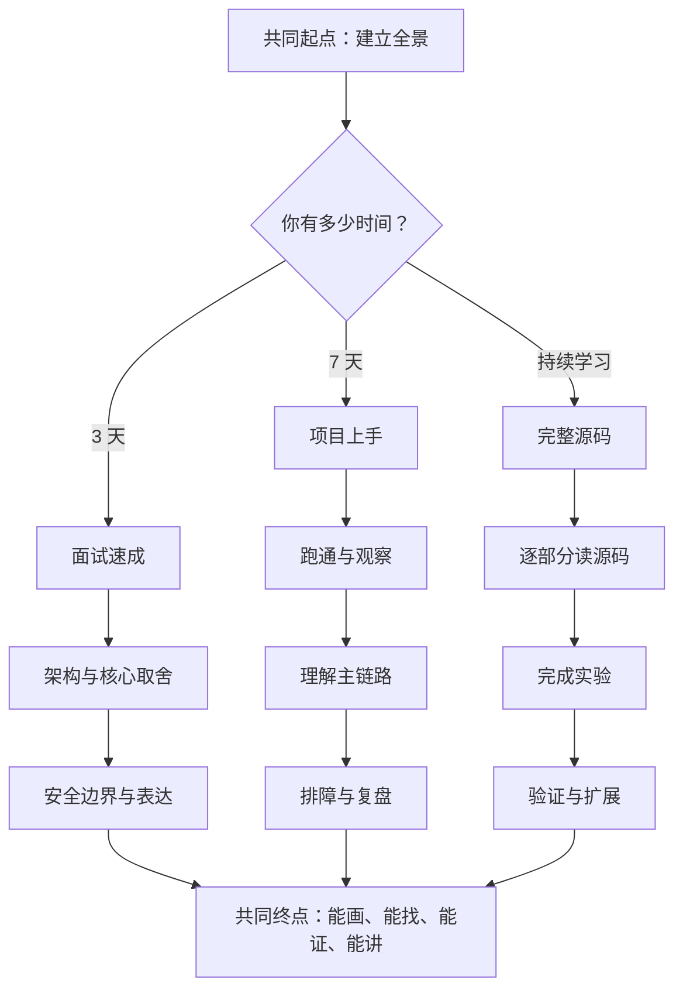

# 路线图：把“想学会”变成每日行动

## 学习目标

读完本页，你应该能够：

1. 根据可用时间选择 3 天、7 天或完整源码路线；
2. 为每个学习阶段定义一个看得见的交付物；
3. 用“现象—解释—证据—复述”判断是否真正掌握；
4. 知道何时继续前进，何时回头补基础；
5. 在不依赖旧章节的情况下，沿全套新目录完成学习。

## 1. 为什么“有空就学”通常会失败？

想象你准备从城市一端去另一端，却只说“我沿路看看”。第一天可能在起点附近逛很久，第二天又被一条小巷吸引，最后拍了很多照片，却没到终点。

源码学习也一样：没有时间盒，就会在陌生概念上无限停留；没有交付物，就会把“看过”误当成“会了”；没有检查点，就不知道自己偏离了主线。

路线图的作用不是催进度，而是帮你回答三个问题：**今天解决什么？留下什么？怎样证明？**

## 2. 用什么类比安排学习节奏？

把学习当作学习驾驶，而不是背汽车说明书：

- **看路线**：先知道起点、终点和关键路口；
- **坐副驾**：观察一次完整过程；
- **短途上路**：亲自完成最小闭环；
- **打开机盖**：理解关键部件如何协作；
- **模拟故障**：练习在安全环境中定位问题；
- **独立讲解**：能向下一位驾驶者说明操作与风险。

每个阶段都需要“动手证据”。只有阅读时产生的熟悉感，不等于可以独立操作。

## 3. 三条路线怎样汇入同一个终点？



三条路线不是三个水平等级，而是三种时间预算。短路线可以少学细节，不能省略事实核验与安全边界。

## 4. 路线怎样落到 PsyConsult 项目？

从这里开始使用项目名和代码入口。所有路线都围绕同一条可观察链路：

```text
front/clinical_cds/src/App.vue
  → app/router/chat.py
  → app/service/chat_service.py
  → agent/core/workflow/graph_manager.py
  → agent/agents/
  → Redis / Milvus / Neo4j（按需参与）
```

这条链路分别覆盖页面、API（程序之间按约定交换请求和结果的入口）、HTTP（浏览器与服务器交换请求和响应的规则）、SSE（服务器沿连接持续发送事件）流式服务、LangGraph（用节点、连线和状态组织任务的工作流库）、多 Agent（多个程序角色分工协作），以及 Redis（高速状态存储）、Milvus（向量检索服务）、Neo4j（关系图数据服务）等增强能力。第一次遇到这些词不必全记：把它们先当成不同岗位，后续再逐个拆开。

## 5. 3 天面试速成路线

**适合：** 一周内要面试、答辩或做项目介绍，已有基本 Web 与 Python 阅读能力。

### 第 1 天：讲清问题与全景

- 阅读：`part00-start-here`、`part01-background`、`part03-architecture`；
- 定位：页面入口、请求路由、工作流入口；
- 产物：手画一张请求链路图；
- 验收：不看文档，用 60 秒讲清“为谁解决什么问题，以及不解决什么”。

### 第 2 天：讲清核心机制与取舍

- 阅读：`part04-langgraph`、`part05-multi-agent`、`part07-memory-cache`；
- 定位：`AgentState`（节点共享的结构化状态）、路由角色、三个领域角色、Checkpoint（可恢复的工作流状态快照）；
- 产物：一张“状态—节点—角色—存储”关系图；
- 验收：回答“为什么用图编排”“为什么拆角色”“外部服务失败怎么办”。

### 第 3 天：讲清工程闭环

- 阅读：`part08-api-frontend`、`part09-security-troubleshooting`、`part11-interview`；
- 定位：SSE 事件、鉴权、输出净化、测试入口；
- 产物：30 秒、60 秒、5 分钟三版项目介绍；
- 验收：每个设计结论至少能给出一个文件、日志或测试证据。

**不要做：** 为追求“面试覆盖率”背诵所有库的定义。面试官更关心你为何这样设计、如何验证、知道哪些限制。

## 6. 7 天上手路线

**适合：** 即将维护仓库，希望一周内能运行、定位和完成小改动。

| 天数 | 当天只解决的问题 | 学习部分 | 必交产物 |
|---:|---|---|---|
| Day 1 | 系统解决什么，边界在哪里？ | `part00`、`part01` | 一页全景与风险边界笔记 |
| Day 2 | 怎样跑通最短闭环？ | `part02` | 命令、输出、日志组成的运行记录 |
| Day 3 | 一次请求经过哪里？ | `part03`、`part08` | 从页面到事件结束的调用链 |
| Day 4 | 任务怎样分支并交接？ | `part04`、`part05` | 节点、边、角色、状态四列表 |
| Day 5 | 资料、历史和复用如何区分？ | `part06`、`part07` | 知识/记忆/缓存对比表 |
| Day 6 | 失败怎样定位，边界怎样守住？ | `part09` | 一张服务降级与排障矩阵 |
| Day 7 | 能否安全完成一次小改造？ | `part10`、`part11` | 变更、验证结果、60 秒复盘 |

每天建议使用 `45 分钟阅读 + 45 分钟源码定位 + 30 分钟实验/复述`。如果只有一小时，优先保留源码定位和复述，减少扩展阅读。

## 7. 完整源码路线

**适合：** 需要长期维护、做架构评审或基于此原型继续扩展。

### 阶段 A：建立可运行基线

顺序：`part00 → part01 → part02`

完成标准：

- 能说明临床决策支持的责任边界；
- 使用虚构数据完成 CLI、API 或页面中的至少一条闭环；
- 记录环境、命令和结果，让别人可以复现。

### 阶段 B：拆解核心推理

顺序：`part03 → part04 → part05`

完成标准：

- 从入口追到 `AgentGraphManager`；
- 解释 `AgentState` 怎样在节点间传递；
- 画出 orchestrator 到 diagnosis、treatment、drug review 的路线；
- 指出分支的收益与多角色交接成本。

### 阶段 C：理解外部能力

顺序：`part06 → part07`

完成标准：

- 区分 Milvus 中的检索资料、长期记忆和语义缓存用途；
- 说明 Neo4j 知识图谱适合表达什么关系；
- 解释 `session_id → thread_id` 与 Redis Checkpoint；
- 知道 Redis/Milvus 不可用时哪些能力应跳过。

### 阶段 D：贯通产品链路

顺序：`part08 → part09`

完成标准：

- 追踪 `POST /api/chat` 到 SSE 完成事件；
- 解释 Bearer Token、`X-User-Id`、输入校验和 DOMPurify 的职责；
- 能根据 HTTP 状态、SSE 内容、容器状态和后端日志定位故障层。

### 阶段 E：用实验闭环

顺序：`part10 → part11`

完成标准：

- 完成一个小而可回滚的改造；
- 运行针对性测试、语法检查或前端构建；
- 用“问题—方案—取舍—证据—下一步”复盘；
- 能分别用 30 秒、60 秒和 5 分钟介绍项目。

## 8. 全套目录怎样导航？

| 顺序 | 入口 | 唯一核心问题 |
|---:|---|---|
| 00 | [开始这里](index.md) | 脑中先放哪张地图？ |
| 00A | [路线图](roadmap.md) | 时间怎样换成学习产物？ |
| 00B | [术语表](glossary.md) | 陌生词怎样翻译成人话？ |
| 01 | [背景与边界](../part01-background/) | 为什么做，不能替谁做决定？ |
| 02 | [第一次运行](../part02-quickstart/) | 怎样跑通最短闭环？ |
| 03 | [总体架构](../part03-architecture/) | 请求经过哪些层？ |
| 04 | [状态图编排](../part04-langgraph/) | 分支与状态怎样组织？ |
| 05 | [多角色协作](../part05-multi-agent/) | 角色怎样分工与交接？ |
| 06 | [知识与工具](../part06-knowledge-tools/) | 不该猜的内容怎样查？ |
| 07 | [记忆与缓存](../part07-memory-cache/) | 历史和重复问题怎样处理？ |
| 08 | [接口与前端](../part08-api-frontend/) | 进度怎样持续显示？ |
| 09 | [安全与排障](../part09-security-troubleshooting/) | 怎样防错并定位失败？ |
| 10 | [动手实验](../part10-labs/) | 怎样安全地改一次？ |
| 11 | [面试与答辩](../part11-interview/) | 怎样把证据讲成故事？ |

## 9. 卡住时应该继续还是回头？

使用“三问检查点”：

1. **我能画出来吗？** 不能，就回到本主题的全景图；
2. **我能在项目中找到吗？** 不能，就回到源码入口和搜索方法；
3. **我能用证据解释吗？** 不能，就运行最小实验或查看测试。

同一个点卡住 30 分钟仍无进展时，记录“已知、未知、尝试、现象”，然后暂时前进。完整地图建立后，许多局部问题会自然获得上下文。

## 10. 每阶段用什么证据结课？

优先级从高到低：

1. 可重复的测试或构建结果；
2. 能对应输入与输出的运行日志；
3. 带文件与符号位置的源码证据；
4. 自己画的图与口头复述；
5. 纯粹的“我看懂了”。

最后一项不能单独作为结课证据。

---

## 面试背板（30–60 秒）

> 我学习 PsyConsult 时会按可交付成果推进，而不是按技术名词推进。先建立请求全景并跑通基线，再拆状态图和多角色协作，然后区分知识工具、会话状态、长期记忆与语义缓存，最后贯通接口、流式页面、安全和降级。我为每阶段保留源码位置、日志或测试证据。这样既能在 3 天内形成面试表达，也能在完整路线中完成可验证的小改造。

## 常见误解

1. **误解：3 天路线就是只背面试题。** 纠正：它压缩范围，不取消源码与证据。
2. **误解：必须学完所有概念才能运行。** 纠正：先跑最短闭环，概念会因真实问题获得意义。
3. **误解：完整路线必须逐行读完所有文件。** 纠正：围绕请求链、状态变化和关键边界做选择性深读。
4. **误解：计划落后就该同时补很多章节。** 纠正：一次只解决一个核心问题，并保留可验收产物。
5. **误解：能复述文档就是掌握。** 纠正：还必须能在代码或运行行为中找到证据。

## 自测

- [ ] 我已选择一条路线，并明确开始与结束日期。
- [ ] 我能说出所选路线每天或每阶段的唯一核心问题。
- [ ] 每个阶段都有图、记录、测试结果或口头复述中的至少一项产物。
- [ ] 我知道主线所有目录，从 `part01-background` 到 `part11-interview`。
- [ ] 我能解释为什么短路线也不能跳过安全边界。
- [ ] 我知道卡住时用“能画、能找、能证”判断下一步。

## 前后导航

- 上一页：[开始这里](index.md)
- 下一页：[术语表：把陌生词翻译成人话](glossary.md)
- 返回总览：[学习指南首页](../README.md)
- 进入主线：[Part 01 · 背景与边界](../part01-background/)
