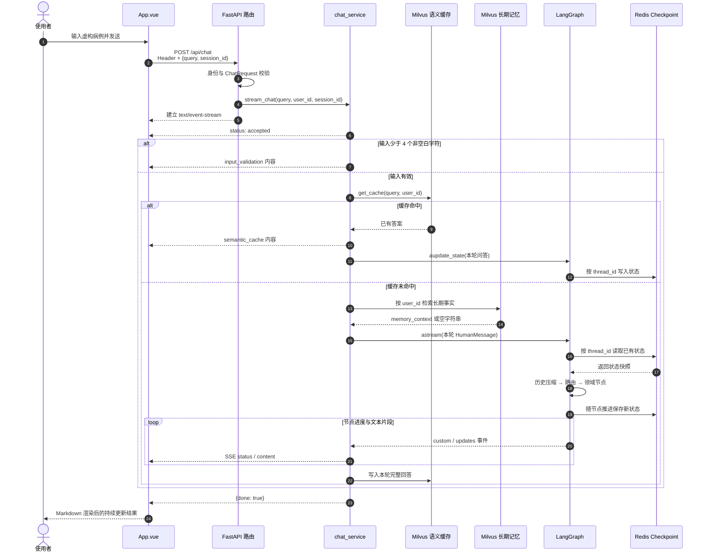

# 03.2｜核心运行闭环：一条聊天请求如何穿过全系统

> **本节定位**：你已经知道系统分为 `front/`、`app/`、`agent/` 三层；现在沿一条真实请求把三层连起来，建立后续阅读 LangGraph、多 Agent、记忆、缓存和 SSE 的共同坐标系。

## 版本与证据边界

本文按 **2026-08-29 的当前工作树**核验，Git 基线为 `1ebae7d`，工作树含尚未提交的文档重构，因此它不是一个可复现的纯提交快照。源码更新后，应优先按文中的“相对路径 + 符号名”重新定位，不要只依赖行号。

文中使用三种标记：

- **[源码事实]**：可以由当前仓库中的源码或测试直接证明；
- **[运行验证]**：已用命令在当前环境观察到结果；
- **[待验证]**：源码能说明设计意图，但本文尚未用真实 Redis、Milvus、Neo4j 或模型请求证明运行表现。

**[运行验证]** 2026-08-29 在 Windows、Python 3.12.10、Node 24.18.0 下执行：系统 Python 的 `compileall` 通过；仓库 `.venv` 的应用导入通过，pytest 为 `11 passed, 1 warning`；前端 `type-check` 与生产构建通过；本文 8 个相对链接均存在，36 个 Markdown 围栏标记组成 18 对。系统 Python 本身缺少 `langchain_openai`，所以直接使用系统解释器时，应用导入和 pytest 会在收集阶段失败。未启动容器，也未发起真实模型或 SSE 请求。

本文只讲软件工程学习。示例必须使用虚构或脱敏数据；系统输出不构成诊断、处方或治疗依据。

## 前置知识

开始前只需知道：

1. HTTP 请求由 Header 和 Body 组成；
2. Python `async` 函数可以逐步产生结果；
3. Vue 的响应式状态变化会更新页面。

不要求先学完 LangGraph、Milvus 或 Redis。遇到这些名字时，先记住它们在本次请求中的岗位。

## 学习目标

完成本节后，你应该能够：

- 不看文档画出 `App.vue → FastAPI → chat_service → LangGraph → SSE → App.vue` 主路径；
- 区分短输入、语义缓存命中、缓存未命中三条服务路径；
- 解释控制流、数据流和状态流分别由什么承载；
- 比较 Redis Checkpoint、Milvus 长期记忆和 Milvus 语义缓存；
- 从一次失败的 HTTP 状态码或中断的 SSE 流定位到对应层；
- 运行静态检查、后端测试和前端构建，并说明它们没有验证什么。

## 30 秒心智模型

把一次请求看成一次“有档案的流式会诊”：

1. **前端打包**：页面发送当前问题、会话 ID 和调用者标识；
2. **API 守门**：FastAPI 检查身份格式、可选 Bearer Token 和请求体；
3. **服务分流**：过短问题本地返回，相似问题复用缓存，其余问题进入推理图；
4. **图内协作**：协调者选择入口，诊断、治疗、药审节点通过共享状态交接；
5. **持续回传**：后端把节点进度和文本片段转换为 SSE，页面边接收边显示；
6. **沉淀状态**：Redis 保存会话状态，Milvus 分别保存长期事实和可复用答案。

这只是导航模型。真实实现中，三类存储并不总是可用，失败后的影响也不同。

## 1. 先看完整主路径

下面的时序图以“请求合法、缓存未命中、外部依赖可用”为主路径，同时保留两个最重要的快分支。



从 `App.vue` 开始顺时针读。主路径是“校验 → 缓存检查 → 长期事实 → 图执行 → SSE”；最重要的分支是缓存命中会跳过推理，但会尝试补写 Checkpoint。图中省略了各 Agent 的工具细节和长期记忆的后台提取，它们会在后文补上。

## 2. 第一站：前端如何发起并接住请求

### 2.1 请求契约

**[源码事实]** `front/clinical_cds/src/App.vue` 的 `sendQuery()` 完成请求发送。其网络契约可以缩写为：

```http
POST /api/chat
Content-Type: application/json
X-User-Id: doctor_demo
Authorization: Bearer <VITE_API_AUTH_TOKEN，仅配置后发送>

{
  "query": "虚构患者近两周情绪低落并伴有失眠，请给出评估思路",
  "session_id": "session_..."
}
```

发送前，函数会快照 `currentSessionId` 为 `requestSessionId`，并先向该会话插入用户消息和一个空助手消息。即使流式响应期间使用者切换到别的会话，后续片段仍写回原会话。

当前 UI 使用全局 `isThinking` 阻止重复提交，所以一次只能有一个前端请求处于思考状态。这是界面策略，不是后端并发能力证明。

### 2.2 SSE 消费

`sendQuery()` 不调用 `response.json()`，而是使用：

```text
response.body.getReader()
  → TextDecoder(stream=true)
  → buffer 按换行切分
  → 只处理 data: 开头的行
  → JSON.parse
  → 更新 status 或追加 content
```

这里的 `buffer` 很关键：它保留**尚未出现换行的尾段**，从而处理一个 JSON 行被网络拆成多个二进制块的情况。当前实现不是通用 SSE 解析器：只接受 `data: ` 开头的单行事件；已经形成完整行但 JSON 非法时会静默丢弃，流结束时也不会再次处理残余 `buffer`。它与当前后端固定输出的 `data: JSON\n\n` 契约配套使用。

### 2.3 输出净化

**[源码事实]** `renderMarkdown()` 先用 `marked.parse()` 生成 HTML，再用 `DOMPurify.sanitize()` 净化：

```ts
const html = marked.parse(text, { breaks: true, gfm: true }) as string
return DOMPurify.sanitize(html)
```

这能降低 DOM XSS 风险，但不能判断医学内容是否正确，也不能阻止模型层面的 prompt injection。不要把“HTML 已净化”误解为“回答已通过临床审核”。

### 源码锚点

- `front/clinical_cds/src/App.vue::sendQuery`
- `front/clinical_cds/src/App.vue::renderMarkdown`
- `front/clinical_cds/src/App.vue::statusLabel`

## 3. 第二站：API 门禁发生在流建立之前

路由入口是 `app/router/chat.py::chat_endpoint`。`app/app_main.py` 以 `/api` 前缀注册路由，所以完整地址是 `POST /api/chat`。

### 3.1 两组校验

**身份与 Header 校验**由 `require_chat_identity()` 完成：

- `X-User-Id` 始终必填，并匹配 `^[A-Za-z0-9_.:-]{1,128}$`；
- 仅当后端配置了 `API_AUTH_TOKEN`，才强制 Bearer Token；
- Token 使用 `secrets.compare_digest()` 比较。

**Body 校验**由 `app/schemas/chat.py::ChatRequest` 完成：

- `query` 原始长度为 1–4000，去除首尾空白后不能是空字符串；
- `session_id` 默认是 `default_session`，并使用与 ID 相同的白名单格式。

### 3.2 为什么要区分 HTTP 错误和 SSE 业务提示

| 情况 | 发生位置 | 表现 | 是否已进入 `stream_chat()` |
|---|---|---|---|
| Bearer 缺失或错误 | `require_chat_identity` | HTTP 401 | 否 |
| `X-User-Id` 缺失或非法 | `require_chat_identity` | HTTP 400 | 否 |
| Body 不符合 `ChatRequest` | Pydantic/FastAPI | HTTP 422 | 否 |
| 少于 4 个非空白字符 | `stream_chat` | HTTP 200 + SSE 提示 | 是 |

这一区分直接决定排错入口：401/400/422 应先看请求契约；已经收到 `accepted` 后才出现的问题，应继续检查服务层和流式执行。

> **[源码事实/安全缺口]** `X-User-Id` 是调用者自报的字符串，共享 Bearer Token 也不等于登录用户身份。应用层没有校验 `session_id` 归属，也没有把认证主体组合进 `thread_id` 或命名空间；省略该字段时还会使用公共默认值 `default_session`。**[待验证]** 当前 `AsyncRedisSaver` 是否会把额外的 `configurable.user_id` 纳入底层键空间。生产系统不能依赖这一未知行为，应显式把已认证主体绑定到会话。

### 源码锚点

- `app/app_main.py::lifespan`
- `app/router/chat.py::require_chat_identity`
- `app/router/chat.py::chat_endpoint`
- `app/schemas/chat.py::ChatRequest`

## 4. 第三站：`stream_chat()` 的三条路径

`app/service/chat_service.py::stream_chat` 是整条闭环的服务层控制器。无论后面走哪条路径，它都会先发送：

```text
data: {"status":"accepted","content":"已接收病例，开始分析..."}


```

随后构造 LangGraph 配置：

```python
config = {
    "configurable": {
        "thread_id": session_id,
        "user_id": user_id,
    }
}
```

### 4.1 路径 A：短输入，本地结束

`_is_insufficient_query()` 会去掉全部空白；剩余字符少于 4 个时：

1. 不查询语义缓存；
2. 不运行 LangGraph；
3. 返回 `input_validation` 提示；
4. 不增加长期记忆提取的有效轮次计数；
5. 最后仍发送 `{"done": true}`。

该分支用于避免把明显不足的输入交给高成本推理，并不替代临床信息完整性判断。

### 4.2 路径 B：语义缓存命中，跳过推理

输入有效后，服务先调用 `semantic_cache.get_cache(query, user_id)`。命中时：

1. 直接发送缓存答案；
2. 不运行领域 Agent；
3. 若 Checkpoint 可用，调用 `_record_cache_hit_turn()`，通过 `graph.aupdate_state()` 把本轮 `HumanMessage + AIMessage` 补入会话；
4. 若长期记忆与提取模型可用，本轮仍增加进程内 `(user_id, session_id)` 计数，并可能在每 5 次有效请求时**调度一次提取尝试**。

为什么必须补写状态？如果缓存回答只显示在页面，却不进入 Checkpoint，下一轮恢复历史时就会出现对话断层。调度提取不等于事实已成功写入：后台任务还依赖可读取的状态快照、提取模型与 Milvus。

### 4.3 路径 C：缓存未命中，进入完整图

未命中时按以下顺序执行：

1. `_extract_long_term_context(user_id, query)` 从长期记忆取回相关事实；
2. 初始 `AgentState` 只放本轮新 `HumanMessage`，不由浏览器回传整段历史；
3. `graph.astream(..., stream_mode=["updates", "custom"])` 运行图；
4. 服务把内部事件翻译成网络 SSE；
5. `full_response` 累积各领域节点输出；
6. 若语义缓存可用且回答非空，尝试写入缓存；
7. 正常结束后发送 `done`。

近期历史由 Checkpoint 按 `thread_id` 恢复，并通过 `AgentState.messages` 的 `add_messages` reducer 与本轮消息合并。

### 4.4 三路径副作用对照

| 路径 | 运行 Agent | 读语义缓存 | 读长期记忆 | 写 Checkpoint | 写语义缓存 | 增加长期提取调度计数 |
|---|---:|---:|---:|---:|---:|---:|
| 短输入 | 否 | 否 | 否 | 否 | 否 | 否 |
| 缓存命中 | 否 | 是 | 否 | 可用时补写 | 否 | 依赖长期记忆与提取模型可用 |
| 缓存未命中 | 是 | 是 | 是 | Checkpoint 可用时由图保存 | 回答非空且缓存可用时 | 依赖长期记忆与提取模型可用 |

### 源码锚点

- `app/service/chat_service.py::_is_insufficient_query`
- `app/service/chat_service.py::_record_cache_hit_turn`
- `app/service/chat_service.py::_extract_long_term_context`
- `app/service/chat_service.py::stream_chat`
- `app/service/chat_service.py::_extract_long_term_memory`

## 5. 第四站：LangGraph 如何完成角色交接

### 5.1 控制流不是“每次都跑全部节点”

**[源码事实]** `AgentGraphManager.build_graph()` 定义的图为：

```text
Checkpoint 可用：START → history_compression → orchestrator
Checkpoint 不可用：START ───────────────────→ orchestrator

orchestrator
  ├─→ differential_diagnosis → treatment_recommend → drug_interaction → END
  ├─→ treatment_recommend ─────────────────────────→ drug_interaction → END
  └─→ drug_interaction ───────────────────────────────────────────────→ END
```

协调者只决定**从哪一个领域节点进入**。一旦进入，后续边是固定的：从诊断开始会继续治疗和药审；从治疗开始仍会继续药审；从药审开始则直接结束。

### 5.2 三种“流”不要混在一起

| 观察角度 | 回答的问题 | 项目中的载体 |
|---|---|---|
| 控制流 | 下一步执行谁？ | 图的边、`next_agent`、`_route_condition()` |
| 数据流 | 本轮输入、记忆和工具结果怎样传递？ | Header/Body、`memory_context`、消息和 chunk |
| 状态流 | 跨节点、跨轮次的信息怎样保留？ | `AgentState`、`add_messages`、Checkpoint、缓存补写 |

### 5.3 `AgentState` 是交接单

`agent/core/workflow/state.py::AgentState` 的关键字段包括：

- `messages`：消息列表，使用 `add_messages` reducer；
- `next_agent`：协调者选择的入口；
- `user_id`、`session_id`：请求上下文；
- `memory_context`：本轮检索出的长期事实；
- `metadata`：附加路由或审查信息。

领域节点读取已有消息，调用自己的工具和模型，最后追加 `AIMessage`。后一个节点因此能看到前一个节点的输出，而不是依赖隐藏的全局变量。

### 5.4 历史压缩只在 Checkpoint 模式存在

当 Checkpoint 可用时，图入口增加 `history_compression`：

- 消息数 `<=16`：不更新状态；
- 消息数 `>16`：尝试摘要较旧消息，保留最近 8 条；
- 消息缺少 ID、旧内容为空或摘要模型抛出异常：返回空更新，保留原历史继续执行；
- 模型成功返回空字符串：当前代码没有单独防护，仍会用空摘要替换旧消息，这是需要补测和修复的边界。

前一类情况体现“失败后保留更多上下文”的降级，而不是“摘要失败就清空历史”。无 Checkpoint 时，图本身不积累跨轮历史，所以构图时不会加入压缩节点。

### 源码锚点

- `agent/core/workflow/state.py::AgentState`
- `agent/core/workflow/graph_manager.py::AgentGraphManager.build_graph`
- `agent/core/workflow/graph_manager.py::AgentGraphManager._compress_history`
- `agent/agents/orchestrator.py::OrchestratorAgent.route`
- `agent/agents/diagnosis_agent.py::DiagnosisAgentNode.__call__`
- `agent/agents/treatment_agent.py::TreatmentAgentNode.__call__`
- `agent/agents/drug_review_agent.py::DrugReviewAgentNode.__call__`

## 6. 第五站：三类状态为何不能合并理解

PsyConsult 的“记住”至少有三种含义：记住会话过程、记住用户事实、记住相似问题答案。

| 能力 | 介质/集合 | 主要键或过滤条件 | 何时读取 | 何时写入 | 失败影响 |
|---|---|---|---|---|---|
| 会话状态 | Redis Checkpoint | `thread_id=session_id` | 图执行或缓存命中补写时 | 图节点推进或 `aupdate_state` | 图退化为无状态；不做历史压缩、缓存命中不补写；长期提取也缺少可靠会话快照 |
| 长期事实 | Milvus `long_term_memory` | `user_id` + 向量相似度 | 缓存未命中、进图之前 | 满足条件时每 5 次有效请求调度一次后台提取尝试 | `memory_context` 为空，主推理仍可继续 |
| 相似问答 | Milvus `qa_semantic_cache` | 用户/公共范围 + 问题相似度 | 有效输入进入服务后 | 完整推理得到非空答案后 | 当作 miss，继续完整推理 |

领域工具还会检索 `cloud_product_docs` 等知识数据。它回答“指南或标准里有什么”，不同于用户长期事实，也不同于整题答案缓存。

### 6.1 Redis Checkpoint

`create_redis_checkpointer()` 尝试创建 `AsyncRedisSaver`，配置 24 小时 TTL，并在读取时续期。依赖缺失、Redis 连接或初始化失败时返回 `None`，`build_graph(checkpointer=None)` 仍能构建无状态图。

**[源码事实/安全缺口]** 应用层把 `session_id` 直接作为 `thread_id`，没有校验会话归属，也没有构造“认证主体 + 会话”的复合命名空间；默认值还是 `default_session`。**[待验证]** 额外的 `configurable.user_id` 在当前 `AsyncRedisSaver` 版本中的底层键行为。真实系统应显式绑定已认证主体与会话，而不是等待底层实现碰巧隔离。

### 6.2 长期记忆

长期记忆按 `user_id` 查询。当长期记忆与提取模型均可用时，每个 Python 进程内的 `(user_id, session_id)` 每累计 5 次非短输入请求，服务会调度一次后台提取尝试。任务通过 `graph.aget_state(config)` 读取**当前 Checkpoint 快照**；该快照可能已经经过历史压缩，并不等于原始完整会话。任务再经 LLM 提取主诉、诊断、用药、量表等临床事实并尝试写入 Milvus。

计数器 `_turn_counters` 仅在当前 Python 进程内，服务重启后会归零。后台任务不阻塞本轮 `done`，失败只记录日志；无 Checkpoint 时没有可靠的跨轮快照，调度发生也不代表提取或写入成功。

### 6.3 语义缓存

缓存先查用户 exact，再查 public exact，最后才在“用户 + public”范围做向量检索。exact 分支按规范化问题文本匹配，直接返回 `distance=0.0`，不受 `0.08` 阈值影响；只有 `L1_SEMANTIC` 分支使用该阈值。它是性能优化，不应成为会话连续性的唯一来源，所以命中后仍要尝试补写 Checkpoint。

**[待验证]** 当前 Milvus 索引使用 COSINE，而语义分支以 `distance <= 0.08` 判断。依赖只声明开放下限版本；返回值究竟是“越小越近的距离”还是“越大越近的得分”，必须记录实际 PyMilvus 版本并用真实集合验证。

在线推理调用 `set_cache(..., user_id=user_id)`，默认写用户范围；`app/preload_cache.py` 不传 `user_id`，写 public 范围。public 内容可被其他用户命中，因此只能放经过审核、无患者数据的标准问答，不能用病例回答做公共预热。

### 源码锚点

- `agent/core/workflow/checkpointer.py::create_redis_checkpointer`
- `agent/core/memory/long_term.py::LongTermMemory`
- `agent/core/memory/memory_manager.py::MemoryManager`
- `app/infra/cache.py::SemanticCache.get_cache`
- `app/infra/cache.py::SemanticCache.set_cache`

## 7. 第六站：内部事件怎样变成页面内容

LangGraph 产生两类内部流，服务层再统一翻译为 SSE：

| LangGraph 输入事件 | 服务发出的 SSE | 前端行为 |
|---|---|---|
| `custom: event=start` | `status=agent_node_start` | 更新“正在执行某节点” |
| `custom: event=tool_call` | `status=agent_tool_call` | 显示工具调用进度 |
| `custom: event=tool_done` | `status=agent_tool_done` | 显示工具查询完成 |
| `custom: chunk` | `{agent, content}` | 按 Agent 标签追加正文 |
| `updates` | `status=agent_node_complete` | 更新节点完成状态 |
| 服务正常收尾 | `{done: true}` | 标记分析完成 |

`full_response` 只累加领域节点发出的 `chunk`。前端自行插入的 `### Agent 标签` 不会被写进语义缓存。

服务端约定 `{"done": true}` 表示正常结束。如果图或模型抛出未捕获异常，当前服务没有统一的结构化 `error` 帧，连接可能在没有 `done` 时结束。当前前端没有维护 `sawDone` 标志：干净 EOF 即使缺少终止帧也会退出读取循环，只有 HTTP 失败或读取抛异常才显示统一错误提示。因此日志是重要排错证据，“缺失 `done` 检测”也是明确的生产差距。

## 8. 错误、安全与降级矩阵

| 场景 | 当前行为 | 主流程是否继续 | 第一检查点 |
|---|---|---:|---|
| Bearer 缺失/错误（启用鉴权时） | HTTP 401 | 否 | `require_chat_identity`、前端环境变量 |
| `X-User-Id` 非法 | HTTP 400 | 否 | Header 格式 |
| Body 不合法 | HTTP 422 | 否 | `ChatRequest` 与请求 JSON |
| 输入少于 4 个非空白字符 | SSE 业务提示 + `done` | 以本地提示结束 | `_is_insufficient_query` |
| Redis 不可用 | 无状态图；缓存命中不补写；长期提取缺少可靠快照 | 主推理可尝试继续，但失去跨轮状态 | `create_redis_checkpointer` 日志 |
| Milvus 语义缓存不可用 | 当作 cache miss | 是 | `SemanticCache.initialize/get_cache` 日志 |
| Milvus 长期记忆不可用 | 注入空 `memory_context`，不调度提取 | 是 | `MemoryManager.initialize` 日志 |
| Milvus 领域 RAG 不可用 | 向量工具返回错误文本 | 图可能继续，但指南/ICD 检索已缺失；Agent 如何处理待运行验证 | `query_vector_db` 与 Agent 工具事件 |
| 历史摘要抛异常/缺少消息 ID | 保留完整历史 | 是 | `_compress_history` warning |
| 历史摘要返回空字符串 | 仍用空摘要替换旧历史 | 是，但可能丢失旧信息 | `_compress_history` 输出与状态快照 |
| 缓存写入失败 | 记录 warning | 是 | `set_cache` warning |
| 不同用户复用同一 `session_id` | 应用层无归属校验或复合线程键 | 存在状态串用风险 | Header、Body 与 Checkpoint 键 |
| 图或模型执行失败 | SSE 可能中途结束且无 `done` | 否 | 后端异常日志、最后一个 SSE 帧 |
| SSE 干净 EOF 但缺少 `done` | 当前前端可能当作普通结束 | 页面不一定报告失败 | `sendQuery` 读取循环 |
| 前端 Markdown 含危险 HTML | DOMPurify 净化后渲染 | 页面继续 | `renderMarkdown` |

### 不要夸大的五个安全结论

1. CORS 限制浏览器来源，但不是身份认证；
2. `VITE_API_AUTH_TOKEN` 会进入前端构建产物，不能当作终端用户看不到的秘密；
3. ID 格式校验不能证明调用者拥有该用户或会话，当前应用层也没有会话归属绑定；
4. public 语义缓存可跨用户命中，只能预热无患者数据且经过审核的内容；
5. DOMPurify 处理 HTML 风险，不负责临床正确性、越权访问或模型提示注入。

## 9. 最小验证 Lab

> **唯一主要增量**：不修改业务代码，只建立“命令 → 观察 → 定位”的闭环。以下命令按 Windows PowerShell 编写，所有病例均为虚构数据。

### 9.1 先确认环境，再运行门禁

先完成 [Part 02 · 第一次运行](../part02-quickstart/index.md) 的依赖准备。`agent/.env` 在干净克隆中不存在；导入应用前必须创建开发配置，并确保不提交真实密钥或患者数据。

在仓库根目录检查：

```powershell
python --version
node --version
Test-Path agent/.env
python -m pip show langchain-openai
```

Node 应满足 `front/clinical_cds/package.json` 中的 `^20.19.0 || >=22.12.0`。若包查询无结果，先按项目依赖说明安装 `agent/requirements.txt`；不要把“缺依赖”误判成业务测试失败。

环境就绪后，在仓库根目录执行：

```powershell
python -m compileall -q agent app
python -c "import app.app_main; print('ok')"
python -m pytest -q
```

前端门禁在 `front/clinical_cds/` 执行：

```powershell
npm run type-check
npm run build
```

文档自身的相对链接与围栏检查在仓库根目录执行：

```powershell
python -c "from pathlib import Path; import re,sys; p=Path(r'learn/part03-architecture/request-flow.md'); t=p.read_text(encoding='utf-8'); links=re.findall(r'\[[^]]+\]\(([^)#]+)(?:#[^)]+)?\)',t); missing=[x for x in links if not x.startswith(('http://','https://')) and not (p.parent/x).resolve().exists()]; fences=t.count(chr(96)*3); print(f'links={len(links)} missing={missing} fence_markers={fences}'); sys.exit(bool(missing) or fences%2)"
```

`npm run build` 内部会再次执行类型检查；这里先单独运行一次，是为了把类型错误与打包错误分开定位，并与仓库门禁约定保持一致。

预期观察：

- `compileall` 无输出且退出码为 0；
- 依赖和 `.env` 完整时，导入检查打印 `ok`；
- pytest 给出通过数量，测试路径来自根目录 `pytest.ini`；
- 前端类型检查和生产构建均成功，生成构建统计。

**[运行验证]** 本文写作环境中，系统 Python 的 `compileall` 通过；仓库 `.venv` 的应用导入通过，pytest 为 `11 passed, 1 warning`；前端类型检查和构建通过；8 个相对链接与 18 对 Markdown 围栏检查通过。系统 Python 仍缺少 `langchain_openai`，直接用它执行导入或 pytest 会失败。未启动外部服务，因此这些结果不能证明 Redis/Milvus/Neo4j 或真实推理通过。

### 9.2 启动依赖与后端

基础设施在 `docker/` 启动：

```powershell
docker compose up -d
docker compose ps
```

后端在仓库根目录启动：

```powershell
python -m uvicorn app.app_main:app --host 0.0.0.0 --port 5000 --reload
```

这是长运行命令，应放在单独终端。启动前确认 `agent/.env` 存在且不包含要提交的真实密钥。

### 9.3 短输入：先验证不依赖模型的分支

另开 PowerShell。后端从 `agent/.env` 读取 Token，不会自动把它导入这个新终端；若启用了鉴权，请把**与后端开发配置一致的测试值**显式赋给当前进程变量：

```powershell
# 仅在后端已启用 API_AUTH_TOKEN 时执行下一行；不要粘贴生产密钥
$env:API_AUTH_TOKEN = "<与 agent/.env 一致的开发测试值>"
$headers = @{ "X-User-Id" = "doctor_demo" }
if ($env:API_AUTH_TOKEN) { $headers["Authorization"] = "Bearer $env:API_AUTH_TOKEN" }
$body = @{ query = "失眠"; session_id = "learning_short_01" } | ConvertTo-Json
$response = Invoke-WebRequest -Uri "http://127.0.0.1:5000/api/chat" -Method Post -Headers $headers -ContentType "application/json" -Body $body
$response.Content
```

`Invoke-WebRequest` 在响应结束后输出完整 Content，适合核对最终帧顺序，但不能证明浏览器逐帧到达的实时性。

预期 Body 至少依次包含：

```text
"status": "accepted"
"agent": "input_validation"
"done": true
```

失败排查：

- 401：后端启用了 Token，但请求未带正确 Token；
- 400：`X-User-Id` 缺失或格式非法；
- 422：Body 字段、JSON 或 `session_id` 不合法；
- 无法连接：先确认 Uvicorn 终端和 5000 端口。

### 9.4 完整请求：观察分流与节点事件

```powershell
$body = @{
  query = "虚构患者近两周情绪低落、失眠、兴趣下降，请给出评估思路"
  session_id = "learning_flow_01"
} | ConvertTo-Json
$response = Invoke-WebRequest -Uri "http://127.0.0.1:5000/api/chat" -Method Post -Headers $headers -ContentType "application/json" -Body $body
$response.Content
```

缓存未命中时，稳定的外层顺序是：

```text
accepted
semantic_cache_check
memory_context_extract
agent_workflow_start
[实际执行节点的事件]
done
```

节点内部可出现 `agent_node_start`、0 到多次 `agent_tool_call/agent_tool_done`、0 到多次正文 `content`，以及节点 `agent_node_complete`。具体节点集合取决于 Checkpoint 是否可用和协调者路由；工具事件还取决于模型是否选择工具，不能把它们视为每次必现。

第二次发送相同问题可能进入 `semantic_cache` 快路径；是否命中取决于 Milvus 可用性、集合数据和相似度判断，因此不能把“第二次一定命中”作为固定预期。

### 9.5 交付物与验收清单

完成命令后，再提交三份不依赖运行环境的学习产物：

1. 合上正文，手绘“短输入 / 缓存命中 / 缓存未命中”三路径，并标出汇合点；
2. 任选完整请求，用三种颜色标注控制流、数据流和状态流；
3. 不看 §6，补全 Redis Checkpoint、长期记忆、语义缓存的键、读写时机和失败影响。

验收：

- [ ] 我能指出短输入为何不需要模型；
- [ ] 我能从响应中区分 HTTP 错误与 SSE 业务提示；
- [ ] 我能在日志中找到 `user_id`、`session_id` 和最后完成的步骤；
- [ ] 我能解释缓存命中后为何仍需要 `aupdate_state`；
- [ ] 我能说明测试通过仍未覆盖哪些外部依赖；
- [ ] 我完成了三份产物，并能不看文档复述主路径；
- [ ] 实验中没有使用真实患者数据，也没有提交 `.env`。

实验结束后，可在 `docker/` 目录停止容器而保留容器状态：

```powershell
docker compose stop
```

不要为了清理实验无提示地使用 `docker compose down`；本项目当前 Compose 未声明持久化卷，删除容器可能丢失本地数据。

### 教学实验与生产验证的差距

这个 Lab 只证明开发环境中的基本闭环。生产化还需要会话归属授权、限流与配额、审计、真实 SSE 中断测试、跨用户隔离测试、外部依赖故障注入、临床有效性评估和人工复核流程。

## 10. 源码证据地图

| ID | 结论 | 分类 | 路径 | 符号/命令 | 可信度与备注 |
|---|---|---|---|---|---|
| E-01 | 前端发送 Body/Header 并按行消费 SSE | 源码事实 | `front/clinical_cds/src/App.vue` | `sendQuery` | 高 |
| E-02 | Markdown 在渲染前经 DOMPurify 净化 | 源码事实 | `front/clinical_cds/src/App.vue` | `renderMarkdown` | 高 |
| E-03 | Header 身份门禁发生在流生成前 | 源码事实 | `app/router/chat.py` | `require_chat_identity`、`chat_endpoint` | 高 |
| E-04 | Query 和 Session 的协议约束由 Pydantic 定义 | 源码事实 | `app/schemas/chat.py` | `ChatRequest` | 高 |
| E-05 | 服务有短输入、缓存命中、完整推理三路径 | 源码事实 | `app/service/chat_service.py` | `stream_chat` | 高 |
| E-06 | 缓存命中会尝试补写 Checkpoint | 源码事实 | `app/service/chat_service.py` | `_record_cache_hit_turn` | 高 |
| E-07 | `session_id` 被用作 LangGraph `thread_id` | 源码事实 | `app/service/chat_service.py` | `stream_chat` 内 `config` | 高 |
| E-08 | 消息状态使用 `add_messages` reducer | 源码事实 | `agent/core/workflow/state.py` | `AgentState.messages` | 高 |
| E-09 | 协调者选入口，三个领域节点沿固定边继续 | 源码事实 | `agent/core/workflow/graph_manager.py` | `build_graph` | 高 |
| E-10 | 超过 16 条时尝试摘要并保留最近 8 条 | 源码事实 | `agent/core/workflow/graph_manager.py` | `_compress_history` | 高；仅 Checkpoint 模式 |
| E-11 | Redis 失败时返回 `None` 并构建无状态图 | 源码事实 | `agent/core/workflow/checkpointer.py` | `create_redis_checkpointer` | 高 |
| E-12 | 长期事实按用户检索，失败时空操作 | 源码事实 | `agent/core/memory/long_term.py` | `LongTermMemory` | 高 |
| E-13 | 满足条件时每 5 次有效请求调度长期提取尝试 | 源码事实 | `app/service/chat_service.py` | `EXTRACT_EVERY_N_TURNS`、`_extract_long_term_memory` | 高；计数不持久化，写入成功未保证 |
| E-14 | exact 与语义缓存按用户/公共范围查询 | 源码事实 | `app/infra/cache.py` | `SemanticCache.get_cache` | exact 分支高；COSINE 语义阈值方向待运行核验 |
| E-15 | 已有测试覆盖部分鉴权、输入和 SSE 首帧 | 测试事实/运行验证 | `app/test/` | `.venv\Scripts\python.exe -m pytest -q` | 2026-08-29：11 passed，1 warning |
| E-16 | Python 语法检查、应用导入和前端门禁通过 | 运行验证 | 仓库根目录与 `front/clinical_cds/` | §9.1 所列命令 | 导入/pytest 使用仓库 `.venv` |
| E-17 | 8 个相对链接存在，36 个围栏标记组成 18 对 | 运行验证 | 本文 | §9.1 文档检查命令 | 2026-08-29 |

当前自动化证据尚未覆盖：真实 `custom + updates → SSE` 顺序、Redis 恢复与 TTL、历史压缩边界、跨用户同会话隔离、语义阈值方向、五轮后台提取、领域 RAG 故障、前端分块/缺 `done`/XSS 专项行为。

## 11. 常见误解

**误解 1：每次 API 请求都要从浏览器发送全部历史。**  
当前实现每轮只发送新 `query`；Checkpoint 可用时由 LangGraph 恢复同一 `thread_id` 的历史。

**误解 2：语义缓存命中后，这轮对话就不需要记录。**  
如果不补写 Checkpoint，下一轮历史会缺少刚才的问答。

**误解 3：Redis 不可用时系统一定无法回答。**  
当前构图会退化为无状态模式；但是否最终能回答仍取决于模型和其他必需能力。

**误解 4：Milvus 只有一个“知识库”。**  
语义缓存、长期事实和领域文档的集合、生命周期与用途都不同。

**误解 5：收到 HTTP 200 就说明请求完整成功。**  
SSE 可能在图执行中途断开。服务端正常结束协议包含 `done`，但当前前端不会强制检查该帧；排错时仍要人工核对最后事件与服务端异常日志。

## 12. 自测

### 记忆

1. 前端发送的两个关键 Header 和两个 Body 字段是什么？
2. 哪个字段被转换为 LangGraph 的 `thread_id`？

### 解释

3. 为什么缓存命中路径仍要调用 `graph.aupdate_state()`？
4. 为什么历史压缩失败时保留完整历史是一种降级？

### 应用

5. 若收到 HTTP 422，你会先检查哪些源码和请求内容？
6. 若第二轮追问完全忘记第一轮，但首轮能正常回答，你会怎样区分 Redis、前端会话 ID 和缓存问题？

### 排错

7. 响应出现 `accepted`、`agent_workflow_start`，但没有 `done`。这说明哪些阶段已经成功，下一步应查哪里？
8. Milvus 不可用时，哪些能力会消失，哪条主路径按设计仍应继续？

<details>
<summary>参考答案</summary>

1. `X-User-Id`、可选 `Authorization`；`query`、`session_id`。  
2. `session_id`。  
3. 保持跨轮会话历史连续，否则下一轮 Checkpoint 中缺少缓存回答。  
4. 摘要是上下文控制优化；失败后不删消息可避免信息丢失，并允许推理继续。  
5. 检查 `ChatRequest`、JSON 字段、长度、空白输入与 `session_id` 格式。  
6. 确认两轮是否使用相同 `session_id`，检查 Redis Checkpoint 初始化/连接日志，再判断是否走了缓存命中补写路径。  
7. 路由校验和 SSE 建立已成功，服务也已进入图；检查最后一个节点事件、后端图/模型异常日志和网络中断。  
8. 语义缓存、长期事实注入和 `cloud_product_docs` 领域检索都会退化；缓存 miss 后的 LangGraph 控制流按设计仍会尝试继续，但领域向量工具会返回错误文本，Agent 如何处理仍需运行验证。

</details>

## 13. 二刷源码顺序

第一次二刷不要逐行读大文件，按以下锚点完成闭环：

1. `App.vue::sendQuery`：确认网络契约和流解析；
2. `chat.py::require_chat_identity`：确认门禁发生顺序；
3. `chat_service.py::stream_chat`：给三条分支做标记；
4. `graph_manager.py::build_graph`：画节点与边；
5. `state.py::AgentState`：标出跨节点交接字段；
6. 三个 Agent 的 `__call__`：只看输入、事件和最终状态更新；
7. `checkpointer.py`、`cache.py`、`long_term.py`：完成三类状态对照。

读完后合上文档，用 60 秒回答：“一个新问题如何从页面进入图，结果怎样回来，状态又保存在哪里？”如果不能回答，再回到对应锚点，而不是从目录第一行重新读。

## 面试背板（60 秒）

> PsyConsult 的一次聊天先由 Vue 页面发送 `query`、`session_id` 和调用者标识。FastAPI 在建立 SSE 前完成 Header 与 Pydantic 校验；服务层随后分成短输入、语义缓存命中和完整推理三条路径。缓存命中会跳过 Agent，但在 Redis Checkpoint 可用时补写本轮状态。缓存未命中则按用户检索长期事实，只把新 HumanMessage 交给 LangGraph；Checkpoint 负责恢复同一线程历史，历史过长时尝试摘要。协调者选择诊断、治疗或药审入口，后续固定边完成角色交接。节点进度与文本通过 custom/updates 流翻译为 SSE，前端持续显示并净化 Markdown。Redis 和 Milvus 失败可让部分能力降级，但图或模型失败仍可能导致流在没有 done 时中断。

## 前后导航

- 上一页：[三层分工](three-layers.md)
- 下一页：[目录地图](directory-map.md)
- 深挖编排：[Part 04 · 状态图编排](../part04-langgraph/index.md)
- 深挖角色：[Part 05 · 多角色协作](../part05-multi-agent/index.md)
- 深挖状态：[Part 07 · 记忆与缓存](../part07-memory-cache/index.md)
- 深挖流协议：[Part 08 · 接口与前端](../part08-api-frontend/index.md)
- 深挖边界：[Part 09 · 安全与排障](../part09-security-troubleshooting/index.md)
