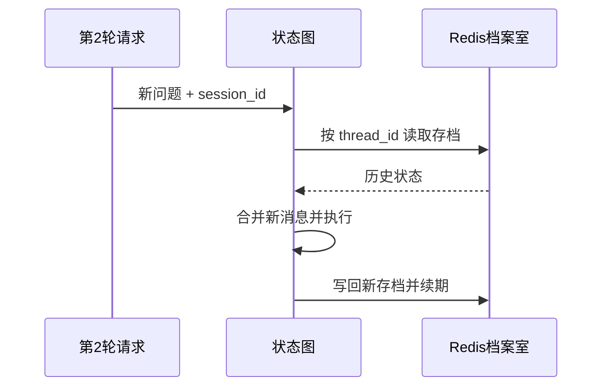

# Checkpoint 怎样让会话可恢复？

## 学习目标

学完本页，你能回答：**为什么下一轮只发送新问题，系统仍能接着上一轮推理？**

## 生活类比

**Checkpoint 是档案室存档**。每次会诊结束，档案室按会话编号保存病历夹；下次报出同一编号，就能取回旧记录再续写。档案有保管期限，每次被读取都会重新计算期限。

## 图

## 项目做法

系统启动时调用 `create_redis_checkpointer()` 创建 Redis 存档器。源码中的 `AsyncRedisSaver` 是 LangGraph 的**异步 Redis 存档实现**：`Async` 表示不阻塞式等待，`RedisSaver` 表示把状态保存到 Redis。

关键配置：

- `session_id` 作为 LangGraph 的 `thread_id`，同一会话据此恢复。
- 默认 TTL 是 **86400 秒（24 小时）**。
- `refresh_on_read=True`，即**读时续期**。
- Redis 或依赖不可用时返回 `None`，图退化为无状态执行。

API 每轮通常只把新的 `HumanMessage` 放进 State。执行图时，存档器先恢复该 `thread_id` 的旧状态，再按消息合并规则加入新消息。语义缓存命中虽然绕过 Agent 图，也会通过 `graph.aupdate_state()` 手工记录本轮问答，避免后续会话断档。

注意：`thread_id` 用于会话连续性，`user_id` 用于用户数据隔离；二者不能混为一谈。

## 源码二刷

- [`create_redis_checkpointer()`：86400 秒与读时续期](../../agent/core/workflow/checkpointer.py)
- [`stream_chat()`：`session_id → thread_id`](../../app/service/chat_service.py)
- [`_record_cache_hit_turn()`：缓存命中仍写存档](../../app/service/chat_service.py)

二刷时追踪同一个 `config` 如何传给 `astream`、`aupdate_state` 和 `aget_state`。

## 面试背板

**30–60 秒答案：**

> Checkpoint 相当于会话档案室。本项目使用 LangGraph 的异步 Redis 存档器，以 session_id 作为 thread_id，保存消息历史和中间状态。默认 TTL 是 86400 秒，也就是 24 小时，并开启读时续期。于是每轮只需提交新的用户消息，图会先恢复旧状态再合并执行。Redis 不可用时工厂返回 None，工作流退化为无状态模式；缓存命中时也会手工写入本轮问答，保持连续性。

**追问：为什么缓存命中还要写 Checkpoint？**

缓存只是复用答案；若不记录该轮，下一次图执行看不到这次问答，追问就会缺上下文。

## 误解

- **误解：TTL 86400 表示固定在创建后 24 小时删除。** 本项目读取时刷新期限。
- **误解：Redis 挂了聊天就完全不可用。** 推理仍可运行，但不能跨轮恢复。
- **误解：Checkpoint 等于长期记忆。** 它服务一个会话；长期要点另存 Milvus，可跨会话检索。

## 自测

1. TTL 的准确数值和续期时机是什么？
2. `session_id` 为什么映射为 `thread_id`？
3. 缓存命中不跑图时，如何补记该轮状态？

## 导航

- 上一篇：[Router 怎样像分诊护士一样选入口？](routing.md)
- 下一篇：[历史为什么要压缩而不是无限累积？](history-compression.md)
- 回到：[Part 04 首页](index.md)
