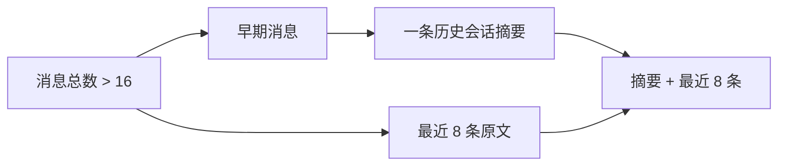

# 历史为什么要压缩而不是无限累积？

## 学习目标

学完本页，你能回答：**系统怎样控制长对话长度，同时尽量保留临床关键信息？**

## 生活类比

会诊病历太厚时，不是把旧页全扔掉，而是把早期内容整理成一页**压缩摘要**，再保留最近几页原文。摘要方便快速回顾，近期原文保留追问所需的细节。

## 图

## 项目做法

历史压缩只在启用了 Checkpoint、会话会累积历史时加入图，并位于分诊之前。规则严格为：

- 消息总数 **超过 16 条**才触发；等于 16 条不压缩。
- **保留最近 8 条**原文。
- 更早的消息交给低温度模型，压成一条 `SystemMessage`。
- 摘要提示要求保留主诉、症状、持续时间、量表分数、诊断、用药、工具检索关键知识及医生偏好。

实现时先为全部旧消息产生 `RemoveMessage` 删除标记，再按“摘要、最近 8 条”的顺序重放。这里依靠 `messages` 的合并规则正确处理删除和追加。

两种优雅降级：任一消息没有 `id` 时跳过压缩；摘要模型调用失败时保留完整历史。无 Checkpoint 时图不会累积历史，也不注册该节点。

压缩摘要不是长期记忆：它仍属于当前会话，用来控制模型上下文；长期要点卡则存入 Milvus，支持跨会话检索。

## 源码二刷

- [`HISTORY_COMPRESS_THRESHOLD`、`HISTORY_KEEP_RECENT`](../../agent/core/workflow/graph_manager.py)
- [`_SUMMARY_PROMPT` 与 `_compress_history()`](../../agent/core/workflow/graph_manager.py)
- [`messages` 的 `add_messages` 合并规则](../../agent/core/workflow/state.py)

二刷时验证边界：16 条返回空更新，17 条才进入摘要流程。

## 面试背板

**30–60 秒答案：**

> 项目用“历史摘要加近期窗口”控制上下文。启用 Checkpoint 时，图入口先执行历史压缩；消息数超过 16 条才触发，保留最近 8 条原文，把更早内容总结成一条系统消息。摘要明确保留症状、持续时间、量表、诊断、用药和工具知识。实现上先删除原消息，再按摘要和近期窗口重放；消息缺少 ID 或模型失败时跳过压缩，保证推理不中断。

**追问：为什么不是只保留最近 8 条？**

仅截断会丢失早期病史和诊疗结论；摘要提供远期信息，原文窗口保留近期细节，两者平衡成本与连续性。

## 误解

- **误解：达到 16 条就压缩。** 条件是严格“大于 16”。
- **误解：压缩后只剩 8 条。** 实际是 1 条摘要加最近 8 条原文。
- **误解：摘要失败就清空旧历史。** 失败时返回空更新，完整历史仍在。

## 自测

1. 16 条和 17 条消息分别会怎样？
2. 压缩后消息由哪两部分组成？
3. 历史摘要与长期要点卡的作用范围有何不同？

## 导航

- 上一篇：[Checkpoint 怎样让会话可恢复？](checkpoint.md)
- 下一部分：[Part 05：为什么要让多个 Agent 组成专科团队？](../part05-multi-agent/index.md)
- 回到：[Part 04 首页](index.md)
