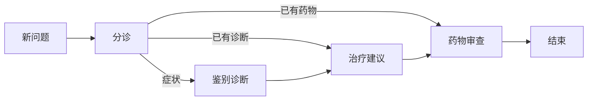

# Part 04：为什么临床推理要用状态图？

## 学习目标

学完本页，你能回答一个问题：**为什么本项目不用一条超长调用链，而要把临床推理画成一张可执行的图？**

## 生活类比

一次会诊不是一个人从头说到尾，而是围绕同一个**会诊病历夹**协作：分诊护士先判断去哪个专科，诊断医生写结论，治疗医生续写方案，药师再审方。谁先谁后、何时分流，都由会诊流程规定。

## 图

图的价值是把“共享信息、执行步骤、流向规则、会话恢复”分开表达，而不是藏在一个巨大函数里。

## 项目做法

本项目用 LangGraph 组装临床工作流：

1. **State（状态）**是会诊病历夹，节点都从中读取并向其中写入。
2. **Node（节点）**是一个工作岗位，如分诊、诊断、治疗、药物审查。
3. **Edge（边）**规定岗位之间的固定交接。
4. **Router（路由器）**像分诊护士，按当前问题选择入口。
5. 启用会话存档后，入口先做历史压缩，再进入分诊。

真实主链是：`START → history_compression → orchestrator → 专科流水线 → END`；Redis 不可用时会去掉存档和压缩，退化为无状态流程，不阻塞推理。

## 源码二刷

按“病历夹 → 图装配 → API 调用”的顺序看：

- [`AgentState`：病历夹字段](../../agent/core/workflow/state.py)
- [`AgentGraphManager.build_graph()`：节点和边](../../agent/core/workflow/graph_manager.py)
- [`stream_chat()`：每轮如何进入图](../../app/service/chat_service.py)

二刷时只追三个问题：输入写进哪里、路由结果存在哪里、每个节点返回什么。

## 面试背板

**30–60 秒答案：**

> LangGraph 适合这个项目，因为临床决策不是单次问答，而是带共享状态、条件分流、固定流水线和会话恢复的多步骤过程。项目把 State 当作会诊病历夹，把诊断、治疗、药物审查做成节点，由 Router 决定从哪一段进入，再通过边继续执行。图还能接入 Redis Checkpoint 保存会话；基础设施失败时退化为无状态运行。因此它比把全部逻辑塞进一个函数更容易观察、扩展和恢复。

**追问：为什么不用普通 if/else？**

普通 if/else 也能实现小流程，但节点边界、共享状态、流式事件和持久化需要自行拼装；状态图把这些变成统一模型，复杂后更容易维护。

## 误解

- **误解：图就是可视化。** 图首先是可执行流程，可视化只是副产品。
- **误解：多节点一定并行。** 本项目主链主要是顺序流水线，路由只决定起点。
- **误解：用了图就自动有记忆。** 只有接入会话存档后才能跨轮恢复。

## 自测

1. 本项目中的“会诊病历夹、岗位、交接线”分别对应什么？
2. 直接问药物组合时，为什么不必先跑诊断？
3. Redis 不可用时，图还能运行吗？会失去什么？

## 导航

- 下一篇：[State 为什么像会诊病历夹？](state-as-case-file.md)
- 本章路线：State → 节点与边 → 路由 → Checkpoint → 历史压缩
- 上一部分：[`learn/README.md`](../README.md)
