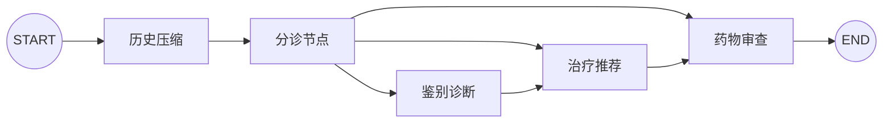

# 节点和边怎样组成会诊流水线？

## 学习目标

学完本页，你能回答：**一个临床步骤怎样变成节点，节点之间又怎样可靠交接？**

## 生活类比

把医院会诊看成岗位交接：分诊台、诊断室、治疗室和药师窗口都是岗位；走廊和交接单规定下一站。岗位负责“做什么”，路线负责“接下来去哪”，二者分开后更容易替换某个岗位而不重写整家医院。

## 图

启用会话存档时有历史压缩节点；未启用时 `START` 直接连到分诊节点。

## 项目做法

`AgentGraphManager.build_graph()` 做三件事：

1. 用 `add_node` 注册四个业务节点；有 Checkpoint 时再注册 `history_compression`。
2. 用普通边连接固定流水线：诊断 → 治疗 → 药物审查 → 结束。
3. 用条件边让分诊节点选择诊断、治疗或药物审查作为入口。

每个业务节点外面包一层 `_timed_node()`，统一记录开始、完成和耗时日志。节点接收同一种 `AgentState`，返回需要更新的部分，而不是直接控制下一个节点。图装配完成后调用 `compile(checkpointer=...)`，得到可以 `ainvoke` 或 `astream` 的执行对象。

关键理解：从“治疗推荐”进入后仍会继续到“药物审查”；从“药物审查”进入则直接走到结束。这叫**按意图选择入口，按边继续流水线**。

## 源码二刷

- [`build_graph()`：注册节点、普通边和条件边](../../agent/core/workflow/graph_manager.py)
- [`DiagnosisAgentNode.__call__()`：节点输入输出形状](../../agent/agents/diagnosis_agent.py)
- [`stream_chat()`：通过 `graph.astream()` 执行图](../../app/service/chat_service.py)

建议在纸上抄一遍 `add_node`、`add_edge` 和 `add_conditional_edges`，再对照上图。

## 面试背板

**30–60 秒答案：**

> 节点封装单一临床职责，边描述执行顺序。本项目注册 orchestrator、differential_diagnosis、treatment_recommend 和 drug_interaction 四个业务节点；诊断到治疗再到药物审查是固定边，orchestrator 后使用条件边选择入口。启用 Checkpoint 时，START 前置历史压缩节点。这样业务实现、路由判断和流程结构彼此分离，节点还能统一记录耗时并通过流式接口输出事件。

**追问：为何节点不自己调用下一个 Agent？**

让图负责调度可以避免节点互相硬编码，便于单测、改路由、插入新节点和统一持久化。

## 误解

- **误解：一条边就是一次网络请求。** 边只是调度关系。
- **误解：三个入口是三套独立流程。** 它们共享后半段流水线。
- **误解：图编译等于启动服务。** 编译只产生可执行图，真正运行发生在请求到来时。

## 自测

1. 有无 Checkpoint 时，`START` 的下一站分别是什么？
2. 用户直接问治疗方案，会经过哪些业务节点？
3. 为什么耗时日志适合放在统一包装层？

## 导航

- 上一篇：[State 为什么像会诊病历夹？](state-as-case-file.md)
- 下一篇：[Router 怎样像分诊护士一样选入口？](routing.md)
- 回到：[Part 04 首页](index.md)
