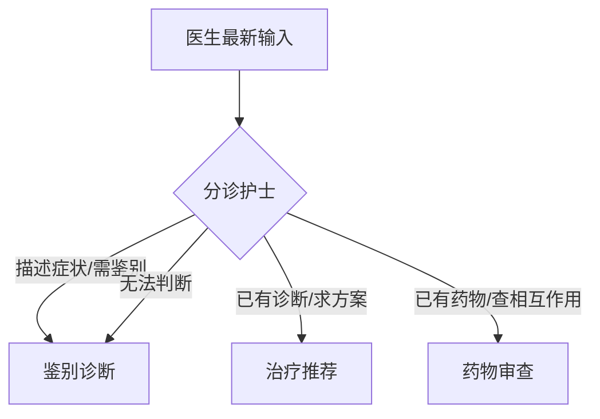

# Router 怎样像分诊护士一样选入口？

## 学习目标

学完本页，你能回答：**同一聊天入口如何把症状、治疗和药物问题送到合适的专科节点？**

## 生活类比

**Router 是分诊护士**。护士不负责完成诊断和开药，只阅读患者最新诉求，再决定先去诊断室、治疗室还是药师窗口。看不清时先送诊断室，比随意跳过评估更稳妥。

## 图

## 项目做法

`OrchestratorAgent.route()` 读取 State 中最新一条消息，并把可用的三个目标及规则交给低温度模型。模型只能输出：

- `differential_diagnosis`
- `treatment_recommend`
- `drug_interaction`

代码随后做白名单式解析：包含 `drug`、`diagnosis/differential` 或 `treatment` 才映射到对应节点；其他结果默认走鉴别诊断。决定写入 `next_agent`，图中的 `_route_condition()` 读取它，条件边再完成跳转。

长期临床背景会作为参考加入路由提示，但分诊主要依据最新输入。药物审查入口还会在 `metadata` 标注 `is_drug_review_workflow`。

这种设计把“模型理解自然语言”和“程序限制合法去向”结合起来：模型负责语义判断，代码负责边界。

## 源码二刷

- [`OrchestratorAgent.route()`](../../agent/agents/orchestrator.py)
- [`_route_condition()` 与条件边映射](../../agent/core/workflow/graph_manager.py)
- [`AgentState.next_agent`](../../agent/core/workflow/state.py)

二刷时找出两层兜底：提示词中的默认目标，以及代码解析失败后的默认目标。

## 面试背板

**30–60 秒答案：**

> Router 类似分诊护士，只决定入口，不做专业推理。本项目的 orchestrator 读取最新消息和可选的长期背景，让模型在诊断、治疗、药物审查三个固定标签中选择；程序再做白名单解析，把结果写入 State 的 next_agent，由 LangGraph 条件边跳转。无法识别时默认进入鉴别诊断。这样既利用模型理解自然语言，又用代码约束流程不会跳到非法节点。

**追问：路由为什么不用纯关键词？**

临床表达变化大，模型更擅长理解“已有诊断但未直接说治疗”等隐含意图；但关键路径仍应用白名单和默认值收口。

## 误解

- **误解：Router 是总专家。** 它只分流，专业结论来自领域 Agent。
- **误解：选了诊断就只执行诊断。** 之后仍沿固定边进入治疗和药物审查。
- **误解：模型可以返回任意节点名。** 图只接受预先映射的三个合法目标。

## 自测

1. “患者服用舍曲林和曲马多，风险如何？”应从哪里进入？
2. 模型输出一段解释而非合法标签时会怎样？
3. `next_agent` 在哪一层被写入、在哪一层被读取？

## 导航

- 上一篇：[节点和边怎样组成会诊流水线？](nodes-edges.md)
- 下一篇：[Checkpoint 怎样让会话可恢复？](checkpoint.md)
- 回到：[Part 04 首页](index.md)
