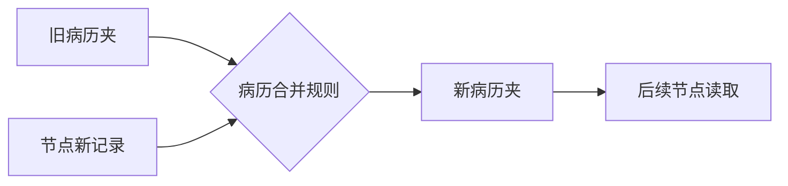

# State 为什么像会诊病历夹？

## 学习目标

学完本页，你能回答：**多个节点怎样共享病例信息，又怎样避免后写内容误删前文？**

## 生活类比

**State 是会诊病历夹**。患者描述、诊断结论、治疗方案都放在同一个夹子里。不同栏目有不同填写规则：会话记录通常追加，分诊去向可以覆盖，用户与会话编号负责标识归属。

**Reducer 是病历合并规则**：它决定新纸张到来时，是追加到旧记录、替换旧值，还是执行删除标记。没有规则，大家虽然共用病历夹，却可能互相覆盖。

## 图

## 项目做法

`AgentState` 定义了病历夹中的栏目：

- `messages`：用户、系统和各 Agent 的消息；采用追加式消息合并规则。
- `next_agent`：分诊结果，决定下一节点。
- `user_id`、`session_id`：用户隔离与会话定位。
- `memory_context`：检索到的长期临床背景。
- `metadata`：工具或流程附加信息。

看到源码中的三个术语时这样翻译：

- `TypedDict`：为字典声明“允许有哪些键、值大致是什么类型”。
- `Annotated`：给某个字段附加额外规则。
- `Reducer`：合并旧值与新值的函数；本项目消息字段使用 `add_messages`。

因此节点返回 `{"messages": [新消息]}` 时，不是把历史整体替换掉，而是按消息合并规则加入病历夹。历史压缩则通过删除标记先移除旧消息，再写入摘要和最近窗口。

## 源码二刷

- [`AgentState` 与 `AgentOutput`](../../agent/core/workflow/state.py)
- [`_compress_history()` 如何利用消息合并规则删除并重放](../../agent/core/workflow/graph_manager.py)
- [`stream_chat()` 每轮只提交新的 `HumanMessage`](../../app/service/chat_service.py)

二刷练习：列出每个节点返回的键，并判断它是“追加”还是“覆盖”。

## 面试背板

**30–60 秒答案：**

> 在项目里，State 相当于多 Agent 共用的会诊病历夹，包含消息、路由目标、用户和会话标识、长期记忆上下文及元数据。State 用 TypedDict 描述字段结构；消息字段额外绑定 add_messages 合并规则，也就是 Reducer，所以节点只返回新增消息就能累积历史，而普通字段按新值更新。这样节点彼此解耦，却能通过同一份状态连续推理。

**追问：为什么消息不能直接用普通列表覆盖？**

因为每个节点通常只知道自己新增的内容；直接覆盖会丢掉用户问题和前序 Agent 结论，也破坏跨轮连续性。

## 误解

- **误解：State 是数据库。** 它是一次图执行看到的逻辑状态；是否跨轮保存取决于 Checkpoint。
- **误解：所有字段都只能追加。** 只有配置合并规则的字段如此，`next_agent` 等字段可更新。
- **误解：类型声明会自动校验所有运行时数据。** 它主要帮助代码理解与静态检查，不等同于 API 入参校验。

## 自测

1. `messages` 为什么需要独立的合并规则？
2. `session_id` 和 `user_id` 各解决什么问题？
3. 节点只返回一条新消息，旧消息为什么还在？

## 导航

- 上一篇：[为什么临床推理要用状态图？](index.md)
- 下一篇：[节点和边怎样组成会诊流水线？](nodes-edges.md)
- 回到：[Part 04 首页](index.md)
