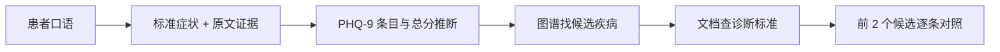

# 诊断 Agent 怎样把口语症状变成鉴别诊断？

## 学习目标

学完本页，你能回答：**从“睡不着、什么都不想做”到可核对的候选诊断，中间经历哪些步骤？**

## 生活类比

诊断医生不会直接凭一句口语下结论，而会先把患者表达写成标准症状，记录原话证据，再查疾病与症状关系、翻诊断标准，最后逐条对照并说明缺失信息。

## 图

## 项目做法

诊断节点把“症状提取”和“鉴别诊断”合并在一个 Agent 中：

1. 用 `query_synonyms` 把口语映射为标准术语，并保留原文引用。
2. 根据描述推断 PHQ-9 的 9 个条目，每项 0–3 分；提示词给出 0–4、5–9、10–14、15–19、20–27 的分级。
3. 用 `query_knowledge_graph` 一次搜索症状相关疾病。
4. 用 `query_vector_db` 检索候选的 ICD-11 标准。
5. 最终只输出前 2 个候选，用 ✅/❌/⚠ 逐条对照，每个候选不超过 5 行。

提示词要求每项症状都有对话原文证据，不得编造未提及症状，并限制最多 2 次工具调用。节点最终把完整诊断文本封装为一条 AI 消息写回 State，供治疗 Agent 继续读取。

这里的 PHQ-9 是基于文本的**推断**，不是患者正式作答量表的替代；输出应保留这种不确定性。

## 源码二刷

- [`DiagnosisAgentNode._build_system_prompt()`](../../agent/agents/diagnosis_agent.py)
- [`query_synonyms()` 与词表加载](../../agent/tools/synonym_tool.py)
- [`query_knowledge_graph()`](../../agent/tools/graph_tool.py)
- [`query_vector_db()`](../../agent/tools/vector_tool.py)

二刷时把“症状标准化、候选生成、标准核对”分别对应到工具和输出栏位。

## 面试背板

**30–60 秒答案：**

> 诊断 Agent 先把口语症状映射为标准术语并保留原文证据，再推断 PHQ-9 条目和严重度；随后用知识图谱找候选疾病，用向量检索查 ICD-11 原文标准，最后只输出最可能的两个候选并逐条标记满足、缺失或不确定。提示词禁止编造症状、要求引用证据且最多调用 2 次工具。结果写回共享消息，成为治疗 Agent 的输入。

**追问：为什么图谱和文档检索都要用？**

图谱擅长从症状关系快速找候选，文档检索擅长提供诊断标准原文；前者缩小范围，后者用于逐条核对。

## 误解

- **误解：文本推断 PHQ-9 等同正式测评。** 它只是决策支持线索。
- **误解：图谱命中就能确诊。** 还要对照标准和临床信息。
- **误解：候选越多越专业。** 项目刻意限制前 2 个，突出可解释核对。

## 自测

1. 为什么每项症状都要附原文证据？
2. 图谱和向量文档各负责哪一步？
3. 诊断结果怎样交给治疗 Agent？

## 导航

- 上一篇：[ReAct 为什么是“开检查—看结果—再判断”？](react-loop.md)
- 下一篇：[治疗与药审为什么要前后接力？](treatment-drug.md)
- 回到：[Part 05 首页](index.md)
