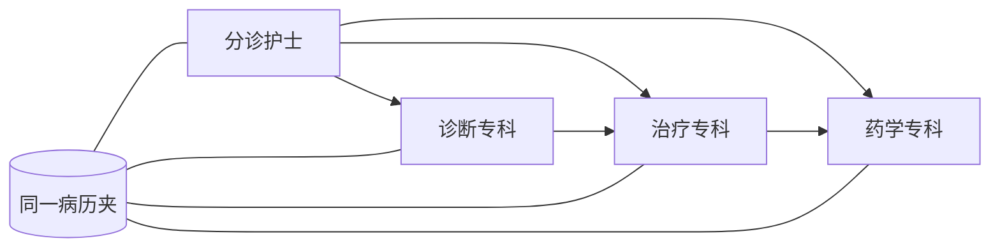

# Part 05：为什么要让多个 Agent 组成专科团队？

## 学习目标

学完本页，你能回答：**为什么不让一个万能模型包办分诊、诊断、治疗和药物审查？**

## 生活类比

**多 Agent 是专科团队**：分诊护士判断去向，诊断医生对照标准，治疗医生查指南，药师核对相互作用。每个人拿着同一份会诊病历夹，但职责、可用工具和输出格式不同。

## 图

## 项目做法

项目有一个协调者和三个领域 Agent：

- `OrchestratorAgent`：只做意图路由。
- `DiagnosisAgentNode`：症状标准化、量表推断和鉴别诊断。
- `TreatmentAgentNode`：检索指南与图谱，生成分级治疗建议。
- `DrugReviewAgentNode`：审查实际药物组合的相互作用。

每个领域 Agent 都有独立系统提示、工具清单、输出模板和最多 2 次工具调用约束。它们通过 State 中的消息历史交接结果：后一个 Agent 能读到前一个 Agent 写入的结论。流程并非四个模型自由聊天，而是由 LangGraph 明确控制入口和顺序。

拆分收益是职责清晰、工具权限更小、输出更稳定、问题更容易定位；代价是调用次数和编排复杂度增加，所以并非节点越多越好。

## 源码二刷

- [`orchestrator.py`](../../agent/agents/orchestrator.py)
- [`diagnosis_agent.py`](../../agent/agents/diagnosis_agent.py)
- [`treatment_agent.py`](../../agent/agents/treatment_agent.py)
- [`drug_review_agent.py`](../../agent/agents/drug_review_agent.py)
- [`graph_manager.py`：团队协作顺序](../../agent/core/workflow/graph_manager.py)

二刷时比较三个领域 Agent 的工具列表和提示词约束。

## 面试背板

**30–60 秒答案：**

> 本项目把多 Agent 当作专科团队，而不是多个模型随意讨论。协调者负责分诊，诊断 Agent 做症状标准化与鉴别，治疗 Agent 查指南给分级方案，药物 Agent 做相互作用审查。它们共享同一 State，通过消息交接，但各自拥有独立提示词、工具和输出格式，并由 LangGraph控制顺序。这样能降低单一提示词的职责冲突，限制工具权限，也便于观测和替换，代价是更多调用和编排成本。

**追问：什么情况下不该拆多 Agent？**

任务只有一步、无需不同工具或质量边界时，单 Agent 更简单；拆分应来自明确职责和交接点，而非追求数量。

## 误解

- **误解：多 Agent 就是并行。** 本项目主要按临床依赖顺序串行执行。
- **误解：每个 Agent 有独立记忆库。** 它们主要共享同一状态和注入的长期背景。
- **误解：协调者会修正所有专业结论。** 它只路由，不承担终审。

## 自测

1. 三个领域 Agent 的职责和工具有何不同？
2. 为什么药物审查位于流水线末端？
3. 多 Agent 相比单 Agent 增加了什么成本？

## 导航

- 上一部分：[Part 04：LangGraph](../part04-langgraph/index.md)
- 下一篇：[Orchestrator 为什么只分诊、不诊疗？](orchestrator.md)
- 本章路线：协调者 → ReAct → 诊断 → 治疗与药审 → 流式输出
