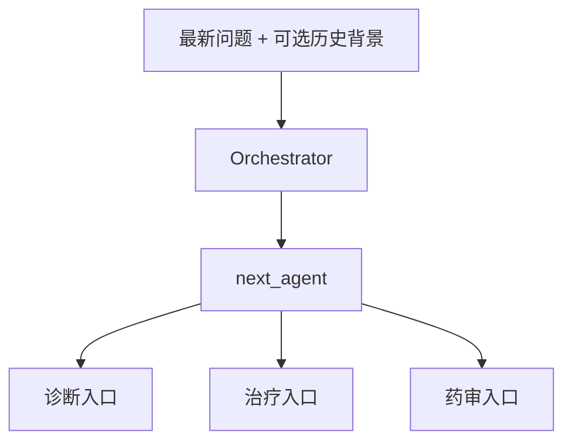

# Orchestrator 为什么只分诊、不诊疗？

## 学习目标

学完本页，你能回答：**协调者如何让专科团队有序协作，又为什么不应该亲自给出临床结论？**

## 生活类比

协调者就是**分诊护士**：快速识别患者当前需要哪个科室，并把病历送到正确入口。若护士同时诊断、开药、审方，职责混在一起，既难追责，也容易遗漏后续专业复核。

## 图

## 项目做法

协调者的输入是 State 中最新消息和可选的 `memory_context`，输出只有路由字段与元数据。其提示词明确列出三个合法目标和典型场景，并要求模型只返回名称。

代码不盲信模型原文，而是再次解析并收口：

- 出现 `drug` → `drug_interaction`
- 出现 `diagnosis` 或 `differential` → `differential_diagnosis`
- 出现 `treatment` → `treatment_recommend`
- 其他情况 → 默认 `differential_diagnosis`

路由开始时还通过流写入器发出 `orchestrator/start` 事件，供 API 及时告诉前端“已进入分诊”。它不会写一段诊疗答案，也不直接调用领域工具。

把协调者限制为单一职责有两个好处：路由错误与专业推理错误能分开排查；后续替换关键词分类器、规则模型或小模型时，不影响领域节点。

## 源码二刷

- [`OrchestratorAgent.route()`：输入、提示词、白名单解析](../../agent/agents/orchestrator.py)
- [`_run_orchestrator()`：统一耗时包装](../../agent/core/workflow/graph_manager.py)
- [`add_conditional_edges()`：路由落到图结构](../../agent/core/workflow/graph_manager.py)

二刷问题：协调者更新了哪些字段？哪些字段完全不碰？

## 面试背板

**30–60 秒答案：**

> Orchestrator 是专科团队的分诊护士，只判断入口，不输出诊疗结论。它读取最新消息和可选长期背景，让模型在诊断、治疗、药审三个标签中选择，再由代码做白名单解析和默认诊断兜底，把结果写入 next_agent。LangGraph 条件边据此跳转。单一职责让路由和领域质量可以分别测试，也便于将来用规则或更小模型替换路由器。

**追问：为何还需要代码解析，不能直接用模型结果？**

模型可能加解释、大小写变化或输出非法文本；程序收口能保证图只收到合法节点名。

## 误解

- **误解：协调者管理所有工具。** 工具挂在各领域 Agent 上。
- **误解：协调者输出就是最终回答。** 它只返回 `next_agent`。
- **误解：加入长期背景后就按全部历史路由。** 实现仍以最新消息为核心，背景只作参考。

## 自测

1. 协调者的最小输出是什么？
2. 非法模型输出如何兜底？
3. 为什么路由与诊疗分开更容易测试？

## 导航

- 上一篇：[为什么要让多个 Agent 组成专科团队？](index.md)
- 下一篇：[ReAct 为什么是“开检查—看结果—再判断”？](react-loop.md)
- 回到：[Part 05 首页](index.md)
