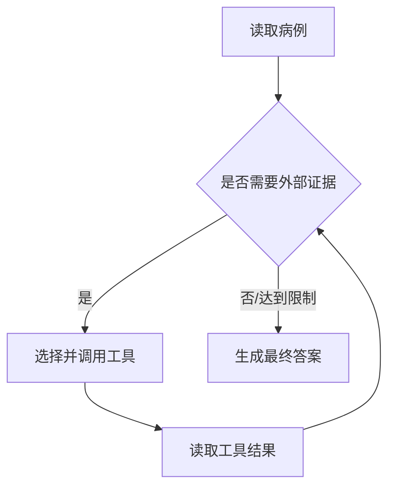

# ReAct 为什么是“开检查—看结果—再判断”？

## 学习目标

学完本页，你能回答：**领域 Agent 如何在回答前主动查资料，并依据检查结果调整下一步？**

## 生活类比

**ReAct 是开检查看结果再判断**：医生先根据当前信息决定要查什么，拿到报告后再判断是否还需检查，最后形成结论。它不是先把所有检查做一遍，也不是脱离报告凭空作答。

## 图

## 项目做法

ReAct 是“推理 + 行动”的循环。本项目用 LangGraph 预构建的 `create_react_agent` 创建领域 Agent；这个名称可理解为“创建一个会自己决定何时调用工具的 ReAct 执行器”。

三个领域 Agent 分别绑定有限工具：

- 诊断：症状同义词、知识图谱、向量文档检索。
- 治疗：向量文档检索、知识图谱。
- 药审：知识图谱。

节点把系统提示和整个会话消息交给内部执行器，并以消息模式异步读取输出。模型发出工具调用时，框架执行对应按钮并把结果作为 `ToolMessage` 放回循环；模型再基于证据继续判断。

项目在三个系统提示中都写明**最多调用 2 次工具**，随后必须输出最终结果。这是提示层约束，用于控制延迟和成本；它不是独立的硬计数器，因此生产级场景还可增加程序侧步数上限。

## 源码二刷

- [`DiagnosisAgentNode`：三种工具与内部执行器](../../agent/agents/diagnosis_agent.py)
- [`TreatmentAgentNode`：两种工具](../../agent/agents/treatment_agent.py)
- [`DrugReviewAgentNode`：图谱工具](../../agent/agents/drug_review_agent.py)
- [`query_vector_db`：一个真实工具按钮](../../agent/tools/vector_tool.py)

二刷时沿着 `AIMessageChunk → tool_calls → ToolMessage → 最终文本` 追踪一轮。

## 面试背板

**30–60 秒答案：**

> ReAct 可以类比医生“开检查、看结果、再判断”的循环。领域 Agent 先读病例，决定是否调用已授权工具；工具结果回到消息上下文后，模型再决定继续检索还是输出结论。本项目用 LangGraph 的预构建 ReAct 执行器，诊断、治疗和药审分别绑定最小工具集合，并在提示词中限制最多 2 次工具调用。这样答案能结合外部证据，而不是完全依赖模型参数记忆。

**追问：工具调用上限为什么重要？**

它限制死循环、延迟和费用；但仅靠提示不是硬保证，关键系统还应在执行层限制总步数或超时。

## 误解

- **误解：ReAct 会展示完整思维链。** 项目只需要工具事件、结果和最终答案，不应依赖暴露内部推理。
- **误解：所有工具每次都调用。** 模型按任务选择。
- **误解：工具结果必然正确。** 工具可能空结果或基础设施失败，Agent 仍需注明不确定性。

## 自测

1. ReAct 循环中的“行动”和“观察”分别是什么？
2. 为什么三个 Agent 不共用全部工具？
3. 本项目工具次数限制属于硬约束吗？

## 导航

- 上一篇：[Orchestrator 为什么只分诊、不诊疗？](orchestrator.md)
- 下一篇：[诊断 Agent 怎样把口语症状变成鉴别诊断？](diagnosis.md)
- 回到：[Part 05 首页](index.md)
