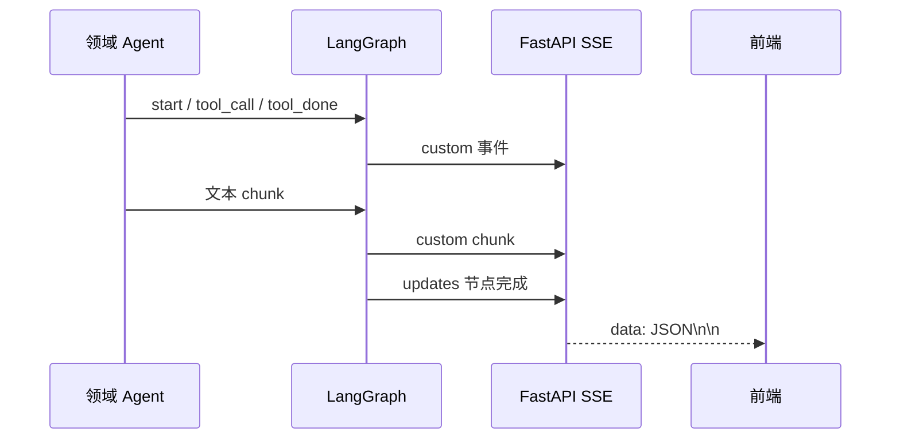

# 流式输出怎样把内部进度变成 SSE？

## 学习目标

学完本页，你能回答：**为什么前端能先看到“正在调用工具”，再逐段看到答案，而不必等待整条工作流结束？**

## 生活类比

像医院叫号屏：它不会等所有检查结束才一次显示，而是持续更新“已接诊、正在检查、报告完成、医生总结”。SSE 就是一条服务器向浏览器持续播报的单向通道。

## 图

## 项目做法

每个领域节点用 `get_stream_writer()` 发自定义事件：

- `start`：节点开始。
- `tool_call`：准备调用某个工具。
- `tool_done`：工具返回。
- `chunk`：答案文本片段。

内部 ReAct 执行器以 `stream_mode="messages"` 产出消息块。节点累计文字，缓冲达到 **20 个字符或出现换行**时向外发送，避免每个字符都形成事件；同时把完整内容累积起来，最后写回 State。

API 层执行整张图时订阅 `stream_mode=["updates", "custom"]`：`custom` 用于上述实时事件，`updates` 用于节点完成通知。`stream_chat()` 将它们转换为 `data: {JSON}\n\n` 格式的 SSE，并在末尾发送 `{"done": true}`。

这是两层流：领域 Agent 内部消息流 → 状态图自定义/更新流 → HTTP SSE。SSE 负责传输，不负责保存状态；会话连续性仍由 Checkpoint 完成。

## 源码二刷

- [`DiagnosisAgentNode.__call__()`：消息块缓冲与事件](../../agent/agents/diagnosis_agent.py)
- [`TreatmentAgentNode.__call__()`](../../agent/agents/treatment_agent.py)
- [`DrugReviewAgentNode.__call__()`](../../agent/agents/drug_review_agent.py)
- [`stream_chat()`：`updates/custom` 到 SSE](../../app/service/chat_service.py)
- [`POST /api/chat` 路由](../../app/router/chat.py)

二刷时从一个 `tool_call` 事件追到浏览器收到的 JSON 字段。

## 面试背板

**30–60 秒答案：**

> 项目采用两层流式机制。领域 Agent 从内部执行器读取消息块，并通过 LangGraph 的自定义写入器发出节点开始、工具调用、工具完成和文本 chunk；文本缓冲达到 20 字符或换行时发送。API 同时订阅 custom 和 updates 两种图事件，前者提供实时细节，后者表示节点完成，再统一编码成 `data: JSON` 的 SSE 帧，最后发送 done。这样前端能显示进度并逐段渲染答案。

**追问：为什么不直接逐 token 发给前端？**

小缓冲能减少事件数和网络/渲染开销，同时仍保持可感知的实时性。

## 误解

- **误解：SSE 是双向协议。** 这里请求通过 POST 进入，响应流主要是服务器单向推送。
- **误解：节点完成事件就是答案内容。** 内容来自 chunk，updates 主要报告状态。
- **误解：流式输出自动提供断线恢复。** 状态持久化和网络重连是另外的问题。

## 自测

1. `custom` 与 `updates` 分别承载什么？
2. 文本片段在什么条件下被刷出？
3. SSE、LangGraph 流和 Checkpoint 各自负责什么？

## 导航

- 上一篇：[治疗与药审为什么要前后接力？](treatment-drug.md)
- 下一部分：[Part 06：RAG、知识图谱和工具怎样分工？](../part06-knowledge-tools/index.md)
- 回到：[Part 05 首页](index.md)
