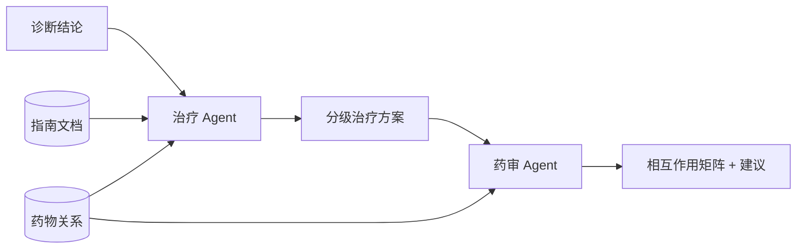

# 治疗与药审为什么要前后接力？

## 学习目标

学完本页，你能回答：**为什么给出治疗建议后，还必须单独经过药物相互作用审查？**

## 生活类比

治疗医生负责“根据诊断选方案”，药师负责“这张处方放在一起是否安全”。前者关注适应证、分级和依据，后者关注药物组合风险；让同一角色一边推荐一边自审，容易产生确认偏差。

## 图

## 项目做法

**治疗 Agent**读取前序诊断，调用向量文档工具查中国精神科指南，再调用知识图谱找一线、二线药物。输出包括诊断、一线方案、二线方案、非药物治疗和注意事项；药物必须来自图谱结果，依据必须标明来源。

**药审 Agent**读取对话中实际治疗方案或用户直接给出的药物清单，查询图谱中的 `INTERACTS_WITH` 关系，输出药物两两矩阵和红/黄/绿风险汇总。若图谱没有直接关系，必须明确标注“未在知识图谱中找到直接相互作用数据”，不能把“没查到”写成“安全”。

图上固定边为 `treatment_recommend → drug_interaction → END`。因此从诊断进入会完整经历诊断、治疗、药审；从治疗进入会再药审；直接询问药物组合则从药审进入。两个 Agent 都在提示词中限制最多 2 次工具调用。

## 源码二刷

- [`TreatmentAgentNode`：指南与图谱双工具](../../agent/agents/treatment_agent.py)
- [`DrugReviewAgentNode`：相互作用矩阵](../../agent/agents/drug_review_agent.py)
- [`graph_manager.py`：治疗到药审的固定边](../../agent/core/workflow/graph_manager.py)
- [`graph_tool.py`：`INTERACTS_WITH` 查询能力](../../agent/tools/graph_tool.py)

二刷时比较二者的输入证据、输出责任和“不确定时如何写”。

## 面试背板

**30–60 秒答案：**

> 治疗推荐和药物审查是两个不同质量关口。治疗 Agent 根据诊断检索指南与药物图谱，给出一线、二线和非药物方案，并标注依据；药审 Agent 再读取实际药物组合，查询相互作用关系，输出风险矩阵和建议。图中治疗固定连接药审，因此推荐不会绕过安全复核。若图谱没有关系，系统标注未找到数据，而不是推断为安全。

**追问：为什么药审 Agent 还读取完整对话？**

它既要看到治疗 Agent 新生成的处方，也要支持用户直接提交现有用药组合，从历史中提取实际药名。

## 误解

- **误解：治疗推荐已考虑副作用，就不需药审。** 单药注意事项和多药相互作用是不同问题。
- **误解：图谱无关系等于安全。** 只能说明当前数据未命中。
- **误解：药审会自行替换处方。** 它输出风险和建议，最终决策仍需临床人员。

## 自测

1. 治疗 Agent 和药审 Agent 的证据来源分别是什么？
2. 为什么“未查到”不能写成“安全”？
3. 三种路由入口各会经过哪些后续节点？

## 导航

- 上一篇：[诊断 Agent 怎样把口语症状变成鉴别诊断？](diagnosis.md)
- 下一篇：[流式输出怎样把内部进度变成 SSE？](streaming.md)
- 回到：[Part 05 首页](index.md)
