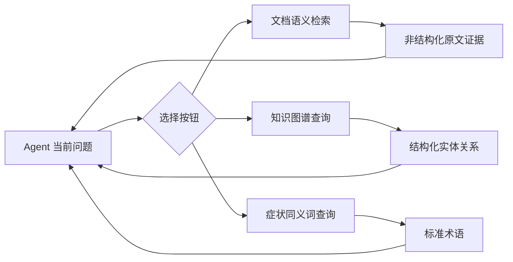

# Part 06：RAG、知识图谱和工具怎样分工？

## 学习目标

学完本页，你能回答：**临床 Agent 为什么既要查文档，又要查关系网络，还要通过统一工具接口调用它们？**

## 生活类比

查临床知识有三种动作：像**开卷考试**一样翻指南原文；像查看**人物关系网**一样追踪疾病、症状、药物之间的连接；像按**可调用按钮**一样执行具体查询。三者分别解决“原文在哪”“关系是什么”“程序怎么调用”。

## 图

## 项目做法

本项目把知识访问分成三层：

1. **RAG**：先检索相关文档片段，再让模型结合片段回答，适合 ICD-11 标准、指南和说明书原文。
2. **知识图谱**：在 Neo4j 中查询疾病—症状、疾病—治疗、药物—副作用、药物—药物等明确关系。
3. **Tool**：把向量检索、图查询、同义词映射包装成 Agent 可选择的函数按钮。

此外还有 **MCP**，可把不同进程或服务的工具接成统一协议接口。本仓库已实现 MCP 管理器与临床工具服务器，但**尚未接入主状态图**，不能把“代码存在”说成“线上主流程已使用”。

三类 Milvus 集合必须区分：文档检索用 `cloud_product_docs`，长期记忆用 `long_term_memory`，语义缓存用 `qa_semantic_cache`。

## 源码二刷

- [`vector_tool.py`：文档检索](../../agent/tools/vector_tool.py)
- [`graph_tool.py`：知识图谱查询](../../agent/tools/graph_tool.py)
- [`synonym_tool.py`：本地词表工具](../../agent/tools/synonym_tool.py)
- [`mcp_manager.py`：MCP 工具发现](../../agent/core/mcp/mcp_manager.py)

二刷时为每个来源写一句“最擅长回答什么、不能保证什么”。

## 面试背板

**30–60 秒答案：**

> 本项目让不同知识形态各司其职：RAG 像开卷考试，负责从指南和诊断标准中找原文；知识图谱像关系网，负责疾病、症状、治疗和药物之间的结构化关系；Tool 是 Agent 可调用的按钮，把这些查询能力暴露给 ReAct 循环。文档、长期记忆、语义缓存分别使用 cloud_product_docs、long_term_memory 和 qa_semantic_cache。MCP 统一工具接入也已实现，但当前未接主图。

**追问：为什么不用一个向量库解决全部问题？**

向量检索擅长语义相关原文，但不保证精确关系和路径；图谱适合结构关系，二者互补。

## 误解

- **误解：工具本身会做最终诊断。** 工具只返回证据，Agent 组织答案。
- **误解：三个 Milvus 集合可以混用。** 它们的数据结构和业务边界不同。
- **误解：有 MCP 文件就表示主流程已使用 MCP。** 当前只是实现与配置，尚未接入主图。

## 自测

1. 文档原文和药物关系分别适合查哪里？
2. 三个 Milvus 集合名及用途是什么？
3. MCP 当前处于什么集成状态？

## 导航

- 上一部分：[Part 05：多 Agent](../part05-multi-agent/index.md)
- 下一篇：[RAG 为什么像开卷考试？](rag-open-book.md)
- 本章路线：RAG → 知识图谱 → Tool → MCP
