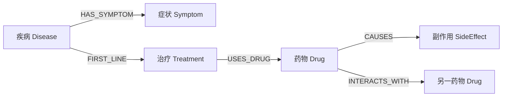

# 知识图谱为什么像人物关系网？

## 学习目标

学完本页，你能回答：**系统怎样精确表达“某疾病有什么症状、某治疗用什么药、两种药是否相互作用”？**

## 生活类比

**知识图谱是人物关系网**：圆点是人物，连线是“同事、亲属、朋友”。临床图谱把人物换成疾病、症状、治疗、药物和副作用，把连线换成“具有症状、首选治疗、导致副作用、存在相互作用”等关系。

## 图

## 项目做法

图数据存于 Neo4j。`query_knowledge_graph()` 接收自然语言问题，当前有两条查询路径：

1. **默认路径：关键词图查询。** 从问题提取最多 8 个关键词，查命中节点及关系，各自限制 8 行。它启动快，不需要额外模型生成查询语句。
2. **可选路径：LLM Cypher。** Cypher 是 Neo4j 的图查询语言，可理解为“专门查询关系网的 SQL”。设置 `ENABLE_LLM_GRAPH_CYPHER=true` 后，模型根据图结构生成 Cypher，再由 `GraphCypherQAChain` 执行；失败时回退关键词查询。

默认开关为 `false`，因此不能笼统说项目每次都由大模型生成图查询。可选链开启了 `allow_dangerous_requests=True`，在生产环境应配合只读账号、查询白名单和权限控制。

图谱模型和导入逻辑位于 `core/graph/`；`agent/test/build_kg.py` 是构建脚本。在线 Agent 通过工具查询，而不直接操作 Neo4j 客户端。

## 源码二刷

- [`query_knowledge_graph()`：默认关键词与开关](../../agent/tools/graph_tool.py)
- [`Neo4jClient`：连接和执行查询](../../agent/core/graph/client.py)
- [`models.py`：疾病、症状、药物等模型](../../agent/core/graph/models.py)
- [`KnowledgeGraphIngestor`](../../agent/core/graph/ingestor.py)
- [`build_kg.py`：手工构图脚本](../../agent/test/build_kg.py)

二刷时定位 `ENABLE_LLM_GRAPH_CYPHER` 的默认值和失败回退路径。

## 面试背板

**30–60 秒答案：**

> 知识图谱像人物关系网，用节点表示疾病、症状、治疗、药物和副作用，用边表达 HAS_SYMPTOM、FIRST_LINE、USES_DRUG、CAUSES、INTERACTS_WITH 等关系。本项目存储在 Neo4j，在线工具默认走快速关键词图查询；只有开启 ENABLE_LLM_GRAPH_CYPHER 才让模型生成 Cypher，失败后仍回退关键词路径。它适合精确关系查询，与擅长找原文的 RAG 互补。

**追问：为什么默认不用模型生成 Cypher？**

关键词路径更快、更可控，也减少额外模型调用；模型生成查询更灵活，但有延迟、错误和权限风险。

## 误解

- **误解：默认每次都生成 Cypher。** 默认是关键词图查询。
- **误解：图谱没边就证明不存在相互作用。** 只能说明当前图数据未记录。
- **误解：知识图谱替代指南原文。** 图谱表达关系，指南细节仍适合 RAG。

## 自测

1. 知识图谱的节点和边各表示什么？
2. 默认查询路径是什么？如何开启 LLM Cypher？
3. 开启模型生成查询时有哪些安全注意？

## 导航

- 上一篇：[RAG 为什么像开卷考试？](rag-open-book.md)
- 下一篇：[Tool 为什么是 Agent 的可调用按钮？](tools.md)
- 回到：[Part 06 首页](index.md)
