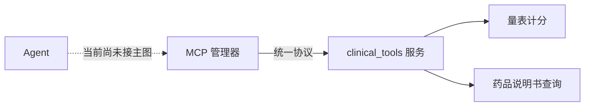

# MCP 为什么像统一插座？

## 学习目标

学完本页，你能回答：**不同进程提供的工具如何用统一方式被发现和调用，以及本项目现在集成到了哪一步？**

## 生活类比

**MCP 是统一插座**。电器内部实现各不相同，只要遵循同一种插头与供电规范，就能被插座发现和使用。对 Agent 来说，不同服务里的量表计算、药品查询也可以通过统一协议变成工具。

## 图

虚线提醒：能力已实现，但当前主状态图没有连接这条链路。

## 项目做法

MCP 即 Model Context Protocol，是模型工具接入协议。仓库已有三部分：

1. `MCPManager`：读取 JSON 配置，用 `MultiServerMCPClient` 连接多个服务，发现并聚合工具，提供名称和工具列表。
2. `mcp_servers.json`：配置 `clinical_tools` 服务，以 `python -m mcp_servers.clinical_tools`、`stdio` 方式启动。
3. `clinical_tools.py`：基于 `FastMCP` 暴露 `calculate_scale_score` 和 `query_drug_label`。前者支持 PHQ-9/GAD-7，后者当前读取 mock 药物数据。

必须准确描述现状：**MCP 已实现，但未接入 `AgentGraphManager` 主图，也没有加入三个领域 Agent 的 `tools` 列表。** 因而主聊天流程实际仍调用本地 LangChain 工具。若未来接入，应在应用生命周期中连接与清理管理器，再按最小权限把发现的工具注入对应 Agent，而不是仅导入类名。

## 源码二刷

- [`MCPManager`](../../agent/core/mcp/mcp_manager.py)
- [`mcp_servers.json`](../../agent/config/mcp_servers.json)
- [`clinical_tools.py`](../../agent/mcp_servers/clinical_tools.py)
- [`AgentGraphManager`：当前未连接 MCP](../../agent/core/workflow/graph_manager.py)
- [`DiagnosisAgentNode.tools`：当前本地工具列表](../../agent/agents/diagnosis_agent.py)

二刷时用全局引用链验证：管理器虽从 `core` 导出，但主图构造与 Agent 初始化没有使用它。

## 面试背板

**30–60 秒答案：**

> MCP 像统一插座，用标准协议连接不同进程或服务提供的工具。本仓库已经有 MCPManager，可从 JSON 配置连接服务并发现工具；也实现了 clinical_tools 服务，提供 PHQ-9/GAD-7 计分和 mock 药品说明书查询。但它目前没有接入 AgentGraphManager，也未加入领域 Agent 工具列表，所以主聊天流程仍使用本地工具。未来接入还需要生命周期管理和最小权限注入。

**追问：为什么说“已实现”不等于“已集成”？**

有服务器、客户端和配置只证明组件可用；只有主入口实际创建连接、注入工具并在关闭时清理，才算进入运行链路。

## 误解

- **误解：MCP 是新的大模型。** 它是工具与上下文接入协议。
- **误解：当前诊断 Agent 已用 MCP 算 PHQ-9。** 当前诊断提示让模型推断，MCP 计分工具未接主图。
- **误解：统一协议意味着所有 Agent 都应获得所有工具。** 仍要按职责最小授权。

## 自测

1. MCP 管理器、配置和服务器分别负责什么？
2. 临床 MCP 服务当前暴露哪两个工具？
3. 用哪两处源码能证明 MCP 尚未接主图？

## 导航

- 上一篇：[Tool 为什么是 Agent 的可调用按钮？](tools.md)
- 下一部分：[Part 07：记忆和缓存到底有什么不同？](../part07-memory-cache/index.md)
- 回到：[Part 06 首页](index.md)
