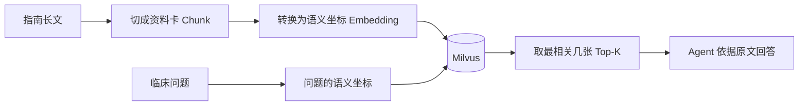

# RAG 为什么像开卷考试？

## 学习目标

学完本页，你能回答：**系统如何从大量指南中找出相关原文，再把原文交给 Agent 作答？**

## 生活类比

**RAG 是开卷考试**：不是要求考生背完整本书，而是先按题意找资料卡，再依据卡片答题。

- **Chunk 是资料卡**：把长文切成适合检索的小段。
- **Embedding 是语义坐标**：把文字变成一组数字，使意思相近的问法落在相近位置。
- **Top-K 是最相关几张**：按距离取回若干最相关资料卡，而非整本书。

## 图

## 项目做法

RAG 是 Retrieval-Augmented Generation，即“检索增强生成”。本项目的在线工具 `query_vector_db()`：

1. 用 DashScope `text-embedding-v2` 生成语义坐标。
2. 连接 Milvus 集合 **`cloud_product_docs`**。
3. 调用 `similarity_search_with_score(query, k=3)`，实际取回 **3 个**相关片段。
4. 将每段整理为“来源文件名 + 原文内容”返回 Agent。

诊断 Agent 用它查 ICD-11 诊断标准，治疗 Agent 用它查中国精神科指南。`agent/test/milvus_rag.py` 是手工导入/查询脚本，不属于 pytest 套件；在线查询代码不负责切分和灌库。

要区分“检索相关”与“医学正确”：相关片段仍可能不完整、过期或缺少适用条件，最终回答应标来源和不确定性。

## 源码二刷

- [`query_vector_db()`：在线检索 k=3](../../agent/tools/vector_tool.py)
- [`MilvusRAGManager`：文档导入与查询脚本](../../agent/test/milvus_rag.py)
- [`DiagnosisAgentNode`：诊断标准检索场景](../../agent/agents/diagnosis_agent.py)
- [`TreatmentAgentNode`：治疗指南检索场景](../../agent/agents/treatment_agent.py)

二刷时找出集合名、模型名、k 值和返回文本格式。

## 面试背板

**30–60 秒答案：**

> RAG 像开卷考试：先把长文切成 Chunk，也就是资料卡；用 Embedding 把文字映射到语义坐标；提问时再取 Top-K，也就是最相关的几张卡，交给模型结合原文回答。本项目用 DashScope text-embedding-v2 和 Milvus，文档集合名是 cloud_product_docs，在线工具每次实际取 3 个片段，并返回来源与内容，供诊断查 ICD-11、治疗查指南。

**追问：为什么取回结果后还需要模型？**

检索只找相关材料，模型还要结合病例、整合多段证据并按临床输出格式作答。

## 误解

- **误解：Embedding 是摘要。** 它是用于比较语义距离的数字表示，不直接给人阅读。
- **误解：Top-K 越大越好。** 过多片段会增加噪声和上下文成本。
- **误解：集合名 `cloud_product_docs` 表示只存云产品。** 这是沿用的真实集合名，当前工具说明用于临床指南和诊断标准。

## 自测

1. Chunk、Embedding、Top-K 分别是什么？
2. 在线工具真实的集合名和 k 值是什么？
3. RAG 命中为什么仍不能当作最终临床事实？

## 导航

- 上一篇：[RAG、知识图谱和工具怎样分工？](index.md)
- 下一篇：[知识图谱为什么像人物关系网？](knowledge-graph.md)
- 回到：[Part 06 首页](index.md)
