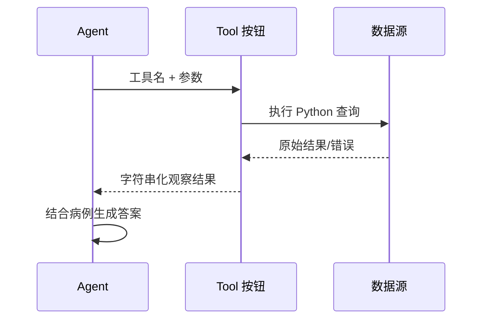

# Tool 为什么是 Agent 的可调用按钮？

## 学习目标

学完本页，你能回答：**普通 Python 查询函数怎样变成模型可以选择、调用并读取结果的能力？**

## 生活类比

**Tool 是可调用按钮**。按钮上写着名称、用途和输入要求；医生选择“查同义词”“查指南”或“查关系”，后台执行具体程序，再把结果送回病历夹。医生不需要知道数据库连接细节，但只能按到被授权的按钮。

## 图

## 项目做法

本项目用 LangChain 的 `@tool` 装饰器把函数包装为工具。函数名和文档字符串告诉模型“何时调用”，参数签名告诉框架“要传什么”，返回字符串成为 ReAct 循环的观察结果。

现有三个主流程工具：

- `query_synonyms(phrase)`：读取本地 JSON，将口语症状映射为标准术语。
- `query_vector_db(query)`：查询 Milvus 文档集合，返回来源与片段。
- `query_knowledge_graph(query)`：查询 Neo4j 节点和关系。

权限按最小需要分配：诊断拥有三个工具，治疗只有向量与图谱工具，药审只有图谱工具。工具内部捕获常见异常并返回可读错误，避免一次外部服务失败直接打断整个 Agent；但“返回错误字符串”仍需模型正确识别，不能当作正常证据。

工具是接口，不是自主角色：它不决定是否调用，也不负责最终答案。是否按按钮由 Agent 决定，调用顺序由 ReAct 循环管理。

## 源码二刷

- [`query_synonyms`](../../agent/tools/synonym_tool.py)
- [`query_vector_db`](../../agent/tools/vector_tool.py)
- [`query_knowledge_graph`](../../agent/tools/graph_tool.py)
- [`DiagnosisAgentNode.tools`：工具授权列表](../../agent/agents/diagnosis_agent.py)
- [`TreatmentAgentNode.tools`](../../agent/agents/treatment_agent.py)
- [`DrugReviewAgentNode.tools`](../../agent/agents/drug_review_agent.py)

二刷时只看每个工具的“输入、输出、失败行为、外部依赖”。

## 面试背板

**30–60 秒答案：**

> Tool 可以理解为 Agent 的可调用按钮。项目用 `@tool` 将 Python 函数的名称、说明和参数暴露给模型；模型在 ReAct 循环中选择按钮，框架执行函数并把结果作为观察返回。主流程有同义词、向量文档和知识图谱三个工具，并按职责做最小授权：诊断三个、治疗两个、药审一个。工具负责取证，不负责最终临床判断，外部服务失败时也尽量返回可读错误让流程降级。

**追问：工具描述为什么重要？**

模型主要依赖名称、说明和参数来决定何时调用；描述含糊会导致选错工具或构造错误参数。

## 误解

- **误解：Tool 就是 Agent。** Tool 是被调用函数，没有自主调度职责。
- **误解：所有 Agent 挂全部工具更灵活。** 工具越多越容易误选，也扩大权限面。
- **误解：捕获异常就等于结果可信。** 它只保证流程不断，仍要区分证据与错误信息。

## 自测

1. `@tool` 为普通函数增加了哪些可发现信息？
2. 三个领域 Agent 的工具权限分别是什么？
3. 工具失败为何要优雅降级，又为何不能静默伪造结果？

## 导航

- 上一篇：[知识图谱为什么像人物关系网？](knowledge-graph.md)
- 下一篇：[MCP 为什么像统一插座？](mcp.md)
- 回到：[Part 06 首页](index.md)
