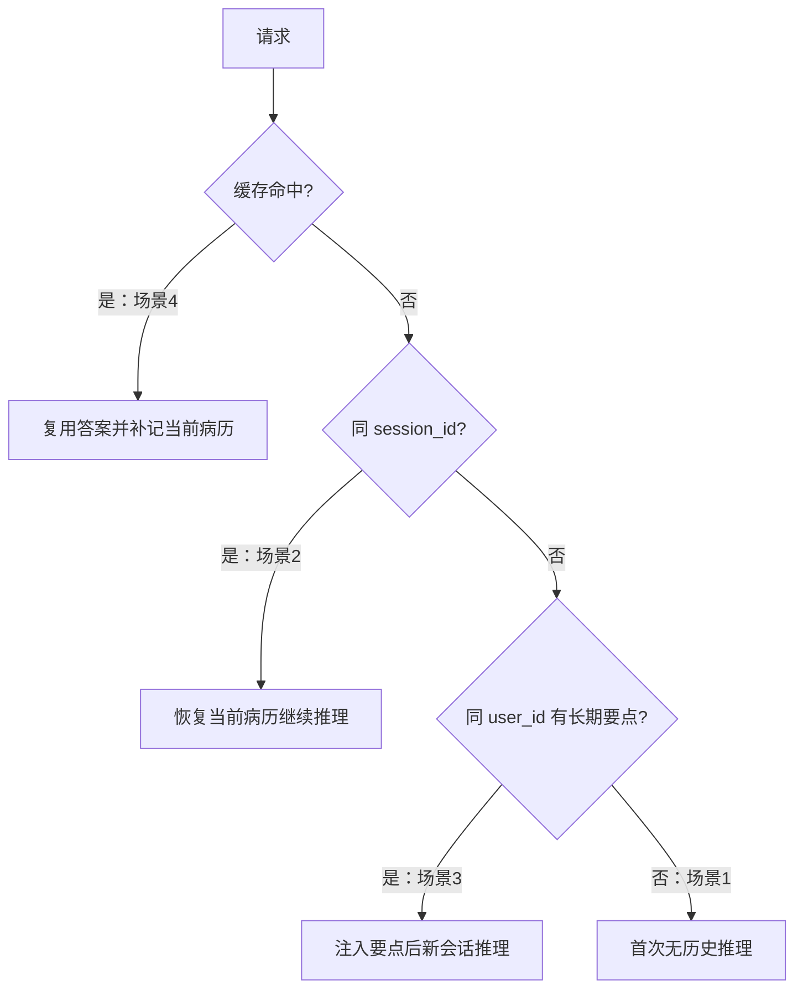

# 四个场景怎样判断记忆、缓存和推理谁在工作？

## 学习目标

学完本页，你能回答：**面对首次提问、同会话追问、跨会话提问和重复问题时，系统分别读取什么、执行什么、写回什么？**

## 生活类比

想象医生在四种情况下工作：第一次建病历；拿同一本病历追问；换一本新病历但带着长期要点卡；重复一道已有现成答案的问题。判断关键不是“系统有没有记忆”，而是当前用了哪一层。

## 图

## 项目做法

**场景 1：首次问题，缓存未命中。** 当前会话没有旧 Checkpoint，长期检索可能为空；系统运行分诊和领域 Agent，写入会话状态与用户缓存。轮次达到 5 的倍数时才后台提取长期要点。

**场景 2：同一 `session_id` 追问。** Redis 按 `thread_id` 恢复当前病历，新消息与历史合并；超过 16 条时压缩并保留最近 8 条。TTL 为 86400 秒且读取会续期。

**场景 3：新 `session_id`、同一 `user_id`。** 不会恢复旧会话病历，但会从 `long_term_memory` 按用户过滤并检索相关要点，注入 `memory_context`。它不是完整旧对话，只是提取过的临床事实。

**场景 4：相同或高度相似问题命中缓存。** `qa_semantic_cache` 精确命中或距离 `<=0.08` 时直接返回，不运行 Agent 图；但仍把问答写入当前 Checkpoint。缓存若不可用或距离过大，就回到场景 1–3 的推理路径。

基础设施故障也可据此判断：Redis 挂了影响场景 2 和压缩；Milvus 挂了影响场景 3、4及文档检索，但各模块设计为优雅降级，不应让基础聊天入口崩溃。

## 源码二刷

- [`stream_chat()`：四场景的总分支](../../app/service/chat_service.py)
- [`checkpointer.py`：场景 2](../../agent/core/workflow/checkpointer.py)
- [`long_term.py`：场景 3](../../agent/core/memory/long_term.py)
- [`cache.py`：场景 4](../../app/infra/cache.py)
- [`graph_manager.py`：未命中后的推理路径](../../agent/core/workflow/graph_manager.py)

二刷练习：为四个场景各写出 `session_id`、`user_id`、缓存结果三个输入条件。

## 面试背板

**30–60 秒答案：**

> 我用四个场景解释系统：首次提问且缓存未命中时跑完整 Agent 并写状态；同 session_id 追问时从 Redis 恢复当前病历，TTL 86400 秒且读时续期，超过 16 条压缩并保留 8 条；新 session_id 但同 user_id 时，不恢复旧会话，只从 long_term_memory 注入每 5 轮提取的要点；相同或相似问题在 qa_semantic_cache 距离不超过 0.08 时直接复用答案，但仍写回 Checkpoint。

**追问：Redis 和 Milvus 同时不可用会怎样？**

失去跨轮恢复、长期要点、缓存和向量文档检索，但代码按模块优雅降级；模型与可用工具仍可做无状态推理，答案证据能力会下降。

## 误解

- **误解：同一用户换会话仍能看到全部原对话。** 只能检索已提取的长期要点。
- **误解：同一会话必然走 Agent。** 若缓存先命中，会直接返回并补记状态。
- **误解：每第 5 条消息都提取。** 代码按有效聊天轮次计数，每 5 轮后台调度一次，且进程重启会重置计数。

## 自测

1. 新会话同用户能读取什么、不能读取什么？
2. 缓存命中与同会话恢复能否同时发生？执行顺序是什么？
3. Redis、Milvus 分别故障时，四个场景受哪些影响？

## 导航

- 上一篇：[语义缓存怎样判断“这题以前答过”？](semantic-cache.md)
- 回到：[Part 07 首页](index.md)
- 全部学习目录：[`learn/README.md`](../README.md)
