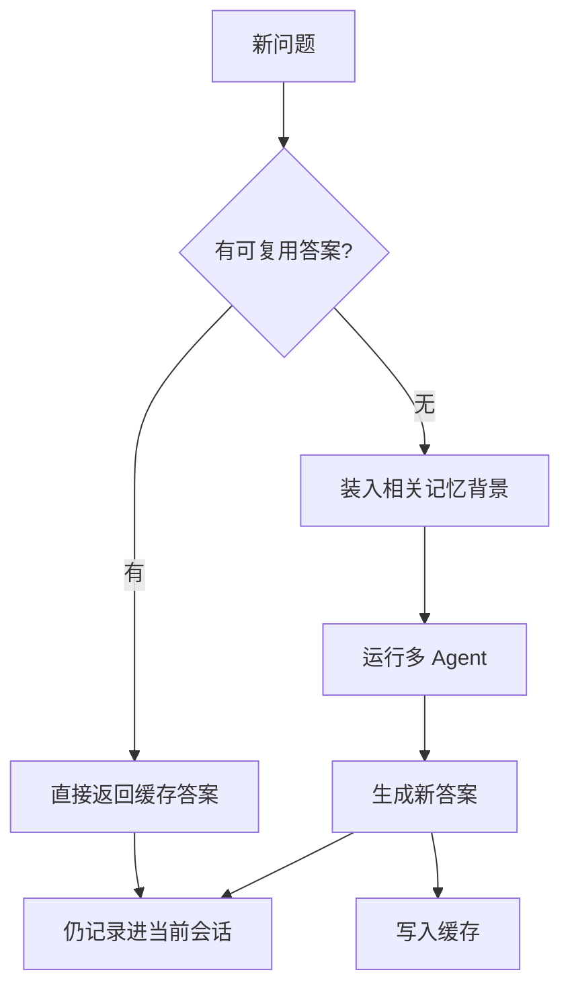

# Part 07：记忆和缓存到底有什么不同？

## 学习目标

学完本页，你能回答：**为什么“记住这位患者的病史”和“复用以前算好的答案”不是一回事？**

## 生活类比

三层记忆分别是**当前病历、压缩摘要、长期要点卡**：它们保存“发生过什么”，帮助系统理解后续问题。

**缓存是现成答案复用，不是记忆**：看到足够相同或相近的问题，直接拿出以前的答案，目的是减少重复计算。

## 图

## 项目做法

请求先查语义缓存；命中则跳过 Agent 图，但仍把本轮问答写入 Checkpoint。未命中时，系统检索长期要点作为 `memory_context`，再运行携带当前会话状态的图。

三层记忆：

1. 当前病历：Checkpoint 保存的会话消息和中间状态。
2. 压缩摘要：消息超过 16 条时，把早期内容压成摘要并保留最近 8 条。
3. 长期要点卡：每 5 轮从会话中提取主诉、诊断、用药、量表等，写入 `long_term_memory`。

缓存使用 `qa_semantic_cache`，语义距离 **<= 0.08** 才命中。文档知识另在 `cloud_product_docs`，三者不能混淆。Redis 或 Milvus 不可用时均优雅降级：可能失去连续性、长期背景或加速，但不应阻塞基本推理。

## 源码二刷

- [`chat_service.py`：缓存、记忆与图的调用顺序](../../app/service/chat_service.py)
- [`checkpointer.py`：当前会话存档](../../agent/core/workflow/checkpointer.py)
- [`memory_manager.py`：长期要点](../../agent/core/memory/memory_manager.py)
- [`cache.py`：现成答案复用](../../app/infra/cache.py)

二刷时分别标出“读发生在何时、写发生在何时、命中后是否跳过图”。

## 面试背板

**30–60 秒答案：**

> 记忆保存用户与病例上下文，缓存复用已生成答案，两者目标不同。本项目有当前病历、压缩摘要和长期要点卡三层记忆：Checkpoint 保存会话；超过 16 条时摘要旧消息并保留 8 条；每 5 轮提取临床要点到 long_term_memory。语义缓存则在 qa_semantic_cache 中找现成问答，距离小于等于 0.08 才复用。缓存命中仍写回 Checkpoint，保证后续追问连续。

**追问：缓存命中为何不能替代记忆写入？**

因为缓存只返回答案，不自动成为该会话历史；不写入当前病历，下一轮就不知道刚才说过什么。

## 误解

- **误解：长期记忆就是更久的缓存。** 长期记忆存临床事实，缓存存完整问答结果。
- **误解：缓存命中后什么都不用做。** 仍要记录该轮状态。
- **误解：三层都在同一数据库。** 当前会话在 Redis，长期要点和缓存虽都用 Milvus，但集合不同。

## 自测

1. 三层记忆分别保存什么？
2. 缓存命中后为什么仍写 Checkpoint？
3. `cloud_product_docs`、`long_term_memory`、`qa_semantic_cache` 各是什么？

## 导航

- 上一部分：[Part 06：知识与工具](../part06-knowledge-tools/index.md)
- 下一篇：[三层记忆怎样接力？](three-memories.md)
- 本章路线：三层记忆 → 语义缓存 → 四个场景
