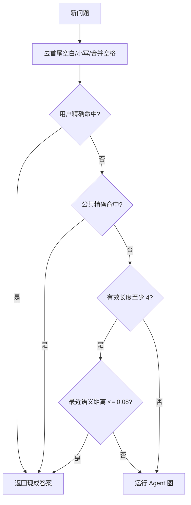

# 语义缓存怎样判断“这题以前答过”？

## 学习目标

学完本页，你能回答：**完全相同和意思相近的问题如何命中现成答案，又怎样避免跨用户串数据？**

## 生活类比

缓存像答疑台的现成答案柜：先按规范化题目找完全相同的卡片；找不到时，再比较题意是否足够接近。**缓存是现成答案复用，不是记忆**，它减少重复推理，但不负责理解患者长期病史。

## 图

## 项目做法

语义缓存使用 Milvus 集合 **`qa_semantic_cache`**。写入问题、规范化问题、答案、作用域、用户、启用标记和语义向量。

语义向量就是把文本变成可计算距离的数字坐标，源码类型名是 **Embedding**。查询顺序：

1. 先查当前用户作用域的规范化精确匹配，距离记为 0。
2. 再查公共作用域精确匹配。
3. 去空白后的问题少于 4 个字符则不做语义匹配。
4. 否则在“公共 + 当前用户”范围内找最近 1 条；距离 **<= 0.08** 才命中，`> 0.08` 拒绝。

聊天生成的新答案以 `user_id` 写入，因此默认是用户作用域。命中后绕过 Agent 图并直接流式返回，但 `_record_cache_hit_turn()` 会把用户问题和缓存答案写入 Checkpoint。未命中且生成成功后再写缓存。Milvus 或语义模型不可用时返回未命中，不阻塞推理。

## 源码二刷

- [`SemanticCache.get_cache()`：精确与语义两级查找](../../app/infra/cache.py)
- [`set_cache()`：用户作用域写入](../../app/infra/cache.py)
- [`_record_cache_hit_turn()`](../../app/service/chat_service.py)
- [`stream_chat()`：先查缓存再跑图](../../app/service/chat_service.py)

二刷时验证边界值：距离恰好 `0.08` 会命中，因为代码只拒绝 `> 0.08`。

## 面试背板

**30–60 秒答案：**

> 语义缓存先做规范化精确匹配，再做相似问题匹配。项目使用 qa_semantic_cache，依次查当前用户精确项、公共精确项；有效问题至少 4 个字符时，再在公共和当前用户范围找最近一条，语义距离小于等于 0.08 才命中。命中直接复用答案、跳过 Agent 图，但仍把本轮问答写入 Checkpoint。这样既加速重复问题，也保持后续追问连续和用户隔离。

**追问：为什么距离阈值是“越小越相似”？**

这里使用的是距离语义，0 表示精确；源码只接受不超过 0.08 的结果。不同向量库或指标可能返回相似度，判断方向不能照搬。

## 误解

- **误解：阈值是 0.8。** 真实阈值是 **0.08**。
- **误解：所有缓存答案全用户共享。** 默认生成结果按用户作用域写入，另支持公共作用域。
- **误解：语义缓存命中后无需 Checkpoint。** 仍需记录本轮以支持追问。

## 自测

1. 缓存查找的准确顺序是什么？
2. 距离等于 0.08 时命中吗？
3. 用户作用域与公共作用域怎样共同参与检索？

## 导航

- 上一篇：[三层记忆怎样接力？](three-memories.md)
- 下一篇：[四个场景怎样判断记忆、缓存和推理谁在工作？](four-scenarios.md)
- 回到：[Part 07 首页](index.md)
