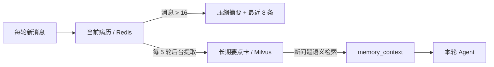

# 三层记忆怎样接力？

## 学习目标

学完本页，你能回答：**当前病历、压缩摘要和长期要点卡各保存什么，何时读取，何时写入？**

## 生活类比

- **当前病历**：本次会诊的完整工作夹，保留原始对话与中间结论。
- **压缩摘要**：病历太厚后整理的一页摘要，兼顾早期信息和近期原文。
- **长期要点卡**：跨会诊携带的少量关键卡片，如主诉、诊断、用药、量表。

三者是不同粒度，不是三份相同备份。

## 图

## 项目做法

**第一层：当前病历。** LangGraph Checkpoint 以 `session_id` 为 `thread_id` 存在 Redis，TTL **86400 秒**且**读时续期**。每轮只传新消息，旧状态自动恢复。

**第二层：压缩摘要。** 只有启用 Checkpoint 时才加入图。消息总数严格 **>16** 时，把更早内容压成一条系统摘要，保留最近 **8** 条原文。它仍在当前会话内，不跨用户检索。

**第三层：长期要点卡。** `MemoryManager` 从 Checkpoint 历史中提取主诉、诊断、用药、PHQ-9、复诊周期、过敏史等，存入 Milvus 集合 **`long_term_memory`**，按 `user_id` 过滤。聊天服务按 `(user_id, session_id)` 计数，**每 5 轮**创建后台任务，不阻塞 SSE；进程内计数重启后会重置。新问题到来时按语义取默认最多 5 条，注入 `memory_context`。

Redis/Milvus 不可用时对应层变为空操作或无状态模式，基本推理继续。

## 源码二刷

- [`checkpointer.py`：第一层 TTL 与续期](../../agent/core/workflow/checkpointer.py)
- [`_compress_history()`：第二层阈值与窗口](../../agent/core/workflow/graph_manager.py)
- [`MemoryManager`：第三层提取与检索](../../agent/core/memory/memory_manager.py)
- [`LongTermMemory`：集合和 user_id 过滤](../../agent/core/memory/long_term.py)
- [`chat_service.py`：每 5 轮后台触发](../../app/service/chat_service.py)

二刷时分别画出三层的 key：`thread_id`、消息列表、`user_id`。

## 面试背板

**30–60 秒答案：**

> 三层记忆是当前病历、压缩摘要和长期要点卡。当前病历由 Redis Checkpoint 按 session_id 保存，TTL 86400 秒且读时续期；消息超过 16 条时，第二层把旧内容压成一条摘要并保留最近 8 条；第三层每 5 轮从会话历史后台提取主诉、诊断、用药和量表等，存入 Milvus 的 long_term_memory，并按 user_id 在后续问题中检索注入。三层粒度和生命周期不同，基础设施失败时都优雅降级。

**追问：为什么长期记忆按 user_id，而 Checkpoint 按 session_id？**

会话状态要区分每次会诊线程；长期要点要在同一用户的不同会话间复用，因此隔离键不同。

## 误解

- **误解：每 5 轮会同步阻塞回答。** 提取通过后台任务执行，不阻塞 SSE。
- **误解：摘要就是长期记忆。** 摘要服务当前线程，长期卡可跨会话检索。
- **误解：长期记忆保存全部原对话。** 它提取少量可操作临床事实并去重。

## 自测

1. 三层的存储位置、隔离键和触发时机分别是什么？
2. 为什么长期提取在后台执行？
3. 进程重启对“每 5 轮”计数有什么影响？

## 导航

- 上一篇：[记忆和缓存到底有什么不同？](index.md)
- 下一篇：[语义缓存怎样判断“这题以前答过”？](semantic-cache.md)
- 回到：[Part 07 首页](index.md)
