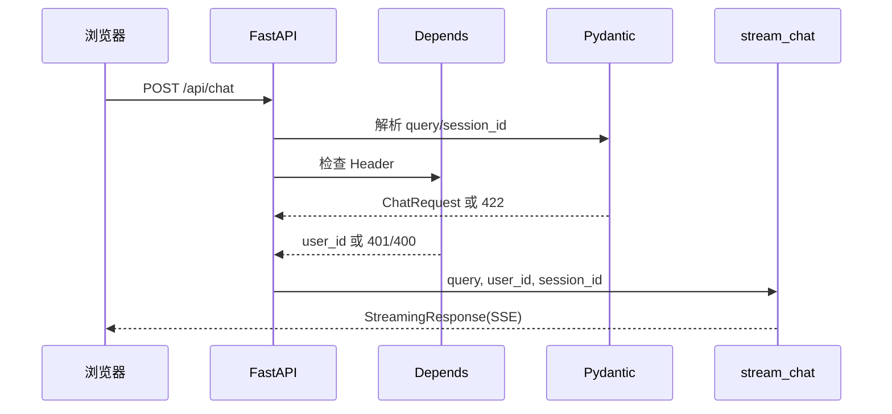

# 08.1｜FastAPI：医院接待窗口怎样收下一份病例

把 API 想成医院接待窗口。窗口不负责做鉴别诊断，而是确认“材料能不能收、来访标识长得是否合法、该把材料交给谁”。这能帮助我们避免把 HTTP 边界和临床推理揉成一个大函数。

## 学习目标

- 说清 `app_main.py`、路由、依赖和 Pydantic 的分工；
- 理解 `lifespan` 的初始化/清理时机及其边界；
- 区分 401、400、422 与 200 后的业务提示；
- 能从 `POST /api/chat` 一路跟到 `stream_chat()`。

## 类比：接待员、材料清单与交接单

- **医院大门与营业时间**：`FastAPI(..., lifespan=lifespan)`；开门前连接资源，关门时清理。
- **接待窗口号**：`app.include_router(..., prefix="/api")` 与 `@router.post("/chat")` 合成 `/api/chat`。
- **门禁卡检查**：`require_chat_identity()` 检查可选 Bearer 和必填 `X-User-Id`。
- **材料清单**：`ChatRequest` 检查 `query/session_id` 的形状。
- **交接单**：endpoint 把三个已整理参数交给 `stream_chat()`。

接待员只能确认“卡片匹配共享口令、登记号格式合规”，不能据此证明持卡人真实身份；这条边界在安全篇会继续展开。

## 图：窗口内的处理顺序



FastAPI 内部解析与依赖求值的细节不需要死背；工程上要抓住一点：endpoint 只有在输入和依赖满足时才获得可用参数。

## 真实实现

### 1. 应用入口

[`app/app_main.py`](../../app/app_main.py) 做四件事：补充导入路径、配置日志、注册 lifespan、挂载 CORS 与路由。

```python
@asynccontextmanager
async def lifespan(app: FastAPI):
    await init_agent_system()
    yield
    await shutdown_agent_system()
```

`yield` 前是开门准备，之后是关门清理。但不要夸大为“所有初始化都在 lifespan”：模块导入时已经构造 API Settings、配置日志，并沿导入链加载部分 Agent/工具模块。

### 2. 路由依赖

[`app/router/chat.py`](../../app/router/chat.py) 的 `require_chat_identity()`：

- `API_AUTH_TOKEN` 非空时，必须提供正确 `Bearer <token>`，否则 401；
- 无论 token 是否启用，`X-User-Id` 都必填；
- `X-User-Id` 必须匹配 `^[A-Za-z0-9_.:-]{1,128}$`，否则 400；
- token 用 `secrets.compare_digest()` 比较。

成功后依赖返回 `user_id`：

```python
async def chat_endpoint(
    request: ChatRequest,
    user_id: Annotated[str, Depends(require_chat_identity)],
):
    return StreamingResponse(
        stream_chat(request.query, user_id, request.session_id),
        media_type="text/event-stream",
    )
```

### 3. 请求模型

[`app/schemas/chat.py`](../../app/schemas/chat.py) 规定：

- `query` 原始长度 1～4000，`strip()` 后不能为空；
- `session_id` 默认 `default_session`，字符白名单和长度与用户 ID 类似；
- Body 没有 `user_id` 字段。

因此有两层“太短”：全空白在 Schema 层通常得到 422；去掉全部空白后少于 4 个字符，会进入 `stream_chat()` 的本地提示路径，HTTP 仍是 200。

### 4. CORS 不是门禁

`CORSMiddleware` 默认允许 `http://localhost:5173` 和 `http://127.0.0.1:5173`。它决定浏览器跨源读取是否被允许，不校验调用者身份；curl 和服务端程序不受浏览器同源策略约束。

## 源码二刷

按以下断点重读：

1. 在 `app_main.py` 找到 `include_router`，算出最终 URL；
2. 在 `chat.py` 列出 401 与 400 的所有分支；
3. 在 `schemas/chat.py` 手工推演空字符串、三个空格、`../bad`；
4. 在 `chat_service.py` 找到 `< 4` 的业务规则；
5. 阅读 `app/test/test_chat_security.py`，把每个测试映射回一个窗口规则。

二刷时特别留意两个 Settings 类：API Settings 用绝对路径读取 `agent/.env`；Agent Settings 当前使用相对 `.env`，不能把它们随意说成同一个配置对象。

## 面试背板

> FastAPI 层像接待窗口：Pydantic 管 Body 的形状，Depends 统一管 Header 身份标签，endpoint 只做协议到服务的交接。当前 Bearer 是可配置共享口令，`X-User-Id` 只做格式校验，不等于真实用户认证。合法请求返回 StreamingResponse，后续业务是否完成还要读到 SSE 的 done 标志。

## 常见误解

- **“配置了 CORS 就完成鉴权。”** CORS 只是浏览器策略。
- **“合法 `X-User-Id` 就是真医生。”** 正则只证明格式合法。
- **“query 最短是 4，所以 1 字输入返回 422。”** Schema 最短为 1；服务层才执行 4 字业务规则。
- **“200 就代表模型回答成功。”** 流可能中断，也可能只是返回短输入提示。
- **“lifespan 前没有副作用。”** 当前导入链确实存在配置、日志和工具模块副作用。

## 自测

1. 缺 `X-User-Id` 为什么是 400，而非法 `session_id` 通常是 422？
2. 当 `API_AUTH_TOKEN` 为空时，哪些检查仍然执行？
3. 为什么 user ID 不放进 JSON Body？当前设计仍缺少什么身份保证？
4. `StreamingResponse` 为什么可以在 endpoint 返回后继续产生内容？
5. CORS 报错时，为什么 curl 可能仍正常？

## 导航

- [上一篇总览](./index.md)
- [下一节：SSE 实时报告](./sse-live-report.md)
- [安全门禁详解](../part09-security-troubleshooting/security-gates.md)
