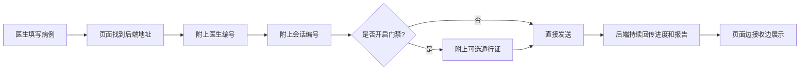
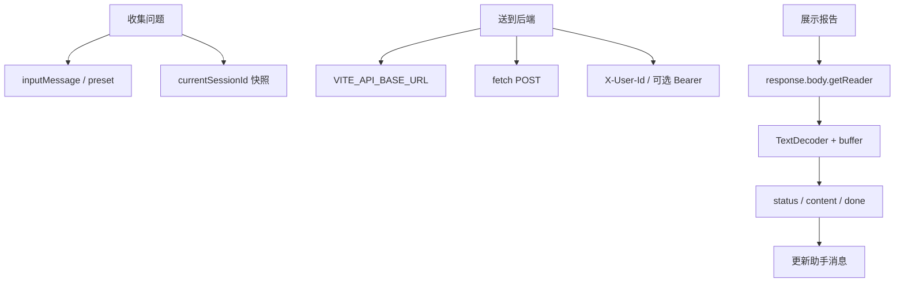

# 08.4｜前端请求：页面怎样把病例交给后端？

## 学习目标

读完这一节，你不需要背代码，但要先回答三个问题：

1. 页面为什么要知道后端在哪里？
2. 后端怎样分清“谁在提问”和“这是哪一次连续对话”？
3. 为什么分析结果不是等全部完成后一次出现，而是一段一段显示？

第二遍阅读时，再把这三个问题对应到项目里的变量和函数。

## 生活类比：寄一份会不断回传进度的病例快递

想象医生要把一份病例寄给远程会诊中心。寄件时需要准备五样东西：

| 寄快递时需要什么 | 在这个项目里代表什么 |
|---|---|
| 收件地址 | 后端服务运行在哪里 |
| 包裹里的病例 | 医生这一轮输入的问题 |
| 医生编号 | 告诉后端是谁提交的 |
| 会话编号 | 告诉后端属于哪一次连续问诊 |
| 可选通行证 | 系统开启门禁后，用来证明请求知道入口口令 |

先只记住一句话：

> 页面负责把病例送到正确的后端，并随病例带上医生编号和会话编号；如果系统开启了门禁，还要再带一张通行证。

同一个聊天窗口会继续使用同一个**会话编号**。因此医生追问“那用药方面呢？”时，后端能找到这次问诊之前的内容，而不是把它当成一个全新病例。

这份“快递”还有一个特别之处：会诊中心不会等报告全部写完才寄回来，而是不断回传“已接收、正在查资料、正在生成建议”等进度。页面一边接收，一边展示，所以用户能看到内容逐步出现。



## 从人话映射到项目名称

建立直觉后，再认识源码里的名字：

| 前面的人话 | 项目里的名称 | 现在只需记住什么 |
|---|---|---|
| 后端地址 | `VITE_API_BASE_URL` | 决定请求送到哪里 |
| 发送快递 | `fetch()` | 浏览器用它发起 HTTP 请求 |
| 医生编号 | `X-User-Id` | 是用户标签，但不等于完成了真实登录认证 |
| 会话编号 | `session_id` | 同一聊天窗口复用它来保持多轮连续 |
| 可选通行证 | `VITE_API_AUTH_TOKEN` | 后端开启令牌校验时才携带 |
| 持续回传报告 | `ReadableStream` | 结果会分批到达，不是一次性完整 JSON |

第一遍读到这里就够了。下面进入“源码二刷”，才需要关注这些名称具体写在哪里。

## 图：三件事映射到源码



## 真实实现

### 1. 收集问题

```ts
const query = preset || inputMessage.value.trim()
if (!query || isThinking.value) return
const requestSessionId = currentSessionId.value
```

preset 来自页面场景卡片，否则取输入框。`requestSessionId` 是本次请求快照；UI 后续即使切到其他会话，返回片段仍写回原消息字典。

### 2. 选择后端地址

```ts
const apiBaseUrl = import.meta.env.VITE_API_BASE_URL
  || 'http://127.0.0.1:5000'
```

Vite 只把 `VITE_*` 暴露给前端代码。它解决“请求发往哪里”，不解决 CORS、服务是否启动或用户权限。

### 3. 组装请求

```ts
const headers = {
  'Content-Type': 'application/json',
  'X-User-Id': userId.value,
}
if (apiAuthToken) headers.Authorization = `Bearer ${apiAuthToken}`

fetch(`${apiBaseUrl}/api/chat`, {
  method: 'POST',
  headers,
  body: JSON.stringify({ query, session_id: requestSessionId }),
})
```

映射关系：

| 值 | 放在哪里 | 当前职责 | 不代表什么 |
|---|---|---|---|
| `query` | Body | 本轮问题 | 完整病历或结构化诊断 |
| `session_id` | Body | UI 会话、checkpoint thread | 真实用户身份、访问授权 |
| `X-User-Id` | Header | 用户标签、缓存/记忆过滤输入 | 已认证医生 |
| Bearer token | Header | 可配置的共享入口口令 | 登录系统、角色权限 |
| API base URL | 构造 URL | 后端位置 | 浏览器一定允许跨域 |

### 4. 用水管理解 ReadableStream

`response.body` 不是完整字符串，而是一根水管：

```ts
const reader = response.body.getReader()
const decoder = new TextDecoder()
let buffer = ''
```

每次 `reader.read()` 接到的“水桶”大小由网络决定。一个 JSON 可能跨桶，一个桶也可能装多帧，甚至一个汉字的 UTF-8 字节也可能被拆开。

```ts
buffer += decoder.decode(value, { stream: true })
const lines = buffer.split('\n')
buffer = lines.pop() || ''
```

`stream: true` 保留跨块字符解码状态；`buffer` 保留最后一条未完整行。当前后端保证每帧 JSON 在单个 `data:` 行内，所以按行处理能工作。通用 SSE 解析器还应按空行组帧、兼容 CRLF、多行 data 和流末尾残留。

### 5. 三类消息

- `parsed.status`：更新气泡状态，例如“正在临床评估”；
- `parsed.content`：按 Agent 分段追加正文；
- `parsed.done`：设置“分析完成”。

前端兼容字面量 `[DONE]`，但当前后端实际发送 JSON `{"done": true}`。

### 6. 当前限制

`catch` 将 HTTP 401、400、422、CORS、断网和中途流错误统一显示为“检查后端/5000 端口”。这是原型级错误体验；排错必须结合 Network 面板和后端日志。浏览器中的 token 可被用户查看，不应被描述为生产级密钥保管。

## 源码二刷

给 `sendQuery()` 的每一段标注三种颜色：

- 输入/会话状态；
- HTTP 请求；
- 流解析/UI 更新。

再推演三个边界：

```text
chunk 1: data: {"agent":"treat
chunk 2: ment","content":"建
chunk 3: 议"}\n\ndata: {"done":true}\n\n
```

确认为什么不能对每次 `read()` 直接 `JSON.parse`。最后检查 `finally`：无论成功失败都释放全局 `isThinking`。

## 面试背板

### 面试官：前端怎样把病例交给后端，并维持多轮对话？

**先给一句短答：**

> 页面会把本轮病例、医生编号和会话编号一起交给后端；同一个聊天窗口复用同一个会话编号，所以后端能接着上一次内容继续分析。

**需要展开时再补充：**

> 具体实现上，浏览器用 `fetch()` 调用聊天接口。医生编号放在 `X-User-Id` 请求头中，本轮问题和 `session_id` 放在请求体中。如果后端开启了令牌校验，页面还会附带 Bearer Token。返回结果采用流式读取，页面通过 `TextDecoder` 和缓冲区处理可能被网络拆开的文本，再把状态和正文逐步追加到当前会话。

**主动说明边界会更加分：**医生编号目前只是经过格式校验的标签，浏览器中的共享令牌也不等于完整登录系统；生产环境还需要真正的身份认证和会话授权。

## 常见误解

- **“每次 reader.read 就是一帧 SSE。”** 网络块与协议帧无关。
- **“VITE token 只有前端代码能看到。”** 构建后用户可查看。
- **“session ID 可以证明访问者是谁。”** 它主要标识会话。
- **“response.ok 后一定会收到 done。”** 流仍可能中断。
- **“忽略 JSON 异常就足够健壮。”** 静默丢帧会掩盖协议错误。

## 自测

1. 用一句话分别解释 API base URL、user ID、token、session ID。
2. `TextDecoder({stream:true})` 解决什么问题？
3. buffer 为什么只保留 `lines.pop()`？
4. 切换会话后，为什么响应仍能写回原会话？
5. 如何改进当前统一错误文案，使 401、422 与流中断可区分？

## 导航

- [上一节：给 Python 开发者的 Vue](./vue-for-python.md)
- [返回本篇总览](./index.md)
- [下一篇：安全、排错与可观测性](../part09-security-troubleshooting/index.md)
