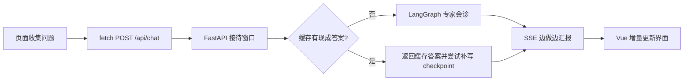

# Part 08｜从医院接待窗口到浏览器工作台

这一篇不从框架名开始，而是跟着一次“接诊”走完全程：接待窗口先检查材料，档案室查有没有现成答案，需要时再组织专家会诊，整个过程通过广播持续汇报；浏览器工作台负责提交材料、听广播、把结果安全地展示出来。

## 学习目标

学完本篇，你应该能：

- 用“医院接待窗口”解释 FastAPI 路由、请求模型与依赖；
- 区分“查现成答案”的语义缓存与“专家会诊”的 LangGraph 主流程；
- 说明 SSE 为什么像边做边汇报，而不是等整份报告完成；
- 用 Python 心智模型理解 Vue `ref`，并读懂 `fetch + ReadableStream`；
- 从页面的三件事反推 `VITE_API_BASE_URL`、Header、token 与 session 的职责。

## 类比：一家有电子叫号屏的医院

| 医院场景 | 项目组件 | 作用 |
|---|---|---|
| 接待窗口 | FastAPI `/api/chat` | 收材料、做入口校验、交给服务层 |
| 门禁卡与登记号 | Bearer / `X-User-Id` | 原型入口保护与用户标签，不等于完整身份系统 |
| 档案室查现成答复 | Milvus 语义缓存 | 尝试复用相同或足够相近的问题答案 |
| 专家会诊 | LangGraph 领域 Agent 流水线 | 路由、鉴别诊断、治疗推荐、药物审查 |
| 叫号屏持续播报 | SSE | 持续发送状态、正文片段和完成标志 |
| 医生工作台 | Vue `App.vue` | 收集输入、发请求、展示流式结果 |

## 图：一次请求的旅程



这张图只表达主路径。短于 4 个非空白字符的输入会在服务层直接返回补充信息提示；Redis、Milvus 不可用时部分能力会降级；模型配置错误则不保证主流程仍可工作。

## 真实实现

建议按用户体验顺序阅读，而不是按目录字母顺序：

1. [FastAPI 接待窗口](./fastapi-window.md)：`app_main.py → router/chat.py → schemas/chat.py`；
2. [SSE 实时报告](./sse-live-report.md)：`chat_service.stream_chat()` 的三条路径；
3. [给 Python 开发者的 Vue](./vue-for-python.md)：`App.vue` 中的状态与模板；
4. [前端怎样发起请求](./frontend-request.md)：`sendQuery()`、Header 和流解析。

当前公开契约是：

```http
POST /api/chat
Content-Type: application/json
X-User-Id: doctor_001
Authorization: Bearer <token>   # 仅 API_AUTH_TOKEN 非空时强制

{"query":"患者近两周情绪低落并伴失眠","session_id":"session_demo"}
```

响应类型为 `text/event-stream`，帧形如 `data: {JSON}\n\n`。后端结束标志是 `{"done": true}`，不是字面量 `[DONE]`。

## 源码二刷

第一遍只跟主线；第二遍带着这些问题回源码：

- `lifespan` 管了哪些资源，哪些导入副作用其实更早发生？
- `Depends(require_chat_identity)` 为什么在 endpoint 前执行？
- 缓存命中为何仍调用 `graph.aupdate_state()`？
- `custom`、`updates` 和 SSE JSON 是哪三层事件？
- 前端为什么快照 `requestSessionId`，却仍用全局 `isThinking`？
- 为什么 `marked.parse()` 后还要 `DOMPurify.sanitize()`？

## 面试背板

> 这个 API 像医院接待窗口：先校验请求和入口凭证，再查语义缓存；未命中才进入多 Agent 会诊。内部进度被翻译成 SSE，让前端能同时展示阶段和正文。前端不是等待完整 JSON，而是用 `fetch` 读取流、缓冲半帧并增量更新 Vue 响应式状态。缓存命中仍写 checkpoint，避免下一轮上下文断裂。

## 常见误解

- **“FastAPI 就负责所有推理。”** 错。API 层负责 HTTP、鉴权、缓存和流式转发，推理逻辑在 `agent/`。
- **“缓存命中就与会话状态无关。”** 错。可用 Redis 时仍要把问答写回 checkpoint。
- **“SSE 就必须使用 GET + EventSource。”** 错。本项目需要 POST Body 和自定义 Header，所以使用 `fetch`。
- **“前端的 session 是安全隔离。”** 错。它主要是 UI 与 checkpoint 的会话标识，不能替代服务端授权。
- **“页面输出就是医疗结论。”** 错。该仓库是辅助决策原型，输出必须由专业人员复核。

## 自测

1. 画出短输入、缓存命中、缓存未命中三条路径。
2. 为什么 HTTP 200 不能证明 SSE 已完整结束？
3. `X-User-Id` 在 Header，`session_id` 在 Body，各自解决什么问题？
4. 网络 chunk 为什么不能直接 `JSON.parse`？
5. Redis 不可用与 Milvus 不可用分别损失什么能力？

## 导航

- [下一节：FastAPI 接待窗口](./fastapi-window.md)
- [本篇：SSE 实时报告](./sse-live-report.md)
- [本篇：给 Python 开发者的 Vue](./vue-for-python.md)
- [本篇：前端请求拆解](./frontend-request.md)
- [下一篇：安全、排错与可观测性](../part09-security-troubleshooting/index.md)
