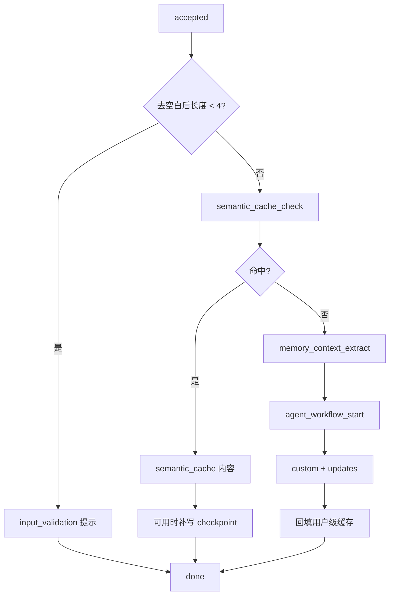

# 08.2｜SSE：先查现成答案，再会诊，边做边汇报

接待窗口收下病例后，不应立刻召集所有专家。系统先去档案室查“有没有可复用的现成答案”；没有才进入专家会诊。不论走哪条路，叫号屏都会持续汇报进度，这就是本项目的 SSE 心智模型。

## 学习目标

- 区分短输入、缓存命中、缓存未命中三条真实路径；
- 解释语义缓存为何是计算复用而非长期记忆；
- 区分 LangGraph `custom`、`updates` 与网络 SSE；
- 理解缓存命中后补写 checkpoint 的必要性；
- 能用 curl 观察首帧、内容帧与完成帧。

## 类比：档案室、专家会诊和广播员

- **查现成答案**：`semantic_cache.get_cache(query, user_id)`；先精确，再在用户/public 范围内找最近邻。
- **专家会诊**：`graph.astream(...)`；路由后进入诊断、治疗、药物审查链。
- **院内工作便笺**：LangGraph `custom`，记录节点开始、工具调用和文本块。
- **会诊签字单**：LangGraph `updates`，表示节点完成并更新 state。
- **对外广播**：`emit_sse()` 把内部信息翻译成稳定 JSON。

档案室的“相似”不是医学等价。当前阈值是实现参数，不是临床验证结论；个体条件不同的问题可能不适合复用。

## 图：三条通道



## 真实实现

### 1. 第一帧先确认“已接收”

`stream_chat()` 一开始就 `yield`：

```text
data: {"status":"accepted","content":"已接收病例，开始分析..."}\n\n
```

项目没有使用 SSE 的 `event:` 行。每一帧只有一行 `data:`，以空行结束。

### 2. 查现成答案

[`app/infra/cache.py`](../../app/infra/cache.py) 的集合为 `qa_semantic_cache`，使用 1536 维 embedding；当前距离判断是 `distance <= 0.08`。读取范围只包括 public 或当前 `user_id`，运行时写入会因为传入 `user_id` 而成为 user scope。

Milvus、embedding key 或缓存开关不可用时，缓存会返回 miss/禁用并让主流程继续。不要把这说成“所有 Milvus 故障都完全无影响”：长期记忆和向量 RAG 也会损失各自能力。

### 3. 命中仍维护病历上下文

缓存命中绕过图执行，因此 LangGraph 不会自然记录本轮。`_record_cache_hit_turn()` 在 checkpointer 可用时调用：

```python
await graph.aupdate_state(
    config,
    {"messages": [HumanMessage(content=query), AIMessage(content=answer)]},
)
```

Redis 不可用时这一步跳过，答案仍返回，但多轮连续性退化。

### 4. 未命中进入会诊

服务只把本轮新 `HumanMessage` 放进 state；历史由 checkpoint 根据 `thread_id=session_id` 恢复。图运行使用两种内部流：

```python
async for stream_mode, data in graph.astream(
    state,
    config=config,
    stream_mode=["updates", "custom"],
):
    ...
```

`custom` 中的 `chunk` 形成正文，`start/tool_call/tool_done` 形成状态；`updates` 被翻译为 `agent_node_complete`。它们都不是浏览器原生 SSE event 名。

### 5. 网络协议

浏览器可能收到：

```text
data: {"status":"agent_node_start","agent":"differential_diagnosis"}

data: {"agent":"differential_diagnosis","content":"..."}

data: {"done":true}

```

结束以应用级 `done` 判断。若连接断开但没有 done，不能算完整成功。

### 6. 手工观察

**目的：确认协议首帧、响应类型与结束标志，而不是评估医学质量。**

```powershell
curl.exe -N -i -X POST "http://127.0.0.1:5000/api/chat" `
  -H "Content-Type: application/json" `
  -H "X-User-Id: doctor_001" `
  -H "Authorization: Bearer $env:API_AUTH_TOKEN" `
  --data-raw '{"query":"患者近两周情绪低落并伴失眠","session_id":"sse_demo"}'
```

后端未配置 token 时删除 Authorization 行。`-N` 用于关闭 curl 输出缓冲。

## 源码二刷

- 在 `stream_chat()` 标出每一个 `yield emit_sse`；
- 把状态帧与内容帧分别列表；
- 在三个 Agent 中搜索 `get_stream_writer()`，确认谁生产 custom 事件；
- 在 `graph_manager.py` 画出条件边和确定性边；
- 在缓存实现中核对精确匹配顺序、scope 过滤和距离方向；
- 阅读 `test_backend_logging.py`，确认首帧 accepted 和短输入行为有测试证据。

## 面试背板

> 请求先发 accepted，再查用户隔离的语义缓存。命中就返回现成答案，但可用 Redis 时仍补写 checkpoint；未命中才检索长期背景并运行 LangGraph。图的 custom 流负责进度和正文块，updates 表示节点完成，服务层统一翻译成 `data: JSON` 的 SSE。客户端必须以 done 判断完整性。

## 常见误解

- **“0.08 是相似度，越大越相似。”** 当前代码把它当距离，越小越接近。
- **“缓存就是长期记忆。”** 缓存复用答案；长期记忆存可检索临床要点，职责不同。
- **“updates 是 token 流。”** 正文块来自 custom `chunk`。
- **“SSE 有 200 就不会失败。”** 响应头发出后仍可能中途异常。
- **“相似问题一定命中。”** 取决于 embedding、作用域、阈值和数据状态。

## 自测

1. 为什么缓存命中需要 `aupdate_state`？
2. `custom` 的 `event=start` 和 SSE `event:` 有什么区别？
3. 短输入路径不会访问哪些组件？
4. 如何从一串帧判断请求完整完成？
5. public cache 与 user cache 的隔离规则是什么？

## 导航

- [上一节：FastAPI 接待窗口](./fastapi-window.md)
- [下一节：给 Python 开发者的 Vue](./vue-for-python.md)
- [可观测性](../part09-security-troubleshooting/observability.md)
