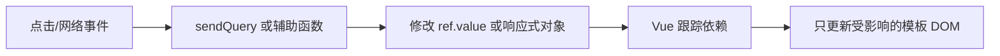

# 08.3｜给 Python 开发者的 Vue：把 `ref` 看成可观察盒子

如果你熟悉 Python，可以先把 Vue 放回熟悉的世界：组件是一份“模板 + 状态 + 函数 + 样式”，`ref` 是一个会通知界面重新观察的盒子。你不需要先掌握整个前端生态，先读懂当前单文件 `App.vue` 就够了。

## 学习目标

- 用“可观察盒子”解释 `ref` 与 `.value`；
- 把 Vue template 指令映射到 Python/Jinja 心智模型；
- 理解当前多会话数据结构和全局并发限制；
- 说明流式正文怎样增量修改同一个消息对象；
- 理解 Markdown 渲染与 DOMPurify 的安全顺序。

## 类比：普通盒子与装了传感器的盒子

Python 普通变量像纸箱：里面的值变了，屏幕不会自动知道。Vue `ref` 像装了传感器的透明盒子：代码改动盒内值，依赖它的模板会刷新。

```ts
const inputMessage = ref('')
const isThinking = ref(false)

isThinking.value = true
```

脚本中通过 `.value` 打开盒子；template 会自动解包，所以模板写 `isThinking`。这不是线程或数据库监听，而是 Vue 的响应式状态机制。

## 图：一次状态更新怎样到界面



## 真实实现

### 1. 单文件组件的四块

```text
<template>      声明界面长什么样
<script setup>  类型、状态和函数
<style scoped>  当前组件样式
```

项目没有 vue-router；整个界面集中在 `front/clinical_cds/src/App.vue`。Element Plus 在 `main.ts` 全局注册，图标按需导入。

### 2. 把 template 翻译成 Python

| Vue | Python/Jinja 类比 | 当前用途 |
|---|---|---|
| `v-if` | ``，但会随状态变化 | 空状态、思考状态 |
| `v-for` | 模板 for 循环 | 会话和消息列表 |
| `v-model` | 输入值与变量双向同步 | 病例输入框 |
| `@click` | 注册回调函数 | 新建会话、发送 |
| `:class` | 根据条件组合 class | 当前会话高亮 |
| `{{ value }}` | 转义文本插值 | 普通文本 |
| `v-html` | 直接插入 HTML | Markdown 结果，风险更高 |

### 3. 当前状态模型

```ts
sessions: SessionItem[]
currentSessionId: string
messagesBySession: Record<string, ChatMessage[]>
messages: ChatMessage[]
isThinking: boolean
```

`messagesBySession` 像 Python 的 `dict[str, list[ChatMessage]]`；`messages` 指向当前会话列表，供模板直接渲染。请求开始时保存 `requestSessionId`，后续片段都写回该 key，因此切换页面会话不会把返回内容写错列表。

不过 `isThinking` 是一个全局盒子：任何请求进行中都会阻止第二次发送。所以当前支持多会话保存与切换，不支持多个会话并行推理。

### 4. 增量更新同一个助手气泡

发送时先插入空消息：

```ts
const msgIdx = sessionMessages.length
sessionMessages.push({ role: 'assistant', content: '' })
```

每个内容片段到达后，`appendAssistantMessage()` 修改该对象的 `content`。Vue 观察到对象属性变化，界面上的同一个气泡逐步增长。状态事件只更新 `status`，不会混进正文。

### 5. 安全展示 Markdown

真实链路是：

```ts
const html = marked.parse(text, { breaks: true, gfm: true }) as string
return DOMPurify.sanitize(html)
```

`marked` 负责把语法变成 HTML；DOMPurify 才负责网页消毒。因为模板使用 `v-html`，不能依赖普通插值的自动转义。模型输出、缓存和知识库内容都应视为不可信。

## 源码二刷

第一遍只找所有 `ref(`；第二遍逐个回答：

- 谁写它，谁在模板读它？
- 是否按 session 隔离？
- 切换会话时是复制数组还是改引用？
- `msgIdx` 在网络请求期间为什么仍有效？
- `nextTick()` 为什么在滚动前调用？
- 哪一条渲染路径经过 `v-html`，是否全部先消毒？

然后查看 `package.json`：当前没有前端单元测试脚本，验证门禁是 `npm run type-check` 与 `npm run build`。

## 面试背板

> 我把 Vue `ref` 理解为可观察盒子：脚本通过 `.value` 修改，模板自动解包并刷新相关 DOM。当前页面用一个按 session 分组的消息字典保存会话，请求开始时快照 session ID，流片段持续修改同一个助手消息。全局 `isThinking` 简化了竞态，但也意味着暂不支持并发会话。

## 常见误解

- **“改普通局部变量也会刷新界面。”** 不一定；模板依赖需要响应式状态。
- **“多个 session 可以同时发送。”** 当前全局 `isThinking` 会阻止。
- **“`messages` 是所有会话唯一真相。”** 常驻索引是 `messagesBySession`，`messages` 服务当前显示。
- **“marked 会自动防 XSS。”** Markdown 解析不等于安全净化。
- **“scoped CSS 永远不会影响子组件内部。”** 穿透 Element Plus 内部通常要用 `:deep()`。

## 自测

1. 为什么脚本写 `inputMessage.value`，模板却写 `inputMessage`？
2. `requestSessionId` 快照解决了什么竞态？
3. 为什么先插入空 assistant 消息，而不是每个 chunk 新建消息？
4. 当前若要支持并发会话，至少要改哪些状态？
5. `v-html` 为什么比 `{{ text }}` 更需要安全审查？

## 导航

- [上一节：SSE 实时报告](./sse-live-report.md)
- [下一节：前端请求拆解](./frontend-request.md)
- [安全门禁](../part09-security-troubleshooting/security-gates.md)
