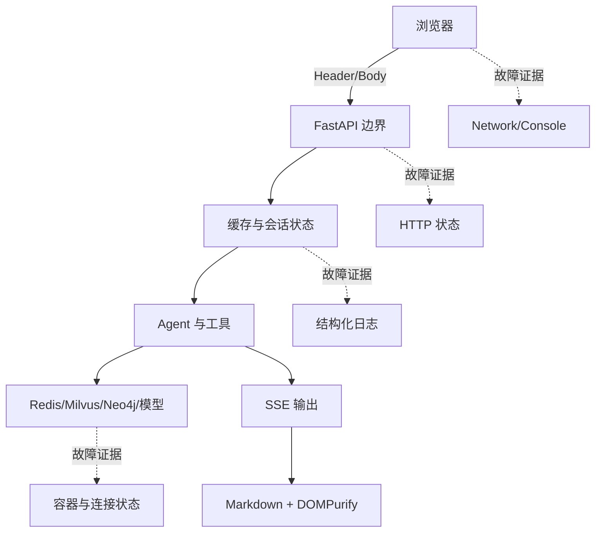

# Part 09｜安全、排错与可观测性：先看清边界，再动手

系统像一座有门禁、有接待、有会诊室的医院。门禁卡减少无关人员进入，身份证号码格式避免脏数据，权限核验决定能否访问资源，网页消毒防止报告夹带恶意 HTML；而发生故障时，第一问永远不是“该重装什么”，而是“哪一层坏了”。

## 学习目标

- 用门禁卡、身份证格式、权限核验、网页消毒解释四类安全控制；
- 明确“格式合法不等于身份真实，身份真实也不自动等于有权限”；
- 按浏览器、API、服务、Agent、基础设施分层排错；
- 读懂当前结构化日志、耗时字段与轮转策略；
- 区分已有控制、原型限制和生产建议。

## 类比：不是一把锁解决所有问题

| 类比 | 当前实现 | 能做什么 | 不能做什么 |
|---|---|---|---|
| 门禁卡 | 可选 Bearer token | 验证共享口令 | 识别个人、角色、过期与撤销 |
| 身份证格式 | ID 正则 | 拒绝非法字符和长度 | 证明号码属于当前调用者 |
| 权限核验 | 当前仅有部分隔离过滤 | cache/长期记忆按 user 查询 | 完整 RBAC、session 所有权校验 |
| 网页消毒 | DOMPurify | 移除危险 HTML | 防 Prompt Injection、验证医学正确性 |
| 值班记录 | 后端日志 | 关联步骤和耗时 | 自动等于审计或指标体系 |

## 图：纵深防御与故障定位

## 真实实现

本篇对应源码：

- `app/router/chat.py`：Bearer 与 `X-User-Id`；
- `app/schemas/chat.py`：Body 边界；
- `app/app_main.py`：CORS；
- `front/clinical_cds/src/App.vue`：Header 与 DOMPurify；
- `app/infra/logging_config.py`：控制台 + 5MB 轮转文件；
- `app/service/chat_service.py`：`chat_request_start/chat_step/sse_emit`；
- `app/test/test_chat_security.py` 与 `test_backend_logging.py`：可执行证据。

学习顺序：

1. [安全门禁](./security-gates.md)：每一道控制到底保护什么；
2. [分层排错](./troubleshooting.md)：先判断哪一层坏了；
3. [可观测性](./observability.md)：怎样用日志和协议建立证据链。

## 源码二刷

二刷不要只找“有没有安全代码”，而要画控制矩阵：输入来自哪里、在哪校验、失败状态是什么、有没有测试、还能如何绕过。排错代码则按“症状→层→证据→最小动作”标注。日志代码要区分用户可见 SSE、内部 LangGraph 事件与日志 event，三者同名不等义。

## 面试背板

> 当前原型有共享 Bearer、ID 白名单、输入长度、CORS 和 DOMPurify，但它们分属不同边界。尤其要强调：ID 格式合法不代表身份真实，CORS 不是鉴权，网页消毒也不防提示注入。排错时我先定位浏览器、HTTP、服务、Agent 还是基础设施层，再用状态码、SSE 完成标志和结构化日志逐层收敛。

## 常见误解

- **“有 token 就是完整 IAM。”** 当前是可选共享口令。
- **“ID 通过正则就完成授权。”** 格式、认证、授权是三个问题。
- **“DOMPurify 能保证回答正确。”** 它只处理浏览器 HTML 风险。
- **“Redis PING 成功就代表 checkpoint 正常。”** saver 还依赖 Redis Stack/RediSearch。
- **“日志存在就等于可观测性完善。”** 还缺统一 request ID、指标、追踪和告警。

## 自测

1. 用一个例子区分身份格式、身份认证和资源授权。
2. 401、400、422、200+业务提示分别来自哪层？
3. curl 正常但浏览器失败，应先查什么？
4. accepted 后没有 done，说明哪几层仍可能出错？
5. 当前日志哪些字段可用于串起一次请求？

## 导航

- [上一篇：API 与前端](../part08-api-frontend/index.md)
- [下一节：安全门禁](./security-gates.md)
- [本篇：分层排错](./troubleshooting.md)
- [本篇：可观测性](./observability.md)
- [下一篇：扩展实战](../part10-labs/index.md)
