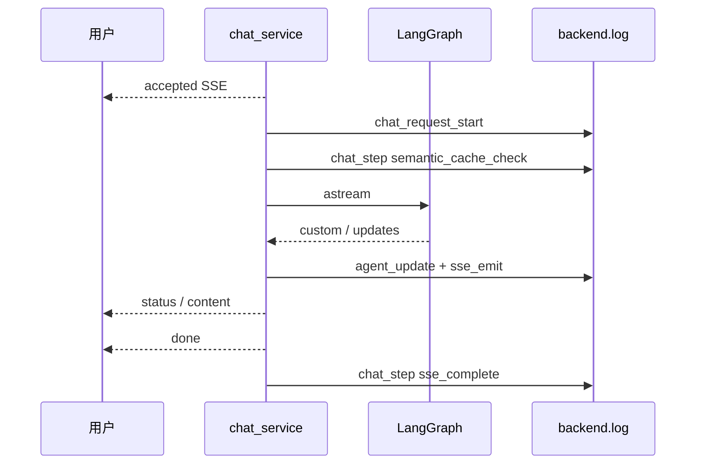

# 09.3｜可观测性：让“发生了什么”有证据

可观测性像医院值班记录：不仅写“完成”，还要知道哪个会话、走到哪一步、用了多久、在哪个环节停止。当前项目已有结构化风格日志和 SSE 状态，但还不是完整的指标与追踪平台。

## 学习目标

- 区分 SSE 状态、LangGraph 内部事件和日志事件；
- 读懂当前 logger、轮转文件、步骤耗时字段；
- 用 `user_id/session_id` 串起一次请求；
- 明确日志的隐私风险和当前缺口；
- 设计不虚构指标的后续观测方案。

## 类比：叫号屏、会诊便笺和值班日志

- **叫号屏**：浏览器看到的 SSE，面向用户体验；
- **会诊便笺**：LangGraph custom/updates，面向内部编排；
- **值班日志**：`clinical_cds.chat` / `clinical_cds.agent`，面向排错和运行分析。

三者可以表达同一阶段，但不是同一个协议。日志中的 `event=sse_emit` 不等于 SSE 的 `event:` 字段；本项目网络帧根本没有 `event:` 行。

## 图：一次请求的证据链



## 真实实现

### 日志配置

[`app/infra/logging_config.py`](../../app/infra/logging_config.py) 给 root logger 配置：

- stdout 控制台；
- `logs/backend.log`；
- 单文件 5MB；
- 5 个备份；
- UTF-8；
- 格式包含时间、级别、logger 和消息。

Agent 层主要使用 `clinical_cds.agent`，聊天服务使用 `clinical_cds.chat`。因为 handler 在 root，上述子 logger 会进入同一输出。

### 关键日志

`stream_chat()` 当前记录：

| 日志 | 用途 |
|---|---|
| `event=chat_request_start` | 请求开始、用户、会话、query 字符数 |
| `event=sse_emit` | 发出帧的 kind 与总耗时 |
| `event=chat_step` | 步骤增量耗时与总耗时 |
| `event=semantic_cache_hit` | 命中级别、距离、匹配问题 |
| `event=agent_workflow_start` | 进入图主链路 |
| `event=agent_update` | 节点更新 |
| `event=long_term_extract_scheduled` | 后台提取已调度 |

`graph_manager.py` 还记录 Agent 节点开始、完成和 elapsed。工具层部分耗时目前用 `print`，格式并未完全统一。

### 观察一次请求

**目的：实时过滤某一用户或 session 的生命周期，而不打印整个日志文件。**

```powershell
Get-Content .\logs\backend.log -Wait |
  Select-String "user_id=doctor_001|session_id=observe_001"
```

**目的：确认自动化测试保护了首帧、短输入步骤和日志落盘。**

```powershell
python -m pytest -q app/test/test_backend_logging.py
```

测试使用 dummy cache，不是性能基准，也不证明外部模型可用。

### 怎样谈耗时

现有 `elapsed` 和 `total` 可用于单次排错，但仓库没有可引用的 p50/p95、并发或成本基准。正确表达是“已经记录步骤耗时，可进一步聚合”，而不是“性能提升了 X%”。

建议后续明确指标定义：

- 请求到 accepted；
- 请求到首个 content；
- 请求到 done；
- 各节点耗时；
- cache hit/miss 和误命中评测；
- SSE 完成率；
- 降级触发次数。

### 隐私边界

日志已有 user/session，且短输入分支会以 repr 记录 query；缓存命中日志还记录 matched question。原型明确不应放真实患者数据。生产需要去标识化、字段级脱敏、访问控制、保留期限和审计，token 绝不能进入日志。

### 当前缺口

- 没有统一 request/correlation ID；
- 没有 OpenTelemetry 分布式 trace；
- 没有 Prometheus 等指标导出与告警；
- 工具层日志混用 `print` 与 logger；
- SSE 异常缺少显式应用级 error 帧；
- 前端错误分类过粗。

这些是下一步，不应写成已经实现。

## 源码二刷

1. 从 `chat_request_start` 找到所有可能终点；
2. 对比 `log_step()` 与 `_timed_node()` 的计时范围；
3. 找出哪些异常只 warning 后降级，哪些会向上中断；
4. 搜索 `print(`，列出尚未统一进入结构化日志的工具；
5. 阅读测试，区分“日志格式行为测试”与“线上观测能力”。

## 面试背板

> 项目已有控制台和轮转文件日志，聊天服务按 user/session 记录请求、SSE 发出、缓存、节点和步骤耗时；Agent 层记录节点 elapsed。它足以支持本地链路排错，但还不是完整可观测平台：缺统一 request ID、指标、trace 和告警，也没有性能分位数证据。

## 常见误解

- **“日志里有 elapsed 就完成性能评测。”** 单次时长不等于基准统计。
- **“SSE 状态就是服务端日志。”** 二者受众和生命周期不同。
- **“记录完整 query 更利于排错。”** 可能泄露患者隐私。
- **“warning 都可以忽略。”** warning 可能表示关键能力已降级。
- **“没有 error 帧就没有错误。”** 流可能直接断开。

## 自测

1. `sse_emit kind=status` 与浏览器 `parsed.status` 有什么关系和区别？
2. 怎样证明一次请求没有完整结束？
3. 当前能测单次哪些时间，不能声称哪些统计指标？
4. 哪些日志字段有隐私风险？
5. 如果新增 request ID，应从哪层生成并传到哪些组件？

## 导航

- [上一节：分层排错](./troubleshooting.md)
- [返回本篇总览](./index.md)
- [下一篇：扩展实战](../part10-labs/index.md)
- [评测实验](../part10-labs/lab-evaluation.md)
