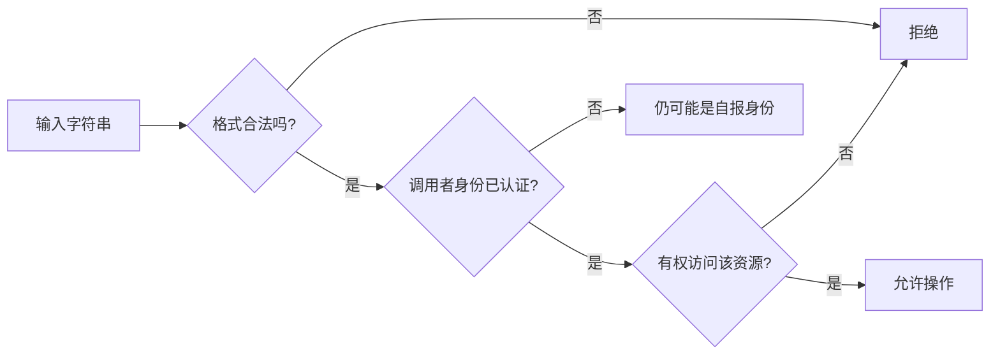

# 09.1｜安全门禁：门禁卡、身份证格式、权限和网页消毒

安全最危险的误会，是把一道门当成全部安全。门禁卡能说明“持有某个共享口令”，身份证号码格式能说明“字符串长得合规”，权限核验才回答“这个主体能不能访问这份资源”，网页消毒则保护报告展示阶段。四者互不替代。

## 学习目标

- 准确描述当前 Bearer 与 `compare_digest` 的能力；
- 牢记“格式合法不等于身份真实”；
- 区分认证、授权、CORS、输入校验与 XSS 防护；
- 识别 session、缓存、checkpoint 和长期记忆的隔离风险；
- 不夸大原型的医疗、安全或合规能力。

## 类比：四道检查

1. **门禁卡**：Bearer token。卡号对上共享口令才放行，但大家共用一张卡时，仍不知道是谁。
2. **身份证格式**：`X-User-Id/session_id` 正则。号码位数和字符合法，不代表证件真实，更不代表持有人就是本人。
3. **权限核验**：主体是否能访问某会话、缓存和记忆。当前有部分 user filter，但没有完整角色/资源所有权系统。
4. **网页消毒**：DOMPurify。报告在贴上网页前去掉危险标签和属性，但不判断报告内容是否符合医学事实。

## 图：格式、认证、授权不可跳步



当前 `X-User-Id` 主要到达 F，没有独立身份提供方把它可靠推进到 A/Z。

## 真实实现

### Bearer

`API_AUTH_TOKEN` 非空时，路由要求 `Authorization: Bearer <token>`，并使用 `secrets.compare_digest`。缺失或错误返回 401 和 `WWW-Authenticate: Bearer`。配置为空则这一检查关闭；部署不能把“代码支持 token”误写成“所有环境强制认证”。

### 用户与会话 ID

`X-User-Id` 始终必填，格式为 `^[A-Za-z0-9_.:-]{1,128}$`，失败返回 400。`session_id` 在 Body 中用相同字符集限制，失败通常返回 422。

白名单减少日志注入、过滤表达式和路径式脏字符风险，但**格式合法不等于身份真实**。浏览器当前可直接设置 `doctor_001`；生产应从已验证身份 claim 派生用户标识，并在服务端核验会话所有权。

### 缓存与状态隔离

语义缓存查询限制在 public 或当前用户 scope，运行时答案写为 user scope。长期记忆也按 user ID 检索。正向控制不代表所有存储天然隔离：checkpoint 主要使用 `thread_id=session_id`，不能只因 config 还含 `user_id` 就假定底层 key 自动租户隔离。需要跨用户同名 session 的测试证据。

### CORS

CORS 限制允许浏览器页面读取响应的 Origin。它不阻止 curl、后端程序或拿到 token 的攻击者调用 API，因此不是权限核验。

### 网页消毒

前端执行：

```ts
marked.parse(text)
→ DOMPurify.sanitize(html)
→ v-html
```

顺序正确。模型输出、缓存答案和检索文本都不可信。DOMPurify 防的是 DOM XSS，不防 Prompt Injection，也不验证药物建议。

### 输入与成本边界

Pydantic 限制 query 1～4000 且拒绝空白；服务层对少于 4 个非空白字符给出固定提示。这能减少无意义调用，却不是限流、并发控制或完整 DoS 防护。

### 医疗边界

该仓库是精神科临床决策支持原型，不应存入真实患者数据；输出仅供参考，不替代诊断、处方和急诊处置。当前没有可支持临床准确率、合规认证或生产安全等级的评测证据。

## 源码二刷

建立一张表，逐项填写“输入—控制—失败表现—测试—缺口”：

- Authorization → `require_chat_identity` → 401 → security tests → 共享 token；
- X-User-Id → 正则 → 400 → security tests → 自报身份；
- session/query → Pydantic → 422 → schema tests → 无所有权；
- Markdown → DOMPurify → 净化后 DOM → 当前无专门前端安全测试；
- cache user scope → Milvus filter → miss → 当前缺 A/B 隔离自动化测试。

## 面试背板

> 当前安全是纵深但仍是原型：共享 Bearer 做入口门禁，ID 正则做格式清洗，缓存/长期记忆按 user 过滤，DOMPurify 清洗最终 HTML。关键边界是格式合法不等于身份真实，CORS 不等于认证，user filter 也不自动证明 checkpoint 的跨租户隔离。生产还要接身份提供方、服务端授权、TLS、限流、审计和数据治理。

## 常见误解

- **“`compare_digest` 能防 token 被盗。”** 它只改善比较时序特征。
- **“自报 user ID 可作为审计身份。”** 未认证主体可以冒用合法格式。
- **“public cache 可以放常见病例答案。”** public 内容绝不能含患者信息。
- **“Prompt Injection 用 DOMPurify 就能解决。”** 一个是模型指令边界，一个是浏览器 HTML 边界。
- **“没有姓名就是匿名数据。”** 症状组合仍可能可识别。

## 自测

1. 为什么合法的 `doctor_001` 仍可能是伪造身份？
2. token 正确后，为什么还需要资源级授权？
3. checkpoint 跨用户隔离需要怎样的测试？
4. DOMPurify 能处理什么，不能处理什么？
5. 当前哪些安全能力有测试，哪些仍只是建议？

## 导航

- [本篇总览](./index.md)
- [下一节：先判断哪一层坏了](./troubleshooting.md)
- [面试常见问题](../part11-interview/common-questions.md)
