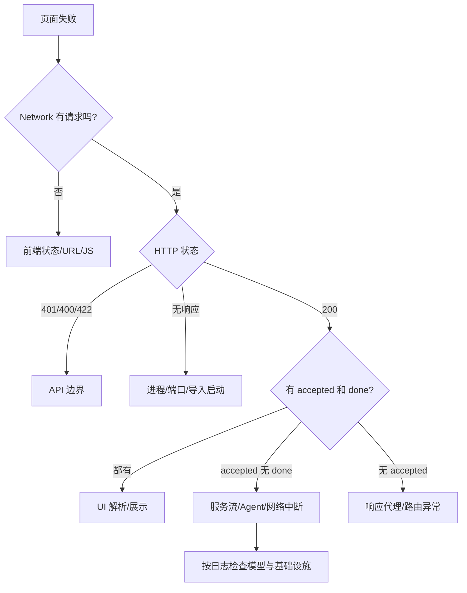

# 09.2｜排错：先判断哪一层坏了

排错不是背命令，而是缩小故障层。先问：页面没发出请求、HTTP 边界拒绝、SSE 中途断了、Agent 出错，还是基础设施能力降级？每次只收集能回答这个问题的证据，再做最小、可逆修复。

## 学习目标

- 按浏览器→API→服务流→Agent→基础设施定位；
- 看到 401/400/422/200+无 done 时能快速归层；
- 每条命令都先说清目的再执行；
- 区分服务不可达、服务为空、功能降级和配置错位；
- 避免删库、重装、硬编码路径等破坏性“修复”。

## 类比：先判断停电在哪一层

灯不亮时，不应先拆发电站。先看灯泡，再看房间开关、楼层配电、园区供电。对应项目：

```text
页面状态 → 浏览器 Network/CORS → FastAPI 状态码
→ SSE 是否有 accepted/done → Agent/工具日志
→ Redis/Milvus/Neo4j/模型配置
```

## 图：故障决策树



## 真实实现

### 第 0 层：固定现场

**目的：确认你在哪个目录、使用哪个 Python，避免把环境差异误判成代码错误。**

```powershell
Get-Location
python -c "import sys; print(sys.executable); print(sys.version)"
```

**目的：查看改动范围，不让排错动作覆盖用户已有工作。**

```powershell
git status --short
```

### 第 1 层：浏览器和前端

症状：按钮无反应、请求地址错、Console 报错、curl 正常但浏览器失败。

先在 DevTools 看 Network：请求 URL、method、Body、Header、Status、Response。页面当前把多种异常合并为统一端口文案，所以不能只信 UI。

**目的：验证前端类型与生产构建，不启动后端或模型。**

```powershell
Set-Location .\front\clinical_cds
npm run type-check
npm run build
Set-Location ..\..
```

**目的：单独验证浏览器预检所需的 CORS 响应。**

```powershell
curl.exe -i -X OPTIONS http://127.0.0.1:5000/api/chat `
  -H "Origin: http://localhost:5173" `
  -H "Access-Control-Request-Method: POST" `
  -H "Access-Control-Request-Headers: authorization,content-type,x-user-id"
```

### 第 2 层：API 边界

| 表现 | 优先检查 |
|---|---|
| 401 | Bearer 缺失、错误或 scheme 不对 |
| 400 | `X-User-Id` 缺失/格式非法 |
| 422 | JSON、query、session_id 违反 Schema |
| 200 + input_validation | 去空白后不足 4 字，属于业务提示 |

**目的：绕开 Vue，直接观察状态、响应头、SSE 首尾。**

```powershell
curl.exe -N -i -X POST http://127.0.0.1:5000/api/chat `
  -H "Content-Type: application/json" `
  -H "X-User-Id: doctor_001" `
  -H "Authorization: Bearer $env:API_AUTH_TOKEN" `
  --data-raw '{"query":"患者近两周失眠并情绪低落","session_id":"debug_001"}'
```

未启用 token 时删除 Authorization。一次只改变一个条件。

### 第 3 层：应用能否导入与启动

**目的：只检查 Python 语法，不连接外部服务。**

```powershell
python -m compileall -q agent app
```

**目的：验证模块导入路径和必需配置是否允许加载应用。**

```powershell
python -c "import app.app_main; print('ok')"
```

导入成功不等于 lifespan 成功。当前 API Settings 绝对定位 `agent/.env`，Agent Settings 使用相对 `.env`；从不同 CWD 启动可能表现不同。

**目的：从项目根使用标准入口启动后端，减少 CWD 变量。**

```powershell
python -m uvicorn app.app_main:app --host 0.0.0.0 --port 5000
```

### 第 4 层：SSE/Agent 执行

若 HTTP 200 且有 accepted，但没有 done，重点查流生成器、模型、工具、代理超时与网络中断。

**目的：关联 `debug_001` 的步骤、异常和是否完整结束。**

```powershell
Get-Content .\logs\backend.log -Tail 200 |
  Select-String "debug_001|ERROR|Traceback|agent_workflow_start|sse_complete"
```

如果日志到了 `sse_complete` 而页面没完成，优先回到代理/前端解析；如果停在某个 Agent，检查对应工具和模型。

### 第 5 层：基础设施

**目的：先看所有容器状态，不写入、不删除任何数据。**

```powershell
Set-Location .\docker
docker compose ps
Set-Location ..
```

**目的：确认 Redis 不仅可连，还加载了 Checkpointer 需要的模块。**

```powershell
docker exec clinical_redis redis-cli PING
docker exec clinical_redis redis-cli MODULE LIST
```

`PONG` 仍不足以证明 Redis Stack 的 RediSearch 可用。

**目的：区分 Milvus 服务不可用与集合为空。**

```powershell
python -c "from pymilvus import MilvusClient; c=MilvusClient(uri='http://localhost:19530'); print(c.list_collections())"
```

`qa_semantic_cache`、`long_term_memory`、`cloud_product_docs` 是不同用途，空集合不等于服务故障。

**目的：查看 Neo4j 服务日志，而不是先运行写入脚本。**

```powershell
Set-Location .\docker
docker compose logs --tail 80 neo4j
Set-Location ..
```

服务健康但节点为零，需要数据摄入；不能靠重启制造数据。

### 第 6 层：自动化回归

**目的：确认安全、SSE 和日志契约是否仍满足，而不是测试真实模型质量。**

```powershell
python -m pytest -q
```

若基线已失败，先记录失败，不要把它算成刚刚修改造成的回归。

## 源码二刷

拿一次真实故障按五列复盘：症状、所属层、证据、最小修复、复测。再阅读两套 Settings、checkpointer 工厂、三种 Milvus 用途和前端 catch。你应该能指出“哪项依赖失败会降级，哪项可能让启动/主推理失败”，而不是笼统说“系统都能优雅降级”。

## 面试背板

> 我的排错顺序是先分层：浏览器是否发请求，HTTP 边界返回什么，SSE 是否从 accepted 走到 done，日志停在哪一步，最后才查具体基础设施。每条命令都有一个判断目的，并坚持只读检查优先、一次只改一个变量、修复后复测同一路径。

## 常见误解

- **“先重装依赖最快。”** 会破坏现场并引入新变量。
- **“容器 running 就有业务数据。”** 服务健康和集合/图非空不同。
- **“Redis PING=PONG 就有多轮状态。”** Checkpointer 还需 saver 初始化成功。
- **“Milvus 挂了所有推理必失败。”** 缓存/记忆/RAG 会受影响，但主流程可能部分降级。
- **“accepted 出现就说明成功。”** 必须看到 done 或明确 error 契约。

## 自测

1. 页面显示“检查 5000 端口”时，至少列出五种真实原因。
2. 为什么导入检查与 lifespan 启动检查要分开？
3. 如何区分 Milvus 不可用、集合不存在和集合为空？
4. Redis 不可用后，单轮与多轮能力分别怎样？
5. 选择一个故障，为每条检查命令写出目的。

## 导航

- [上一节：安全门禁](./security-gates.md)
- [下一节：可观测性](./observability.md)
- [下一篇：扩展实战](../part10-labs/index.md)
