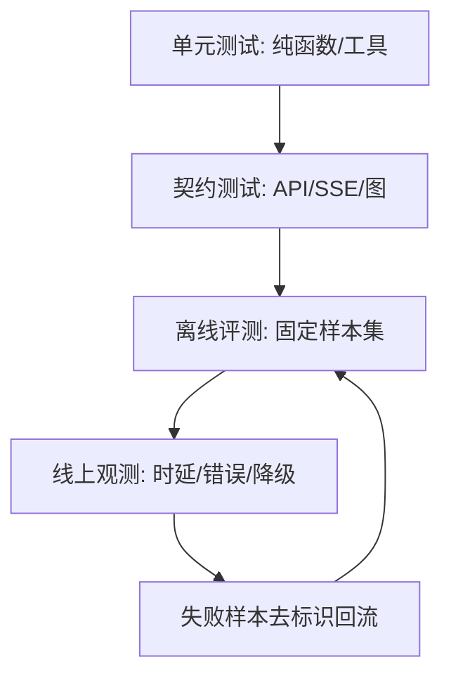

# Lab 3｜建立评测：先定义“好”，再运行数字

没有数据集、样本量、环境和计算方法的“95% 准确率”没有意义。本实验不追求漂亮数字，而是建立一条可复现评测管道：版本固定、样本去标识、指标可计算、失败可回看、结果有边界。

## 学习目标

- 区分单元测试、契约测试、离线评测与线上观测；
- 为路由、检索、SSE、安全和降级分别定义指标；
- 先写评测器测试，再接真实样本；
- 避免用最终自然语言整段相等做脆弱断言；
- 在没有结果时诚实写“未测”。

## 类比：考试前先定题目和评分规则

若先看模型输出再改评分标准，就像看完答卷再定答案。正确顺序：冻结样本与版本→写评分器→用手工小样本验证评分器→运行→查看失败→报告环境和置信边界。

## 图：四层质量证据



线上样本不能未经治理直接进入训练或评测集，尤其不能包含真实患者信息。

## 真实实现

### 1. 先建立评测清单

| 能力 | 样本单位 | 指标示例 | 当前仓库值 |
|---|---|---|---|
| 路由 | query + 标注入口 | accuracy / 混淆矩阵 | 未测 |
| 向量检索 | query + 标准来源 | Recall@K / MRR | 未测 |
| 回答证据 | answer + retrieved docs | 引用覆盖/忠实度人工评分 | 未测 |
| SSE | 事件序列 | accepted 首帧、done 完成率 | 有行为测试，无统计值 |
| 缓存 | 成对临床条件问题 | 误命中率、命中率 | 未测 |
| 安全边界 | 恶意/非法请求 | 拒绝率与状态码 | 有部分自动化测试 |
| 降级 | 依赖故障场景 | 主路径成功率/能力损失 | 有代码路径，缺系统矩阵结果 |
| 时延 | 固定环境请求 | 首内容/完整响应 p50/p95 | 未测 |

### 2. 数据集设计

建议新建（实验实施时）去标识 JSONL，每条包含：

```json
{
  "case_id": "route_001",
  "query": "舍曲林与帕罗西汀合用需要注意什么",
  "expected_route": "drug_interaction",
  "tags": ["drug-review"],
  "source": "synthetic"
}
```

不保存姓名、电话、证件、地址或真实病历。路由标签必须与图当前允许值一致：`differential_diagnosis`、`treatment_recommend`、`drug_interaction`。

### 3. 测试先行：先证明评分器会算

先写纯函数：

```python
def route_accuracy(rows):
    if not rows:
        raise ValueError("evaluation set cannot be empty")
    correct = sum(r["expected"] == r["actual"] for r in rows)
    return correct / len(rows)
```

测试 0%、50%、100% 和空集合。评分器测试通过后，再接模型/路由输出；否则漂亮数字可能只是统计 bug。

**目的：只验证评测器数学和输入边界，不调用真实模型。**

```powershell
python -m pytest -q app/test/test_evaluation_metrics.py
```

### 4. 路由评测

把 orchestrator 的输出解析抽成可测试边界，固定 temperature/模型版本，并保存原始输出与解析结果。报告样本量、数据来源、版本和混淆矩阵。模型网络失败应计为 error 或单列，不得从分母静默删除。

### 5. 检索评测

向量检索不能只看“最终回答不错”。为每个 query 标注期望 source/document ID，计算 Top-K 是否包含。Neo4j 则可对确定关系写精确查询契约。当前工具把来源文件名拼进文本，可作为初步证据，但正式评测最好保留结构化 metadata。

### 6. SSE 契约评测

稳定断言：

- 第一帧 accepted；
- 帧可解析；
- status 与 content 不混淆；
- 结尾存在 `done=true`；
- 缓存命中时内容存在，且可用 checkpointer 时调用状态补写；
- 短输入不进入 graph。

不要断言 token 切分或完整模型文案。现有 `test_backend_logging.py` 是良好起点。

### 7. 安全与隔离评测

扩展 `test_chat_security.py`：Bearer scheme、128 字符边界、超长 query、A/B cache 隔离。另设计同名 session 的跨用户 checkpoint 测试；若 saver 实际只按 thread ID 隔离，应如实判失败并修设计，不能用文档假设通过。

### 8. 降级实验

用 mock 优先测试：Redis saver 创建失败→graph 无 checkpointer；semantic cache 初始化失败→继续主图；MCP（若完成上一个 Lab）失败→空工具。容器停启属于集成测试，执行时不删除 volume。

### 9. 时延采样

先定义三个时间：request→accepted、request→首 content、request→done。固定机器、模型、依赖状态、冷热缓存，重复采样后报告 p50/p95 和样本数。当前代码已有步骤 total/elapsed，但还没有聚合结果。

### 10. 验证与结果登记

**目的：运行已有工程门禁，保证评测代码没有破坏产品契约。**

```powershell
python -m pytest -q
python -m compileall -q agent app
```

**目的：验证前端类型和生产构建，不能以评测脚本替代 UI 门禁。**

```powershell
Set-Location .\front\clinical_cds
npm run type-check
npm run build
Set-Location ..\..
```

结果报告至少包含：Git commit、配置（不含 secret）、模型/embedding 版本、数据集版本、样本量、指标定义、失败数、运行环境、已知限制。没有运行就填“未测”，不要填估计值。

### 11. 回滚

评测器、数据集和报告分开存放；数据集先经隐私审查。若评测接入 CI 导致成本或网络不稳定，把离线单元/契约测试保留在默认 CI，把真实模型评测放显式 job，而不是删除全部评测。每个 job 使用固定超时和预算。

## 源码二刷

从现有测试反推“仓库已经证明什么”：安全测试证明路由边界，日志测试证明部分 SSE 顺序；它们不证明真实模型准确率、工具召回率和生产并发。然后检查日志字段是否足够计算定义好的指标，缺什么字段就先补观测设计，而不是从不完整数据猜结果。

## 面试背板

> 我把测试和评测分层：纯函数测试保证确定逻辑，契约测试保证 API/SSE，固定去标识数据集评估路由和检索，线上观测再看时延与降级。所有指标都带版本、样本量和定义；当前仓库没有临床准确率或性能分位数，所以我会明确说未测，并给出可执行测量方案。

## 常见误解

- **“pytest 通过说明临床准确。”** 工程契约不等于临床有效性。
- **“最终回答看着合理就算 RAG 好。”** 应单独测检索和忠实度。
- **“失败样本删掉后准确率更纯。”** 会产生幸存者偏差。
- **“平均时延足够。”** 长尾需要 p50/p95 等分位数和样本数。
- **“线上病例可直接做评测集。”** 涉及隐私、授权、用途和去标识治理。

## 自测

1. 单元测试、契约测试和离线评测各回答什么问题？
2. 路由模型异常应如何计入报告？
3. 为什么 cache 评测必须包含“相似但不应复用”的反例？
4. 当前哪些结论只能写“未测”？
5. 如何让真实模型评测不拖慢默认 CI？

## 导航

- [上一实验：MCP 接入 Agent](./lab-mcp-agent.md)
- [返回实战总览](./index.md)
- [下一篇：面试表达](../part11-interview/index.md)
- [可观测性](../part09-security-troubleshooting/observability.md)
