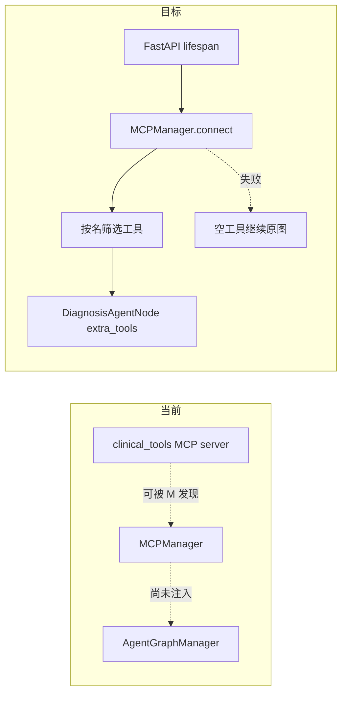

# Lab 2｜把现有 MCP 工具接入 Agent，而不是只说“仓库里有”

当前仓库已经有 MCP 管理器、服务器配置和两个工具服务函数，但 FastAPI 生命周期没有连接它，`AgentGraphManager` 也没有把工具注入任何领域 Agent。因此本实验描述“如何接入”，不是宣称功能已经完成。

## 学习目标

- 区分 MCP 服务存在、工具可发现、主图可调用三种状态；
- 先测试现有工具契约，再测试注入与生命周期；
- 在异步应用生命周期连接 MCP；
- 按名称和最小权限把工具交给目标 Agent；
- MCP 失败时保留现有非 MCP 主链路，并能整体回滚。

## 类比：外院检查中心已经挂牌，但还没有转诊通道

`clinical_tools.py` 是外院检查中心，`mcp_servers.json` 是地址簿，`MCPManager` 是联络员。当前接待窗口没有联系联络员，科室也没有收到项目清单，所以不能对患者说“已经接入”。

## 图：当前与目标



## 真实实现

### 当前事实卡

- `agent/mcp_servers/clinical_tools.py` 定义 `calculate_scale_score` 与 `query_drug_label`；药品数据是 mock。
- `agent/core/mcp/mcp_manager.py` 用 `MultiServerMCPClient` 发现工具。
- `agent/config/mcp_servers.json` 以 stdio 启动 `python -m mcp_servers.clinical_tools`。
- `chat_service.init_agent_system()` 当前只建 checkpointer、graph、memory、extraction LLM、semantic cache。
- `DiagnosisAgentNode.tools` 当前没有 MCP 工具。

### 1. 先固定现有服务契约

先测试量表工具的确定性结果。注意当前函数被 `@mcp.tool()` 装饰后的直接调用方式需以实际对象为准；如果装饰器返回 Tool 对象，应通过其暴露的调用接口测试，不要凭示例假设。

最低契约应覆盖：支持 PHQ-9/GAD-7、条目数错误、非整数、总分与分级。还应补每项 0～3 的边界校验；当前代码只检查整数和数量，尚未限制单项范围，这是应先暴露的缺口。

**目的：只运行 MCP 工具契约测试，先建立当前行为基线。**

```powershell
python -m pytest -q app/test/test_mcp_clinical_tools.py
```

通过只证明服务函数行为，不证明主图接入。

### 2. RED：写注入测试

目标接口建议为：

```python
DiagnosisAgentNode(extra_tools: list[BaseTool] | None = None)
AgentGraphManager(mcp_tools: list[BaseTool] | None = None)
```

测试至少断言：

1. 名为 `calculate_scale_score` 的假工具被诊断 Agent 注册；
2. 不允许的 MCP 工具不会无条件进入每个 Agent；
3. 重名工具去重；
4. 无 extra tools 时保持现状；
5. graph manager 把传入工具交给诊断节点。

**目的：确认当前构造函数不支持注入，因此测试按预期 RED。**

```powershell
python -m pytest -q app/test/test_mcp_injection.py
```

### 3. RED：写生命周期测试

对 `chat_service.init_agent_system()` 做 async mock：

- connect 成功：`AgentGraphManager` 收到工具；
- connect 失败：记录 warning，并用空工具构建原图；
- shutdown：清理 manager 并复位全局引用；
- 重复 init：不重复连接。

这一步不启动真实子进程。有效 RED 应是缺少 manager 生命周期，而不是测试 import 错误。

### 4. 最小实现顺序

1. `DiagnosisAgentNode` 接受 extra tools，只按允许名筛选；
2. `AgentGraphManager` 接受 mcp tools 并向目标节点传递；
3. `chat_service` 在 `init_agent_system()` 内创建并 `await connect()`；
4. `await manager.get_tools()` 后注入图；
5. 捕获 MCP 连接失败并明确 warning，继续用空列表；
6. `shutdown_agent_system()` 调用 `await manager.close()` 并复位；
7. prompt 只在用户提供完整条目分数时使用确定性计分，不把自然语言猜测伪装成正式量表结果。

不要在同步 Agent 构造函数里启动事件循环；不要把所有发现工具交给所有节点；不要因 MCP 挂掉让 API 整体无法启动。

### 5. 真实发现冒烟

单测通过后，再运行一次进程级发现。

**目的：从 `agent` 目录验证配置中的模块路径和 Python 解释器能发现两个 MCP 工具。**

```powershell
Set-Location .\agent
@'
import asyncio
from config import get_settings
from core.mcp import MCPManager

async def main():
    manager = MCPManager(get_settings().mcp_servers_config)
    try:
        await manager.connect()
        print(manager.get_tool_names())
    finally:
        await manager.close()

asyncio.run(main())
'@ | python -
Set-Location ..
```

预期工具名来自实际输出；失败时先查 CWD、配置、解释器和依赖，不要为了“降级”吞掉测试环境配置错误。

### 6. 完整验证

**目的：验证注入、连接失败降级和关闭清理。**

```powershell
python -m pytest -q app/test/test_mcp_injection.py app/test/test_mcp_lifecycle.py
```

**目的：确认既有 API、安全和图导入没有回归。**

```powershell
python -m pytest -q
python -m compileall -q agent app
python -c "import app.app_main; print('ok')"
```

### 7. 回滚

把“Agent 可注入”“Graph 传递”“FastAPI 生命周期”拆成小提交也可以，但最终要有一个可识别的 MCP 接入变更组。MCP 接入异常时优先用配置开关或 revert 整组提交；半撤销最危险，例如保留 import 却删除生命周期全局变量。

## 源码二刷

沿两条路线检查：

- 启动：lifespan → init → connect → get_tools → graph manager → diagnosis tools；
- 关闭：lifespan finally → shutdown → manager.close → 引用复位。

再回答：MCP 进程关闭时，原有同义词、Neo4j、Milvus 工具是否仍可构图？日志能否明确显示 MCP 降级？只有证据通过后，才能说“已接入”。

## 面试背板

> 仓库原本只有 MCP 服务和发现管理基础，主图没有连接。我会在 FastAPI 生命周期异步连接，按工具名和最小权限注入目标 Agent，并用 mock 测成功、失败降级和清理。进程级发现只是补充证据；还必须从 Agent/API 证明工具可达，才能称为已接入。

## 常见误解

- **“能列出工具名就是主图已支持。”** 发现不等于注入与路由。
- **“MCP 工具都应给所有 Agent。”** 违反最小权限并扩大误调用面。
- **“连接失败悄悄忽略最好。”** 降级必须可观察。
- **“量表函数有分级就临床有效。”** 它只是编码规则，且当前输入校验仍有缺口。
- **“药品说明书工具是真实数据库。”** 当前数据明确是 mock。

## 自测

1. 当前 MCP 做到了哪一步，缺哪三段主链路？
2. 为什么先写注入测试，而不先改 lifespan？
3. 哪些工具应该注入哪个 Agent，依据是什么？
4. MCP 不可用时怎样证明原图仍可工作？
5. 什么时候才可以在简历写“接入 MCP”？

## 导航

- [上一实验：新增本地工具](./lab-new-tool.md)
- [下一实验：建立评测](./lab-evaluation.md)
- [面试中的 MCP 口径](../part11-interview/common-questions.md)
