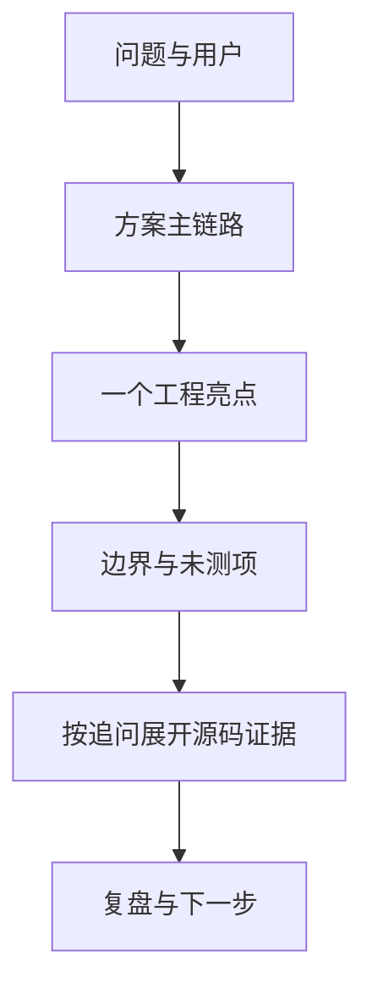

# Part 11｜面试表达：讲问题、证据和边界，不堆名词

面试不是把 README 背一遍。好的项目表达像带面试官走一遍医院：先说为什么需要这个系统，再说请求如何流动、你解决了什么工程问题，最后主动说明哪些能力仍是原型、哪些指标没有测。

## 学习目标

- 用 30 秒讲清问题、方案、亮点、边界，且最多出现 3 个技术名词；
- 用 2 分钟按前端、API、编排、数据、安全逐层展开；
- 对高频题先给一句人话短答，再给项目证据和进阶追问；
- 用 STAR 讲真实工程故事，不捏造商业或性能数字；
- 通过模拟面试训练追问、纠错和诚实边界。

## 类比：电梯介绍、楼层参观、现场答辩

- **30 秒**：电梯里只讲为什么、怎么做、有什么亮点、哪里止步；
- **2 分钟**：每到一层解释职责与数据流；
- **高频问答**：先给方向，再打开源码证据；
- **STAR**：讲一次真实故障或改动的完整闭环；
- **模拟面试**：面对连续追问仍保持口径一致。

## 图：面试信息漏斗

## 真实实现

开始前先校准事实：

| 可以说 | 不应说 |
|---|---|
| 精神科临床决策支持原型 | 已替代医生或可自动诊断处方 |
| LangGraph 编排领域节点 | 自治 Agent 群自由协商 |
| Redis checkpoint 支持会话恢复 | Redis 故障仍保持完整多轮 |
| Milvus 用于缓存、长期记忆和文档检索的不同集合 | 一个向量库自动解决所有记忆问题 |
| 有 MCP 服务与管理器基础代码 | 当前主图已经接入 MCP |
| 有共享 Bearer、ID 校验和 DOMPurify | 完整 IAM、RBAC、合规与零风险 |
| 有工程测试和构建门禁 | 已证明临床准确率、并发和性能提升 |

本篇阅读顺序：

1. [介绍脚本](./intro-scripts.md)：30 秒与 2 分钟；
2. [高频问题](./common-questions.md)：短答→证据→追问；
3. [STAR 故事](./star-stories.md)：把行动和结果讲完整；
4. [模拟面试](./mock-interview.md)：连续追问与评分表。

## 源码二刷

面试前只二刷能支撑口径的关键点：图的节点/边、`stream_chat()` 三路径、checkpoint 配置、缓存命中补写、前端流解析、安全测试、MCP 未接入证据。每个声称后面都要能接一句“代码/测试在……”。

## 面试背板

> 我的表达顺序是问题、主链路、工程亮点、边界。面试官追问后，我再落到具体源码和测试。没有临床准确率、并发或时延数据就明确说未测；MCP 只说已有基础代码但未进主图；鉴权只说原型入口保护，不包装成完整身份系统。

## 常见误解

- **“名词越多越显得高级。”** 过早堆栈会掩盖问题与取舍。
- **“Result 必须是百分比。”** 测试通过、风险隔离、链路可达也是可验证结果。
- **“主动说边界会减分。”** 准确边界通常体现工程判断。
- **“多 Agent 就是并行自治。”** 当前是路由加领域流水线。
- **“原型也可以估一个指标。”** 没有测量方法的数字不可使用。

## 自测

1. 不用框架名，能否讲清系统解决的问题？
2. 30 秒版本是否真的不超过 3 个技术名词？
3. 每个亮点能否指出源码或测试证据？
4. 能否一句话说清当前 MCP 状态？
5. 准备的 STAR 结果是否可验证且没有编造数字？

## 导航

- [上一篇：扩展实战](../part10-labs/index.md)
- [下一节：介绍脚本](./intro-scripts.md)
- [本篇：高频问题](./common-questions.md)
- [本篇：STAR 故事](./star-stories.md)
- [本篇：模拟面试](./mock-interview.md)
