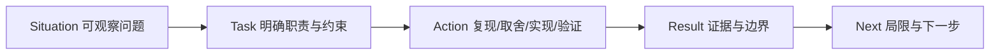

# 11.3｜STAR 故事：结果可以是证据，不一定是百分比

STAR 不是把日常工作戏剧化，而是把情境、职责、行动和可验证结果说完整。没有商业数字时，测试通过、故障被隔离、会话语义恢复、风险被识别都可以是 Result；前提是你确实做过并有证据。

## 学习目标

- 用 Situation、Task、Action、Result 组织真实故事；
- 在 Action 中解释判断与取舍，而不只列文件；
- 用测试、日志、构建和故障矩阵作为结果；
- 区分仓库已有实现与你本人实际贡献；
- 为每个故事准备局限与下一步。

## 类比：病例复盘而不是英雄故事

病例复盘关注“发生了什么、目标是什么、为什么这样处理、证据如何、以后怎样改”，不是把自己写成独自拯救系统。STAR 也一样：事实、职责和证据比戏剧性更重要。

## 图：STAR 闭环

## 真实实现

> 下面是基于仓库实现可组织的示例。只有在你确实参与对应工作时才用“我”；否则改为“我在复盘项目时分析到”或选择自己的真实经历。

### 故事一：缓存快了，但会话不能断

**S｜情境**

语义缓存命中会绕过 LangGraph。如果直接把答案返回，checkpoint 不会记录本轮，用户下一次说“刚才那个方案”时，图看不到刚才问答。

**T｜任务**

保留缓存复用的价值，同时保证可用 Redis 时的多轮语义连续；Redis 故障不能阻断缓存答案返回。

**A｜行动**

先沿 `stream_chat()` 画出命中和未命中两条路径，确认图执行分支会自然写 checkpoint，而命中分支不会。然后在命中后通过 `graph.aupdate_state()` 写入 HumanMessage 与 AIMessage；把写入异常限制为 warning，避免状态增强能力拖垮响应。测试重点放在 accepted 首帧、缓存内容和状态记录调用，而不是模型文案。

**R｜结果**

代码路径保证正常推理和缓存命中都可形成下一轮历史；Redis 不可用时仍返回缓存答案，但明确退化为无状态。没有时延基准，因此不声称提升百分比。

**进阶追问**：并发命中如何排序？重复请求是否幂等？用户隔离如何证明？这些可作为下一步测试。

### 故事二：Redis 故障不应让单轮推理停摆

**S｜情境**

多轮状态依赖 Redis Stack，但本地开发或基础设施故障不应让整个 Agent 图无法构建。

**T｜任务**

把 checkpoint 变成增强能力：可用时恢复会话，不可用时图仍运行，同时让降级可观察。

**A｜行动**

在 checkpointer 工厂中分别处理依赖缺失与连接/初始化异常，失败返回 None；图构建按是否存在 checkpointer 决定是否加入历史压缩节点；关闭逻辑兼容 async/sync close 并容忍失败；日志明确写 `graph runs stateless`。

**R｜结果**

系统具备有状态与无状态两种构图路径，Redis 故障被隔离在多轮能力。结果是代码路径与日志证据，不是“可用性 99.9%”；故障恢复时间尚未测。

**进阶追问**：为何 Redis PING 不够？因为 saver 初始化依赖 Redis Stack/RediSearch，必须测试实际 setup。

### 故事三：流式 Markdown 既要好看，也要消毒

**S｜情境**

模型、缓存和检索内容最终以 Markdown 展示，而 `v-html` 会把生成 HTML 插入 DOM；不可信内容可能携带危险标签或属性。

**T｜任务**

保留 Markdown 可读性和流式更新，同时避免直接把未净化 HTML 写入页面。

**A｜行动**

统一使用 `renderMarkdown()`：先 `marked.parse()`，再 `DOMPurify.sanitize()`，模板只消费净化结果。审查所有 `v-html` 路径，避免旁路。验证门禁包括 type-check/build；进一步应补恶意 Markdown 自动化测试和 CSP。

**R｜结果**

当前渲染路径有明确净化边界。不能因此说“消灭 XSS”或“解决 Prompt Injection”，因为依赖漏洞、配置和模型指令攻击仍是不同问题。

### 故事四：发现 MCP 能力陈述与主链路不一致

**S｜情境**

仓库有 MCP manager、配置和工具服务，容易在介绍中误称“系统已接入 MCP”；但应用初始化与 Agent 工具列表没有连接它。

**T｜任务**

校准事实，并设计一条测试先行、可降级的接入路径。

**A｜行动**

从 `init_agent_system()`、`AgentGraphManager` 与 `DiagnosisAgentNode.tools` 逆向确认断点；把“服务存在、可发现、已注入、API 可达”拆成四级证据；设计生命周期连接、按名注入、失败空工具和关闭清理测试。

**R｜结果**

得到准确口径：当前只有基础代码，主图接入是待实施 Lab。这个结果是识别和阻止错误声明，而不是假装已经交付功能。

**进阶追问**：何时可改为“已接入”？当发现、注入、降级、关闭及 API 可达证据全部通过。

## 可填写模板

**S**：在 `[真实功能/故障]` 中，我通过 `[日志/测试/代码路径]` 观察到 `[问题]`，影响 `[能力/用户]`。

**T**：我负责 `[范围]`，需要同时满足 `[兼容/安全/降级/时间]`。

**A**：我先 `[复现与验收]`，比较 `[方案与取舍]`，然后修改 `[模块]`；使用 `[测试/日志/构建]` 验证，并用 `[开关/小提交/回滚]` 控制风险。

**R**：最终 `[可验证结果]`。`[准确率/时延/业务影响]` 尚未测；下一步会 `[具体方法]`。

## 源码二刷

每个故事只保留 2～3 个关键路径：问题出现点、核心修复点、验证点。准备可能的反证：若面试官问“哪里证明 Redis 失败不影响图”，你要能指到 factory 返回 None 和 conditional build；若问“MCP 为什么没接”，能指出 init 和 tools 列表。

## 面试背板

> 我的 STAR 先从可观察问题开始，任务里说明约束，行动里讲复现、取舍和验证，结果只用测试、日志或已测指标。没有数字就明确未测，并补下一步测量方案；不是自己完成的代码不冒充个人贡献。

## 常见误解

- **“STAR 一定要有业务百分比。”** 可验证工程结果也成立。
- **“Action 就是改了三个文件。”** 还要解释为什么这样改。
- **“团队项目都可以说我实现。”** 必须区分个人职责。
- **“结果只说成功即可。”** 要给证据和能力损失。
- **“故事越夸张越吸引人。”** 经不起源码追问反而失信。

## 自测

1. 你的 S 是否有可观察证据，而不是“系统很慢”？
2. T 是否说明约束和你的职责？
3. A 是否包含至少一个取舍与一个验证？
4. R 中所有数字是否有来源？
5. 每个故事能否主动说出一个局限？

## 导航

- [上一节：高频问题](./common-questions.md)
- [下一节：模拟面试](./mock-interview.md)
- [实战篇](../part10-labs/index.md)
